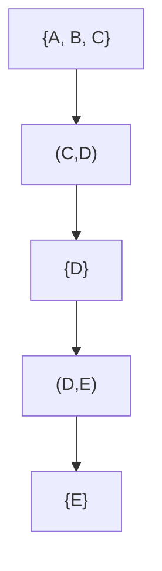

# Bridges in Graphs


## ⏰ Time Estimate
- **Reading Time**: 60-75 minutes
- **Hands-on Activities**: 2-3 hours
- **Total Learning Time**: 3-4 hours

## 📋 Prerequisites
Before we dive into bridges, make sure you're comfortable with these foundational concepts:
- [Graph Representation](/data-structures/graphs-depth-breadth-first-search.md) - What are vertices, edges, connected components, and paths?
- [Depth-First Search](/algorithms/searching.md#extension-depth-first-search-dfs-and-breadth-first-search-bfs) - What are vertices, edges, connected components, and paths?
- [Basic Data Structures](/data-structures/) - Arrays, lists, and how to represent graphs (adjacency lists).

## 🎯 Motivation
Imagine you're a city planner looking at a map of roads. Some roads are super important – if you close them, a whole part of the city becomes isolated. Other roads are less critical; if they close, there are still plenty of alternative routes.

In computer science, we often deal with "networks" that are like these road maps: social networks, computer networks, power grids, or even dependencies in software. Identifying these "super important" connections is crucial for understanding the network's resilience, finding vulnerabilities, or optimizing its structure.

This is where **bridges** come in! A bridge in a graph is an edge that, if removed, would break the graph into more disconnected pieces. Learning about bridges helps us answer questions like:
- Which single point of failure could bring down a network?
- Which friendship is essential for keeping a social group connected?
- Which road closure would cause the most traffic chaos?

Beyond just finding them, understanding the **performance (time and space complexity)** of these algorithms and data structures is vital. In large networks, an inefficient algorithm could take days to run, while an optimized one finishes in seconds. This section will highlight why efficient solutions matter.

## 🎯 Learning Objectives
By the end of this lesson, you will be able to:
1.  Define what a "bridge" (or cut-edge) is in graph theory.
2.  Explain the significance of bridges in real-world networks.
3.  Understand the core idea behind algorithms that find bridges.
4.  Trace a bridge-finding algorithm on a small graph.
5.  **Analyze the time and space complexity of bridge-finding algorithms.**
6.  Describe what a "bridge tree" (or bridge-block tree) is.
7.  Explain why bridge data structures are useful for certain types of queries.
8.  **Compare the performance benefits of using a bridge tree for queries versus the original graph.**

## 🧠 Specific Things to Learn

#### Core Concepts
-   **Connected Components**: What they are and how they change.
-   **Bridge (Cut-Edge)**: Formal definition and properties.
-   **2-Edge-Connected Component**: A part of the graph where no single edge is a bridge.
-   **Discovery Time (`disc[u]`)**: When a node is first visited during DFS.
-   **Low-Link Value (`low[u]`)**: The lowest discovery time reachable from `u` (including `u` itself) through `u`'s DFS subtree and at most one back-edge.
-   **Bridge Tree (Bridge-Block Tree)**: A simplified representation of a graph based on its bridges.

#### Algorithmic Techniques
-   **Depth-First Search (DFS)**: The foundation for bridge-finding.
-   **Tarjan's Bridge-Finding Algorithm**: The classic method using `disc` and `low` values.
    -   **Time Complexity**: How long it takes to run.
    -   **Space Complexity**: How much memory it uses.
-   **Building a Bridge Tree**: The process of constructing this data structure.
    -   **Time Complexity**: How long it takes to build the tree.
    -   **Space Complexity**: How much memory the tree itself uses.

Looking through the lesson content, not all of these terms are explicitly mentioned or explained. Here's what's actually covered in the lesson:

## Vocabulary
- **Bridge (Cut-Edge)**: An edge in a graph whose removal increases the number of connected components. In other words, removing a bridge disconnects the graph or makes it more fragmented.
- **Connected Component**: A maximal set of vertices in a graph where there is a path between every pair of vertices within the set.
- **2-Edge-Connected Component**: A maximal subgraph where every pair of vertices is connected by at least two edge-disjoint paths. This means no single edge removal can disconnect any two vertices within the component.
- **Bridge Tree**: A tree structure where each node represents a 2-edge-connected component from the original graph, and edges represent the bridges that connected those components.
- **Tarjan's Algorithm**: An efficient depth-first search algorithm that finds all bridges in a graph in linear time O(V + E) using discovery times and low-link values.
- **Discovery Time**: The time (or step number) when a vertex is first visited during depth-first search traversal.
- **Low-Link Value**: The lowest discovery time reachable from a vertex using the edges in its DFS subtree, including back edges.
- **Back Edge**: An edge that connects a vertex to one of its ancestors in the DFS tree, creating a cycle.
- **Adjacency List**: A graph representation where each vertex maintains a list of its neighboring vertices, commonly used for sparse graphs.
- **Depth-First Search (DFS) Tree**: The tree structure formed by the edges traversed during a depth-first search, showing parent-child relationships between vertices.
- **Cut Vertex (Articulation Point)**: A vertex whose removal increases the number of connected components (similar concept to bridges, but for vertices instead of edges).

## 🏗️ Activities

### Activity 1: What is a Bridge? (30 minutes)
<details><summary>Let's start by visually understanding what a bridge is. Imagine a simple network. </summary>

```html
<!DOCTYPE html>
<html>
<head>
    <title>What is a Graph Bridge?</title>
    <style>
        body { font-family: Arial, sans-serif; display: flex; flex-direction: column; align-items: center; padding: 20px; }
        .graph-container { border: 2px solid #ccc; border-radius: 8px; padding: 20px; margin: 20px 0; background-color: #f9f9f9; }
        .node {
            width: 40px; height: 40px; background-color: #3498db; border-radius: 50%;
            display: flex; justify-content: center; align-items: center; color: white; font-weight: bold;
            position: absolute; cursor: pointer; z-index: 10;
        }
        .edge {
            position: absolute; background-color: #2c3e50; height: 4px; transform-origin: left center;
            cursor: pointer; z-index: 5;
        }
        .edge.removed { background-color: #e74c3c; height: 6px; }
        .edge.bridge { background-color: #e67e22; height: 6px; }
        .message { margin-top: 10px; font-weight: bold; color: #333; }
        .legend { margin-top: 20px; padding: 10px; border: 1px solid #eee; border-radius: 5px; background-color: #fff; }
        .legend-item { display: flex; align-items: center; margin-bottom: 5px; }
        .legend-box { width: 20px; height: 4px; margin-right: 10px; }
        .legend-box.normal { background-color: #2c3e50; }
        .legend-box.removed { background-color: #e74c3c; }
        .legend-box.bridge { background-color: #e67e22; }
    </style>
</head>
<body>
    <h1>🌉 Understanding Graph Bridges</h1>
    <p>Click on an edge to "remove" it and see if the graph breaks apart!</p>

    <div class="graph-container" id="graphContainer" style="width: 400px; height: 300px; position: relative;"></div>
    <div class="message" id="graphMessage">Click an edge to test if it's a bridge.</div>

    <div class="legend">
        <div class="legend-item"><div class="legend-box normal"></div> Normal Edge</div>
        <div class="legend-item"><div class="legend-box removed"></div> Removed Edge</div>
        <div class="legend-item"><div class="legend-box bridge"></div> Bridge (Cut-Edge)</div>
    </div>

    <script>
        const nodesData = [
            { id: 'A', x: 50, y: 150 },
            { id: 'B', x: 150, y: 50 },
            { id: 'C', x: 150, y: 250 },
            { id: 'D', x: 250, y: 150 },
            { id: 'E', x: 350, y: 150 }
        ];

        const edgesData = [
            { id: 'AB', from: 'A', to: 'B' },
            { id: 'AC', from: 'A', to: 'C' },
            { id: 'BC', from: 'B', to: 'C' },
            { id: 'CD', from: 'C', to: 'D' },
            { id: 'DE', from: 'D', to: 'E' }
        ];

        const graphContainer = document.getElementById('graphContainer');
        const graphMessage = document.getElementById('graphMessage');
        let currentEdges = new Set(edgesData.map(e => e.id));

        function drawGraph() {
            graphContainer.innerHTML = ''; // Clear existing graph

            const nodeElements = {};
            nodesData.forEach(node => {
                const nodeEl = document.createElement('div');
                nodeEl.className = 'node';
                nodeEl.textContent = node.id;
                nodeEl.style.left = `\${node.x - 20}px`;
                nodeEl.style.top = `\${node.y - 20}px`;
                graphContainer.appendChild(nodeEl);
                nodeElements[node.id] = nodeEl;
            });

            edgesData.forEach(edge => {
                const fromNode = nodesData.find(n => n.id === edge.from);
                const toNode = nodesData.find(n => n.id === edge.to);

                const dx = toNode.x - fromNode.x;
                const dy = toNode.y - fromNode.y;
                const length = Math.sqrt(dx * dx + dy * dy);
                const angle = Math.atan2(dy, dx) * 180 / Math.PI;

                const edgeEl = document.createElement('div');
                edgeEl.className = 'edge';
                edgeEl.id = `edge-\${edge.id}`;
                edgeEl.style.width = `\${length}px`;
                edgeEl.style.left = `\${fromNode.x}px`;
                edgeEl.style.top = `\${fromNode.y}px`;
                edgeEl.style.transform = `rotate(\${angle}deg)`;

                if (!currentEdges.has(edge.id)) {
                    edgeEl.classList.add('removed');
                }

                // Check if it's a known bridge for this specific graph
                if (edge.id === 'CD' || edge.id === 'DE') { // These are bridges in this example graph
                    edgeEl.classList.add('bridge');
                }

                edgeEl.onclick = () => toggleEdge(edge.id);
                graphContainer.appendChild(edgeEl);
            });
        }

        function toggleEdge(edgeId) {
            const edgeEl = document.getElementById(`edge-\${edgeId}`);
            if (edgeEl.classList.contains('removed')) {
                currentEdges.add(edgeId);
                edgeEl.classList.remove('removed');
                graphMessage.textContent = `Edge \${edgeId} restored.`;
            } else {
                currentEdges.delete(edgeId);
                edgeEl.classList.add('removed');
                checkConnectivity(edgeId);
            }
        }

        function checkConnectivity(removedEdgeId) {
            // This is a simplified check for demonstration.
            // A real check would involve running BFS/DFS on the modified graph.
            // For this specific graph, we know CD and DE are bridges.
            if (removedEdgeId === 'CD' || removedEdgeId === 'DE') {
                graphMessage.textContent = `Edge \${removedEdgeId} removed. This is a BRIDGE! The graph is now disconnected.`;
            } else {
                graphMessage.textContent = `Edge \${removedEdgeId} removed. The graph remains connected.`;
            }
        }

        drawGraph();
    </script>
</body>
</html>
```

[Play with the code here.](https://codepen.io/daaimah123/pen/raVKEBJ)

</details>


**Step-by-Step Walkthrough:**
1. **Observe the Graph**: Look at the nodes (circles) and edges (lines) connecting them.
2. **Click an Edge**: Click on any line. It will turn red, indicating it's "removed."
3. **Check the Message**: Read the message below the graph. Does removing that edge disconnect the graph?
4. **Identify Bridges**: Notice which edges, when removed, cause the graph to become disconnected. These are the **bridges**! They are highlighted in orange.

**Reflection Questions:**
1. Why is edge `CD` a bridge, but edge `BC` is not?
2. Can a graph have no bridges? Can it have many?


### Activity 2: Finding Bridges with Tarjan's Algorithm (60 minutes)
Now that you know what a bridge is, let's understand how an algorithm finds them. We'll use a conceptual walkthrough of **Tarjan's Bridge-Finding Algorithm**, which relies on Depth-First Search (DFS).

**Key Idea**: During a DFS traversal, an edge `(u, v)` is a bridge if and only if `v` and all its descendants in the DFS tree cannot reach `u` or any ancestor of `u` through a back-edge.

To track this, we use two values for each node `u`:
- `disc[u]`: The "discovery time" of `u` (when DFS first visits `u`).
- `low[u]`: The lowest `disc` value reachable from `u` (including `u` itself) through `u`'s DFS subtree and at most one back-edge.


An edge `(u, v)` is a bridge if `disc[u] < low[v]`.

**Let's trace it on a small graph:**

Here's the graph we'll use for tracing:


<details><summary>Click to view a JavaScript Implementation</summary>

For simplicity, in the code, we'll map A=0, B=1, etc.

```javascript
function findBridges(V, adj) {
    let time = 0;
    const disc = new Array(V).fill(-1); // Discovery times
    const low = new Array(V).fill(-1);  // Low-link values
    const visited = new Array(V).fill(false);
    const parent = new Array(V).fill(-1);
    const bridges = [];

    // DFS function to find bridges
    function dfs(u) {
        visited[u] = true;
        disc[u] = low[u] = time++;

        for (const v of adj[u]) {
            if (!visited[v]) {
                parent[v] = u;
                dfs(v);

                // Check if the subtree rooted with v has a back-edge to
                // one of the ancestors of u
                low[u] = Math.min(low[u], low[v]);

                // If the lowest discovery time reachable from subtree
                // under v is greater than discovery time of u, then u-v is a bridge
                if (low[v] > disc[u]) {
                    bridges.push([u, v]);
                }
            } else if (v !== parent[u]) {
                // Update low value of u for parent function calls.
                low[u] = Math.min(low[u], disc[v]);
            }
        }
    }

    // Call DFS for all unvisited vertices (for disconnected graphs)
    for (let i = 0; i < V; i++) {
        if (!visited[i]) {
            dfs(i);
        }
    }

    return bridges;
}

// Example Usage:
// Graph with 5 vertices (0 to 4)
// Edges: (0,1), (0,2), (1,2), (2,3), (3,4)
// This corresponds to the A-B, A-C, B-C, C-D, D-E graph if we map:
// A=0, B=1, C=2, D=3, E=4

const V_js = 5;
const adj_js = Array.from({ length: V_js }, () => []);
adj_js[0].push(1, 2);
adj_js[1].push(0, 2);
adj_js[2].push(0, 1, 3);
adj_js[3].push(2, 4);
adj_js[4].push(3);

console.log("Bridges in JavaScript example:", findBridges(V_js, adj_js));
// Expected output: Bridges in JavaScript example: [ [ 2, 3 ], [ 3, 4 ] ]
```
</details>

<details><summary>Click to view a Python Implementation</summary>

For simplicity, in the code, we'll map A=0, B=1, etc.

```python
def find_bridges(V, adj):
    time = 0
    disc = [-1] * V  # Discovery times
    low = [-1] * V   # Low-link values
    visited = [False] * V
    parent = [-1] * V
    bridges = []

    def dfs(u):
        nonlocal time
        visited[u] = True
        disc[u] = low[u] = time
        time += 1

        for v in adj[u]:
            if not visited[v]:
                parent[v] = u
                dfs(v)

                # Check if the subtree rooted with v has a back-edge to
                # one of the ancestors of u
                low[u] = min(low[u], low[v])

                # If the lowest discovery time reachable from subtree
                # under v is greater than discovery time of u, then u-v is a bridge
                if low[v] > disc[u]:
                    bridges.append((u, v))
            elif v != parent[u]:
                # Update low value of u for parent function calls.
                low[u] = min(low[u], disc[v])

    # Call DFS for all unvisited vertices (for disconnected graphs)
    for i in range(V):
        if not visited[i]:
            dfs(i)

    return bridges

# Example Usage:
# Graph with 5 vertices (0 to 4)
# Edges: (0,1), (0,2), (1,2), (2,3), (3,4)
# This corresponds to the A-B, A-C, B-C, C-D, D-E graph if we map:
# A=0, B=1, C=2, D=3, E=4

V_py = 5
adj_py = [[] for _ in range(V_py)]
adj_py[0].extend([1, 2])
adj_py[1].extend([0, 2])
adj_py[2].extend([0, 1, 3])
adj_py[3].extend([2, 4])
adj_py[4].extend([3])

print("Bridges in Python example:", find_bridges(V_py, adj_py))
# Expected output: Bridges in Python example: [(2, 3), (3, 4)]
```
</details>

Consider a graph with 5 nodes (A, B, C, D, E) and edges (A-B, B-C, C-D, D-E, A-C).

**Bridges we found:** (C, D) and (D, E)

<details><summary>Performance Analysis of Tarjan's Algorithm:</summary>

**Time Complexity**: O(V + E)
- This means the time it takes to run the algorithm is directly proportional to the number of vertices (V) plus the number of edges (E) in the graph.
- Why is it so efficient? Because it's essentially a single Depth-First Search (DFS) traversal, and DFS itself runs in O(V + E) time. Each vertex and each edge is visited a constant number of times.

**Space Complexity**: O(V + E)
- This refers to the memory used by the algorithm.
- It needs space for:
    - Storing the graph (e.g., adjacency list: O(V + E)).
    - Auxiliary arrays for `disc`, `low`, `visited` status, and parent pointers (all O(V)).
    - The recursion stack for DFS (in the worst case, O(V) for a path graph).
- Therefore, the dominant factor is the graph representation itself, leading to O(V + E).

</details>

**Step-by-Step Construction:**

1. **Remove Bridges**: Imagine removing edges (C,D) and (D,E).
2. **Identify 2-Edge-Connected Components**:
    - Component 1: A, B, C (because A, B, C are all connected even if (C,D) and (D,E) are removed)
    - Component 2: D
    - Component 3: E
3. **Create Bridge Tree Nodes**: Create a node for each component: `[A,B,C]`, `[D]`, `[E]`.
4. **Add Bridge Tree Edges**:
    - Bridge (C,D) connects component A,B,C and component D. So, add an edge between `[A,B,C]` and `[D]`.
    - Bridge (D,E) connects component D and component E. So, add an edge between `[D]` and `[E]`.

**The resulting Bridge Tree would look like this:**


**Why is this useful?**
This bridge tree is much simpler. If you want to know if removing a *single edge* disconnects two original nodes, you just check if they end up in different components in the bridge tree, and if the path between those components in the tree involves a bridge. It simplifies complex connectivity questions into simpler tree traversals.

<details><summary>Performance Analysis of Bridge Data Structures (Bridge Tree):</summary>

**Construction Time Complexity**: O(V + E)
- Building the bridge tree involves two main steps:
    - Finding all bridges (O(V + E) using Tarjan's).
    - Identifying 2-edge-connected components (also O(V + E) using DFS or Union-Find).
    - Constructing the tree from these components and bridges (O(V + E) as well).
- Thus, the overall construction time is dominated by the bridge-finding algorithm.

**Space Complexity**: O(V)
- The bridge tree itself will have at most V nodes (each 2-edge-connected component is a node) and at most V-1 edges (since it's a tree).
- This makes it a very compact representation, especially for dense graphs.
- **Time Complexity**: Significantly faster than on the original graph for certain queries.
- For example, checking if two original nodes are in the same 2-edge-connected component, or if they are separated by a bridge, can often be done in O(log V) or even O(1) time after some preprocessing on the tree (like LCA - Lowest Common Ancestor).
- In contrast, performing these checks directly on the original graph might require a full DFS/BFS traversal (O(V + E)) for each query, which is much slower if you have many queries.

</details>

**Reflection Questions:**

1. If you wanted to find the shortest path between node A and node E in the original graph, how might the bridge tree help you think about the problem?
2. What kind of queries would be much faster on the bridge tree compared to the original graph?

### Activity 3: Building a Bridge Tree (60 minutes)

Once we've identified all the bridges in a graph, we can use this information to build a special data structure called a **Bridge Tree** (sometimes called a Bridge-Block Tree). This tree simplifies the graph by collapsing all "strongly connected" parts (where no single edge is a bridge) into single nodes, and then connecting these nodes with the bridges.

**Why build a Bridge Tree?**
Imagine a complex road network. If you want to know if two neighborhoods are still connected after a single road closure, checking the original map might be complicated. But if you have a simplified map where each "block" of interconnected neighborhoods is a single point, and only the critical roads (bridges) connect these blocks, answering such questions becomes much faster. The Bridge Tree helps us answer connectivity queries more efficiently.

**Key Idea**:
1.  Find all bridges in the original graph (using Tarjan's algorithm from Activity 2).
2.  Remove these bridges. The remaining graph will break into several **2-edge-connected components**. A 2-edge-connected component is a maximal subgraph where no single edge is a bridge.
3.  Each of these 2-edge-connected components becomes a **node** in our new Bridge Tree.
4.  Each original **bridge** becomes an **edge** connecting the two components it originally linked.

**Let's build a Bridge Tree from our example graph:**

Recall our example graph with 5 nodes (A, B, C, D, E) and edges (A-B, B-C, C-D, D-E, A-C).

**Bridges we found:** (C, D) and (D, E)

Try to implement this concept using starter pseudocode below: 

<details><summary>Bridge Tree JavaScript Implementation </summary>

```javascript
/**
 * Given a graph and its bridges, group nodes into 2-edge-connected components.
 * This function assigns a component ID to each node.
 * @param {number} V - Number of vertices in the original graph.
 * @param {Array<Array<number>>} adj - Adjacency list of the original graph.
 * @param {Array<Array<number>>} bridges - List of identified bridges, e.g., [[u, v], ...].
 * @returns {Array<number>} componentId - An array where componentId[i] is the component ID for node i.
 */
function identify2EdgeConnectedComponents(V, adj, bridges) {
  const componentId = new Array(V).fill(-1)
  let currentComponent = 0
  const visited = new Array(V).fill(false)

  // Create a temporary graph where bridges are "removed" by not adding them
  const tempAdj = Array.from({ length: V }, () => [])
  // Using a Set for fast lookup of bridges (store sorted string for consistency)
  const bridgeSet = new Set(bridges.map((b) => `${Math.min(b[0], b[1])}-${Math.max(b[0], b[1])}`))

  for (let u = 0; u < V; u++) {
    for (const v of adj[u]) {
      // Only add edge if it's NOT a bridge
      const edgeStr = `${Math.min(u, v)}-${Math.max(u, v)}`
      if (!bridgeSet.has(edgeStr)) {
        tempAdj[u].push(v)
      }
    }
  }

  // Perform DFS on the modified graph (without bridges) to find connected components
  function dfsForComponents(u) {
    visited[u] = true
    componentId[u] = currentComponent // Assign current component ID
    for (const v of tempAdj[u]) {
      if (!visited[v]) {
        dfsForComponents(v)
      }
    }
  }

  // Iterate through all nodes to find all components (for disconnected scenarios)
  for (let i = 0; i < V; i++) {
    if (!visited[i]) {
      dfsForComponents(i)
      currentComponent++ // Increment for the next component
    }
  }
  return componentId
}

// Example usage:
// First, you'd run findBridges from Activity 2 to get the bridges.
// For this example, we'll use the known bridges:
const bridges_from_act2_js = [
  [2, 3],
  [3, 4],
] // Bridges for A=0, B=1, C=2, D=3, E=4
const V_example_js = 5
const adj_example_js = [
  // Adjacency list for A=0, B=1, C=2, D=3, E=4
  [1, 2], // 0: A
  [0, 2], // 1: B
  [0, 1, 3], // 2: C
  [3, 4], // 3: D
  [3], // 4: E
]
const components_js = identify2EdgeConnectedComponents(V_example_js, adj_example_js, bridges_from_act2_js)
console.log("Node to Component ID mapping (JS):", components_js) // Expected: [0, 0, 0, 1, 2]
console.log("Number of components (JS):", Math.max(...components_js) + 1) // Expected: 3

```
</details>

<details><summary>Bridge Tree Python Implementation</summary>

```python
def identify_2_edge_connected_components(V, adj, bridges):
    """
    Given a graph and its bridges, group nodes into 2-edge-connected components.
    This function assigns a component ID to each node.
    :param V: Number of vertices in the original graph.
    :param adj: Adjacency list of the original graph.
    :param bridges: List of identified bridges, e.g., [(u, v), ...].
    :return: component_id - An array where component_id[i] is the component ID for node i.
    """
    component_id = [-1] * V
    current_component = 0
    visited = [False] * V

    # Create a temporary graph where bridges are "removed" by not adding them
    temp_adj = [[] for _ in range(V)]
    bridge_set = set()
    for u, v in bridges:
        bridge_set.add(tuple(sorted((u, v)))) # Store sorted tuple for consistent lookup

    for u in range(V):
        for v in adj[u]:
            if tuple(sorted((u, v))) not in bridge_set:
                temp_adj[u].append(v)
    
    def dfs_for_components(u):
        nonlocal current_component
        visited[u] = True
        component_id[u] = current_component
        for v in temp_adj[u]:
            if not visited[v]:
                dfs_for_components(v)

    for i in range(V):
        if not visited[i]:
            dfs_for_components(i)
            current_component += 1
            
    return component_id

# Example usage:
# First, you'd run find_bridges from Activity 2 to get the bridges.
# For this example, we'll use the known bridges:
bridges_from_act2_py = [(2, 3), (3, 4)] # Bridges for A=0, B=1, C=2, D=3, E=4
V_example_py = 5
adj_example_py = [ # Adjacency list for A=0, B=1, C=2, D=3, E=4
    [1, 2],
    [0, 2],
    [0, 1, 3],
    [2, 4],
    [3]
]
components_py = identify_2_edge_connected_components(V_example_py, adj_example_py, bridges_from_act2_py)
print("Node to Component ID mapping (Python):", components_py) # Expected: [0, 0, 0, 1, 2]
print("Number of components (Python):", max(components_py) + 1) # Expected: 3

```
</details>

**Step-by-Step Construction:**

1.  **Remove Bridges**: Imagine removing edges (C,D) and (D,E).
2.  **Identify 2-Edge-Connected Components**:
    *   Component 1: `{A, B, C}` (because A, B, C are all connected even if (C,D) and (D,E) are removed)
    *   Component 2: `{D}`
    *   Component 3: `{E}`
3.  **Create Bridge Tree Nodes**: Create a node for each component: `[A,B,C]`, `[D]`, `[E]`.
4.  **Add Bridge Tree Edges**:
    *   Bridge (C,D) connects component {A,B,C} and component {D}. So, add an edge between `[A,B,C]` and `[D]`.
    *   Bridge (D,E) connects component {D} and component {E}. So, add an edge between `[D]` and `[E]`.

**The resulting Bridge Tree would look like this:**




### Activity 4: Applying Bridge Concepts (30 minutes)
Let's consider a real-world scenario and think about how bridge concepts apply.

**Representing Your Network**

Before you can apply graph algorithms, you need to represent your network data in a graph structure, such as an adjacency list.

<details><summary>Representing Your Network in JavaScript</summary>

```javascript
// Example: Representing a small network segment
// Nodes could be servers, routers, switches, etc. Edges are connections (e.g., cables).
// We'll use 0-indexed numbers for nodes for simplicity:
// Server A = 0, Router 1 = 1, Server B = 2, Router 2 = 3, Database = 4

const V_network_js = 5; // Total number of nodes (vertices) in our small network segment
const adj_network_js = Array.from({ length: V_network_js }, () => []); // Initialize adjacency list

// Add connections (edges) between nodes
// An undirected edge (u, v) means we add v to u's list and u to v's list.

// Server A (0) <-> Router 1 (1)
adj_network_js[0].push(1);
adj_network_js[1].push(0);

// Router 1 (1) <-> Server B (2)
adj_network_js[1].push(2);
adj_network_js[2].push(1);

// Router 1 (1) <-> Router 2 (3)
adj_network_js[1].push(3);
adj_network_js[3].push(1);

// Router 2 (3) <-> Database (4)
adj_network_js[3].push(4);
adj_network_js[4].push(3);

console.log("Network Adjacency List:");
adj_network_js.forEach((neighbors, i) => console.log(`${i}: [${neighbors.join(', ')}]`));

// Now you could use the findBridges function from Activity 2 with this 'adj_network_js'
// to find critical cables (bridges) in this network.
// Example: console.log("Critical Cables (Bridges):", findBridges(V_network_js, adj_network_js));
```
</details>

<details><summary>Representing Your Network in Python</summary>

```python
# Example: Representing a small network segment
# Nodes could be servers, routers, switches, etc. Edges are connections (e.g., cables).
# We'll use 0-indexed numbers for nodes for simplicity:
# Server A = 0, Router 1 = 1, Server B = 2, Router 2 = 3, Database = 4

V_network_py = 5 # Total number of nodes (vertices) in our small network segment
adj_network_py = [[] for _ in range(V_network_py)] # Initialize adjacency list

# Add connections (edges) between nodes
# An undirected edge (u, v) means we add v to u's list and u to v's list.

# Server A (0) <-> Router 1 (1)
adj_network_py[0].append(1)
adj_network_py[1].append(0)

# Router 1 (1) <-> Server B (2)
adj_network_py[1].append(2)
adj_network_py[2].append(1)

# Router 1 (1) <-> Router 2 (3)
adj_network_py[1].append(3)
adj_network_py[3].append(1)

# Router 2 (3) <-> Database (4)
adj_network_py[3].append(4)
adj_network_py[4].append(3)

print("Network Adjacency List:")
for i, neighbors in enumerate(adj_network_py):
    print(f"{i}: {neighbors}")

# Now you could use the find_bridges function from Activity 2 with this 'adj_network_py'
# to find critical cables (bridges) in this network.
# Example: print("Critical Cables (Bridges):", find_bridges(V_network_py, adj_network_py))
```
</details>

**Scenario**: You are managing a critical data center network. The network is represented as a graph where servers and routers are nodes, and cables are edges. You want to ensure maximum uptime and identify single points of failure.

Here's a simplified representation of such a network:


**Problem**: How would you use the concepts of bridges to identify the most critical cables in your network? If you find a critical cable, what would be your next step to improve network resilience?

**Using Bridge Concepts:**
1. **Represent as a Graph**: First, model your data center network as a graph. Each server, router, or switch is a **node (vertex)**. Each physical cable connecting them is an **edge**.
2. **Run Bridge-Finding Algorithm**: Apply a bridge-finding algorithm (like Tarjan's) to this graph. The output will be a list of all the cables that are **bridges**.
3. **Identify Critical Cables**: Any cable identified as a bridge is a single point of failure. If that cable fails, parts of your network will become isolated from each other.
4. **Improve Resilience**:
        - **Redundancy**: For each bridge identified, add a redundant cable (another edge) between the two components it connects. This creates an alternative path, making the original "bridge" no longer a bridge.
        - **Monitoring**: Prioritize monitoring and maintenance for these critical cables.
        - **Load Balancing**: Ensure traffic isn't overly reliant on a single bridge.

**Why this works**: By finding bridges, you pinpoint the exact cables whose failure would cause the most damage. Then, by adding redundancy, you eliminate those single points of failure, making your network more robust.

## 🎯 Key Takeaways
After completing these activities, you should understand:

1. **Bridges are critical edges**: They are the "weak links" in a graph whose removal increases the number of connected components.
2. **DFS is key**: Algorithms like Tarjan's use Depth-First Search along with `disc` and `low` values to efficiently find bridges.
3. **Performance matters**: Tarjan's algorithm is highly efficient with **O(V + E) time complexity** and **O(V + E) space complexity**, making it suitable for large graphs.
4. **Bridge trees simplify**: They are a powerful data structure that condenses a graph into a tree, where nodes are 2-edge-connected components and edges are the original bridges.
5. **Query efficiency**: Building a bridge tree takes **O(V + E) time**, but allows for much faster **O(log V)** or **O(1)** queries about connectivity compared to repeated O(V + E) traversals on the original graph.
6. **Applications are everywhere**: From network design to social analysis, understanding bridges helps identify vulnerabilities and improve system resilience.


## 🚀 Next Steps
Ready to dive deeper into graph theory and algorithms? Try these challenges:

- Implement Tarjan's Bridge-Finding Algorithm in your favorite programming language.
- Implement the construction of a Bridge Tree from a graph and its bridges.
- Explore other graph connectivity concepts like **articulation points** (cut vertices).
- Research real-world case studies where bridge analysis was crucial (e.g., power grid failures, internet backbone vulnerabilities).
- Consider how these concepts might apply to directed graphs (which is a bit more complex!).

Remember: Graph theory is a vast and fascinating field. Keep exploring, and you'll discover how these abstract concepts solve very concrete problems! 
