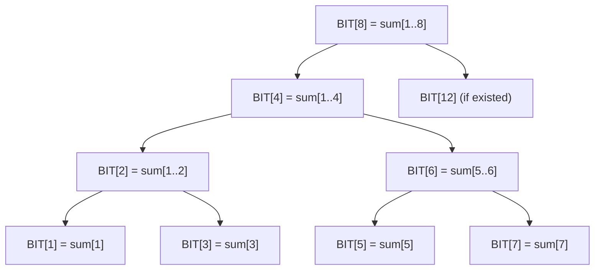

# Fenwick Tree (Binary Indexed Tree) - Complete Guide

### Time Estimate
- **Reading Time**: 45-60 minutes
- **Completing Activities**: 2-3 hours
- **Total Learning Time**: 3-4 hours

### Prerequisites
- **Basic Programming Concepts, Arrays, and Strings:** Variables, data types, conditional statements, loops (for, while). How to access elements, iterate, and basic operations
    - [JavaScript 2 - Arrays, Functions](/javascript/javascript-2-array-functions.md)
    - [JavaScript 1 - Variables, Strings, Numbers lesson](/javascript/javascript-1-variables.md)
- **Time and Space Complexity (Big O Notation):** A basic understanding of how to analyze algorithm efficiency.
    - [Runtime Complexity](/runtime-complexity/runtime-complexity.md)
    - [Intro to Algorithms](/algorithms/intro-to-algorithms.md)
- [Recursion](https://github.com/Techtonica/curriculum/tree/main/recursion)

### Motivation
Imagine you're building a leaderboard for a gaming platform where players' scores change frequently, and you need to quickly answer questions like:
- "What's the sum of scores from player 1 to player 100?"
- "What's the total score of all players up to rank 50?"

A naive approach would take O(n) time for each query. With millions of players and thousands of queries per second, this becomes too slow. Fenwick Trees solve this elegantly, reducing query time to O(log n) while keeping updates equally fast.

### Learning Objectives
By the end of this lesson, you will be able to:
1. Explain what a Fenwick Tree is and why it's useful
2. Understand the binary representation magic behind Fenwick Trees
3. Implement basic Fenwick Tree operations (update, query)
4. Apply Fenwick Trees to solve range sum problems
5. Analyze the time and space complexity of Fenwick Tree operations

## 🎯 What is a Fenwick Tree?

A Fenwick Tree (also called Binary Indexed Tree or BIT) is a data structure that efficiently:
- Calculates prefix sums (sum from index 0 to any index i)
- Updates individual elements
- Both operations run in O(log n) time

Think of it as a clever way to store partial sums that allows for quick calculations without recalculating everything from scratch.

### Real-World Applications
- **Gaming leaderboards**: Quick score summations
- **Financial systems**: Running totals of transactions
- **Analytics dashboards**: Cumulative metrics over time ranges
- **Inventory management**: Stock level tracking across regions

## 🔧 How Fenwick Trees Work

### The Key Insight: Binary Magic

The magic of Fenwick Trees lies in how they use binary representations of indices. Each position in the tree is responsible for a specific range of the original array.

<details>
<summary>Click to see the binary representation breakdown</summary>

| Index | Binary | Range   |
|-------|--------|---------|
| 1     | 001    | [1]     |
| 2     | 010    | [1, 2]  |
| 3     | 011    | [3]     |
| 4     | 100    | [1, 4]  |
| 5     | 101    | [5]     |
| 6     | 110    | [5, 6]  |
| 7     | 111    | [7]     |
| 8     | 1000   | [1, 8]  |

The pattern: Each index i in the Fenwick Tree stores the sum of elements from (i - (i & -i) + 1) to i in the original array.

</details>

### Visual Representation

Original Array: [3, 2, -1, 6, 5, 4, -3, 3]
Indices:        [1, 2,  3, 4, 5, 6,  7, 8]



## 💻 Implementation

### Basic Structure

<details>
<summary>Complete Fenwick Tree Implementation</summary>

```javascript
class FenwickTree {
    constructor(size) {
        this.size = size;
        this.tree = new Array(size + 1).fill(0); // 1-indexed
    }
    
    // Update element at index i by adding delta
    update(i, delta) {
        while (i <= this.size) {
            this.tree[i] += delta;
            i += i & (-i); // Move to next index to update
        }
    }
    
    // Get prefix sum from index 1 to i
    query(i) {
        let sum = 0;
        while (i > 0) {
            sum += this.tree[i];
            i -= i & (-i); // Move to parent
        }
        return sum;
    }
    
    // Get range sum from left to right (inclusive)
    rangeQuery(left, right) {
        return this.query(right) - this.query(left - 1);
    }
    
    // Build tree from existing array
    static fromArray(arr) {
        const ft = new FenwickTree(arr.length);
        for (let i = 0; i < arr.length; i++) {
            ft.update(i + 1, arr[i]); // Convert to 1-indexed
        }
        return ft;
    }
}
```

</details>

### Step-by-Step Walkthrough

Let's trace through building a Fenwick Tree with array [3, 2, -1, 6]:

#### Step 1: Initialize
```javascript
const ft = new FenwickTree(4);
// tree = [0, 0, 0, 0, 0] (index 0 unused)
```

#### Step 2: Insert first element (3 at index 1)
<details>
<summary>Trace the update process</summary>

```javascript
ft.update(1, 3);
// i = 1 (binary: 001)
// tree[1] += 3 → tree = [0, 3, 0, 0, 0]
// i += i & (-i) → i = 1 + 1 = 2

// i = 2 (binary: 010)  
// tree[2] += 3 → tree = [0, 3, 3, 0, 0]
// i += i & (-i) → i = 2 + 2 = 4

// i = 4 (binary: 100)
// tree[4] += 3 → tree = [0, 3, 3, 0, 3]
// i += i & (-i) → i = 4 + 4 = 8 > size, stop
```

</details>

#### Step 3: Continue with remaining elements
After inserting all elements [3, 2, -1, 6]:
```
Final tree: [0, 3, 5, -1, 10]
```

## 🎮 Interactive Activities

### Activity 1: Bit Manipulation Practice
Understanding `i & (-i)` is crucial. This operation finds the rightmost set bit.

```javascript
function rightmostSetBit(n) {
    return n & (-n);
}

// Try these:
console.log(rightmostSetBit(6));  // 6 = 110₂, result = 2
console.log(rightmostSetBit(8));  // 8 = 1000₂, result = 8
console.log(rightmostSetBit(5));  // 5 = 101₂, result = 1
```

### Activity 2: Build Your Own
<details>
<summary>Practice Implementation Challenge</summary>

```javascript
// Complete this implementation
class SimpleFenwickTree {
    constructor(arr) {
        this.n = arr.length;
        this.tree = new Array(this.n + 1).fill(0);
        
        // TODO: Initialize the tree with array values
        // Hint: Use update method for each element
    }
    
    update(i, val) {
        // TODO: Implement update
        // Remember: i should be 1-indexed
        // Use i += i & (-i) to move to next position
    }
    
    prefixSum(i) {
        // TODO: Implement prefix sum query
        // Use i -= i & (-i) to move to parent
    }
}

// Test your implementation
const arr = [1, 3, 5, 7, 9, 11];
const ft = new SimpleFenwickTree(arr);
console.log(ft.prefixSum(3)); // Should output 9 (1+3+5)
```

</details>

### Activity 3: Problem Solving
**Problem**: Given an array of student scores, efficiently handle:
1. Update a student's score
2. Find the sum of scores from student A to student B

<details>
<summary>Solution Approach</summary>

```javascript
class ScoreTracker {
    constructor(initialScores) {
        this.fenwick = FenwickTree.fromArray(initialScores);
        this.scores = [...initialScores]; // Keep original for reference
    }
    
    updateScore(studentIndex, newScore) {
        const oldScore = this.scores[studentIndex];
        const delta = newScore - oldScore;
        
        this.fenwick.update(studentIndex + 1, delta); // Convert to 1-indexed
        this.scores[studentIndex] = newScore;
    }
    
    getScoreSum(fromStudent, toStudent) {
        // Convert to 1-indexed and get range sum
        return this.fenwick.rangeQuery(fromStudent + 1, toStudent + 1);
    }
}

// Usage example
const scores = [85, 92, 78, 96, 88];
const tracker = new ScoreTracker(scores);

console.log(tracker.getScoreSum(1, 3)); // Sum of scores from student 1 to 3
tracker.updateScore(2, 95); // Update student 2's score to 95
console.log(tracker.getScoreSum(1, 3)); // New sum after update
```

</details>

## 📊 Complexity Analysis

| Operation | Time Complexity | Space Complexity |
|-----------|----------------|------------------|
| Build | O(n log n) | O(n) |
| Update | O(log n) | O(1) |
| Query | O(log n) | O(1) |
| Range Query | O(log n) | O(1) |

### Why O(log n)?
The height of the implicit tree structure is log n, and each operation traverses from a leaf to the root (or vice versa).

## 🔍 Common Pitfalls and Tips

### Pitfall 1: Index Confusion
Fenwick Trees are typically 1-indexed, but arrays are 0-indexed.

```javascript
// ❌ Wrong
fenwick.update(0, value); // Index 0 doesn't work in Fenwick Tree

// ✅ Correct  
fenwick.update(1, value); // Use 1-based indexing
```

### Pitfall 2: Forgetting Range Query Formula
```javascript
// Range sum from i to j is NOT query(j) - query(i)
// ✅ Correct formula:
rangeSum = query(j) - query(i - 1);
```

### Pro Tips
1. **Debugging**: Print the tree array to visualize what's happening
2. **Testing**: Always test with small arrays first
3. **Variants**: Learn about 2D Fenwick Trees for matrix problems

## 🎯 Practice Problems

1. **Easy**: Implement a Fenwick Tree that supports both point updates and range sum queries
2. **Medium**: Use Fenwick Tree to count inversions in an array
3. **Hard**: Implement a 2D Fenwick Tree for matrix range sum queries

## 📚 Additional Resources

- [Competitive Programming 3 by Steven Halim](https://cpbook.net/)
- [TopCoder Fenwick Tree Tutorial](https://www.topcoder.com/community/competitive-programming/tutorials/binary-indexed-trees/)
- [Codeforces Practice Problems](https://codeforces.com/problemset?tags=data%20structures)
