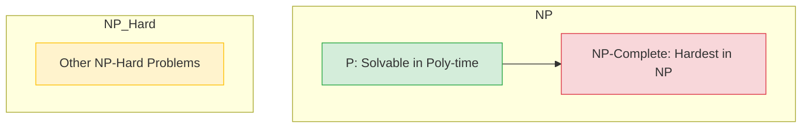

# NP-Completeness

## 📌 Introduction
In the world of computational complexity, we categorize problems based on the resources (time and space) required to solve them. **NP-Completeness** represents a class of problems for which no efficient (polynomial-time) solution is known to exist, yet if a solution is provided, it can be verified quickly.

### The Big Picture: P vs NP
- **P (Polynomial Time):** Problems that can be **solved** quickly (e.g., Sorting, Shortest Path).
- **NP (Nondeterministic Polynomial Time):** Problems where a solution can be **verified** quickly (e.g., Sudoku, Traveling Salesperson).
- **NP-Hard:** Problems that are "at least as hard" as the hardest problems in NP.
- **NP-Complete:** Problems that are both in **NP** and are **NP-Hard**.

---

## 🛠️ Interactive Walkthrough: The SAT Problem
The **Boolean Satisfiability Problem (SAT)** was the first problem proven to be NP-Complete.

### 1. The Challenge
Imagine a logic formula: `(A OR B) AND (NOT A OR C)`. 
Can you assign `True` or `False` to A, B, and C to make the whole expression `True`?

### 2. The "Brute Force" Approach (Exponential Time)
If you have $n$ variables, there are $2^n$ possible combinations.
- 10 variables $\rightarrow$ 1,024 combinations.
- 50 variables $\rightarrow$ 1.12 quadrillion combinations.
**This is why NP-Complete problems are computationally "expensive".**

### 3. The Verification (Polynomial Time)
If I tell you: `A=True, B=False, C=True`, you can check the formula instantly:
`(True OR False) AND (False OR True)` $\rightarrow$ `True AND True` $\rightarrow$ **True!**
**Verification is fast, solving is slow.**

---

## 🖼️ Visualizing Complexity Classes

---

## 🚀 Classical NP-Complete Problems

| Problem | Description | Real-world Application |
| :--- | :--- | :--- |
| **Traveling Salesperson (TSP)** | Find the shortest route visiting all cities once. | Logistics & Delivery |
| **Knapsack Problem** | Maximize value in a bag with weight limits. | Resource Allocation |
| **Clique Problem** | Find a complete subgraph of size $k$. | Social Network Analysis |
| **Vertex Cover** | Find minimum nodes to cover all edges. | Network Security |

---

## 💡 How to handle NP-Complete problems in production?
Since we can't find the *perfect* solution quickly, we use:
1. **Greedy Algorithms:** Fast, but might not find the absolute best solution.
2. **Dynamic Programming:** Works for smaller inputs (e.g., Knapsack).
3. **Approximation Algorithms:** Guarantees a solution within a certain % of the optimum.
4. **Heuristics:** Rules of thumb (e.g., Genetic Algorithms, Simulated Annealing).

## 📝 Exercises
1. [ ] Research the **Cook-Levin Theorem**.
2. [ ] Try to implement a brute-force solver for the **Subset Sum Problem**.
3. [ ] Explain in your own words why $P = NP$ would change the world of cryptography.
