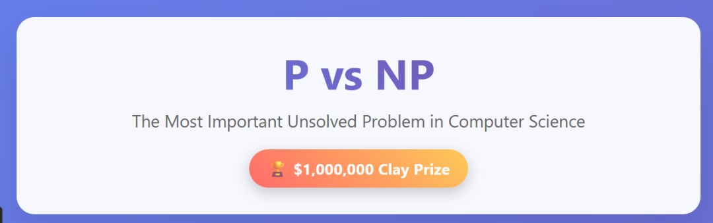
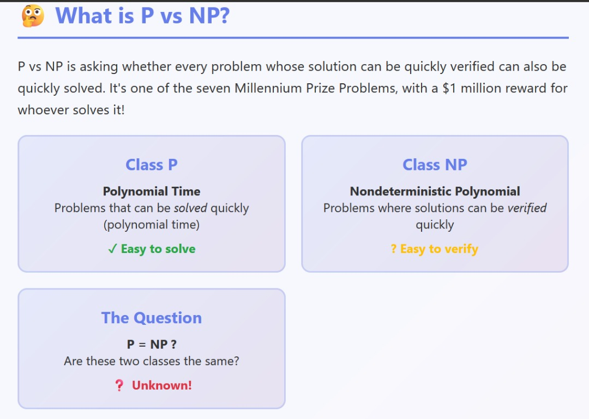
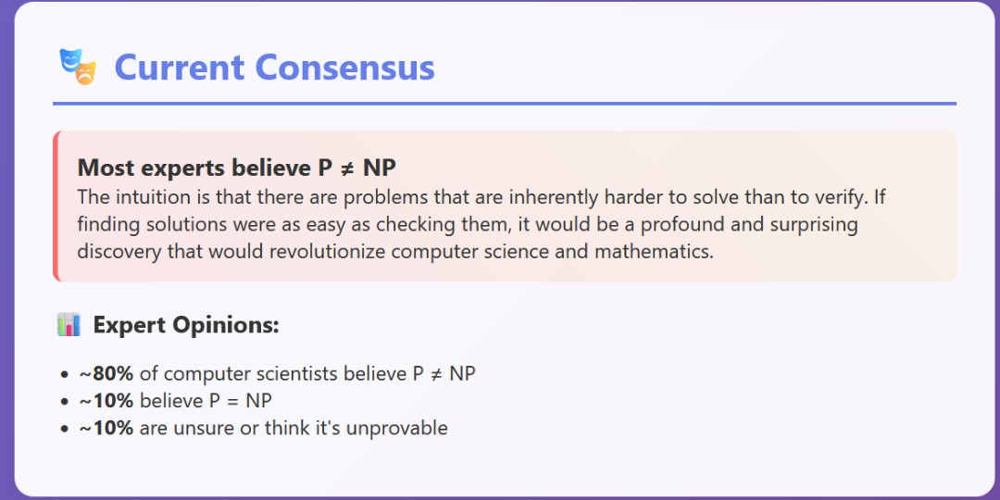
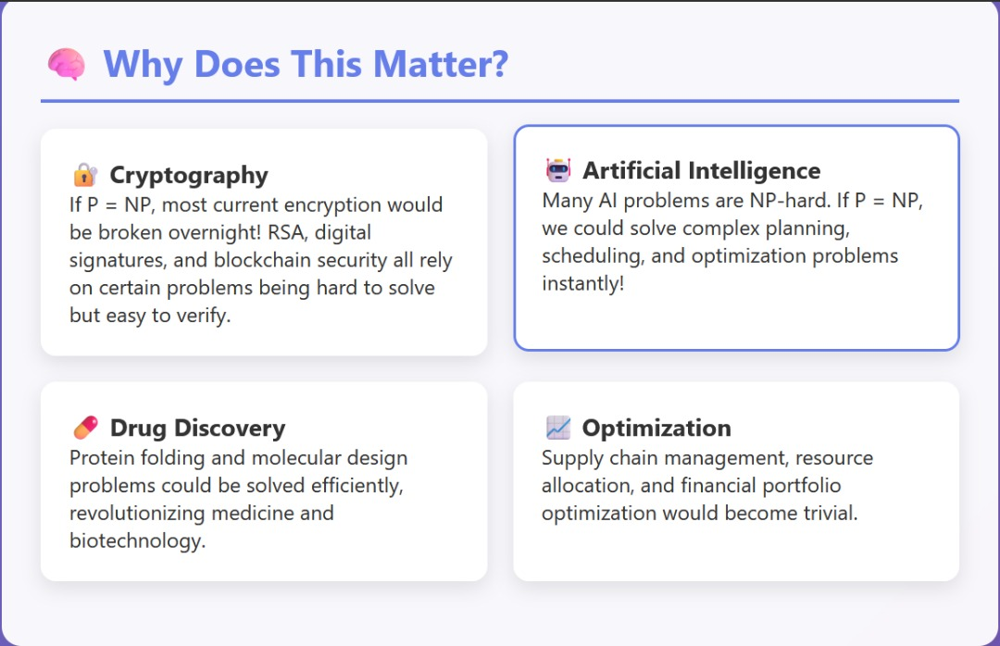
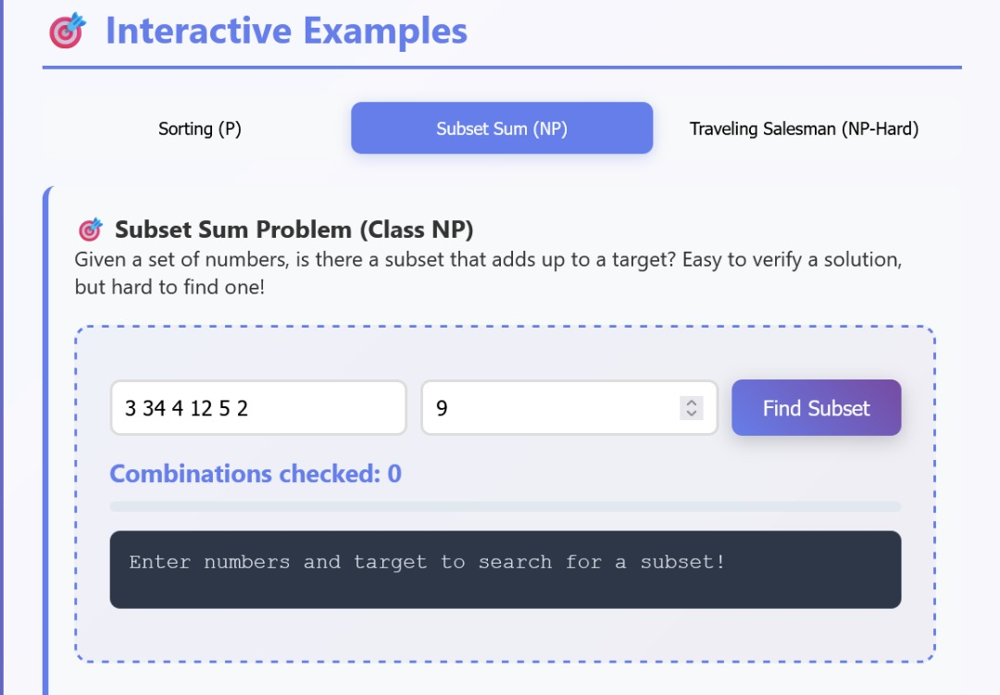
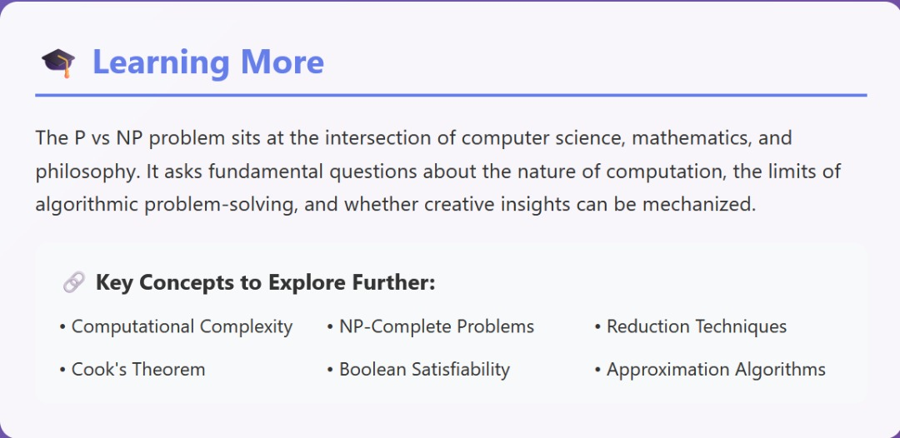

# P vs NP Problem

### Projected Time

45-60 minutes total

- Lesson - 25 min
- Video - 8 min
- Interactive Examples - 15 min
- Independent Practice - 10 min
- Check for Understanding - 12 min

### Prerequisites

Required:

- [Runtime Complexity](/runtime-complexity/runtime-complexity.md)
- [Intro to Algorithms](/algorithms/intro-to-algorithms.md)
- [Big-O Notation](/runtime-complexity/big-o-notation.md)

Recommended:

- [Searching Algorithms](/algorithms/searching.md)
- [Graph Algorithms](/algorithms/graph-algorithms.md)
- [Dynamic Programming](/algorithms/dynamic-programming.md)

### Motivation

Imagine you're organizing a massive music festival. You have a list of 1000 bands that want to perform, but you can only book 20 of them. Each band has different costs, popularity ratings, and scheduling requirements. Someone hands you a proposed lineup and asks "Is this the absolute best possible combination?" You can quickly check if it's good (just add up the costs and ratings), but finding the actual best combination would take you years of checking every possibility.

This is the heart of the P vs NP problem: there's a huge difference between checking if an answer is correct versus finding that answer in the first place. This isn't just academic - it affects everything from internet security to AI, medical research, and even your GPS navigation.

**Why should you care?**

- **Job Security**: If P = NP, many current tech jobs would disappear overnight as computers could solve previously impossible problems
- **Cryptography**: Your online banking, passwords, and private messages all depend on P ≠ NP being true
- **AI Breakthrough**: If P = NP, artificial intelligence would advance by decades in a single day
- **Million Dollar Prize**: Solve this problem and the Clay Mathematics Institute will give you $1,000,000

**Which companies are affected?**

- **Google**: Search algorithms, optimization problems, machine learning
- **Netflix**: Recommendation systems, content optimization
- **Amazon**: Supply chain optimization, pricing algorithms
- **Every tech company**: Encryption, security, algorithmic efficiency

### Objectives

**Participants will be able to:**

- Distinguish between problems that are easy to solve vs. easy to verify
- Distinguish between P and NP complexity classes
- Explain what P and NP complexity classes represent
- Provide examples of problems in each class
- Identify examples of P, NP, and NP-Hard problems
- Understand why P vs NP is considered the most important unsolved problem in computer science
- Explain why P vs NP matters for cybersecurity
- Recognize the real-world implications if P = NP or P ≠ NP
- Recognize NP-Complete problems and their significance
- Understand the current expert consensus on P ≠ NP
- Connect computational complexity to real-world applications

### Materials

- [Interactive P vs NP Demonstrator](https://cacm.acm.org/research/the-status-of-the-p-versus-np-problem/)
- [Video: P vs NP and the Computational Complexity Zoo](https://youtu.be/YX40hbAHx3s)
- [Slideshow: Understanding Computational Complexity](https://www.slideshare.net/slideshow/computational-complexitypptx/257802437)

### Lesson



#### What Does P vs NP Actually Mean?



Think of P vs NP like the difference between being a food critic and being a chef. A food critic can quickly taste a dish and tell you if it's delicious (verification), but creating that perfect dish from scratch might take hours of experimentation (solving).

**Class P (Polynomial Time)**
Problems that can be solved quickly. "Quickly" in computer science means the time grows polynomially with input size - like O(n), O(n²), or O(n³). Examples:

- Sorting a list of numbers
- Finding the shortest path between two points
- Checking if a number is even or odd

**Class NP (Nondeterministic Polynomial)**
Problems where, if someone gives you a potential solution, you can verify it's correct quickly. But finding that solution might be much harder. Examples:

- Sudoku: Easy to check if a completed puzzle is correct, hard to solve from scratch
- Password cracking: Easy to verify a password is correct, hard to guess it
- Finding the best team lineup: Easy to evaluate a proposed team, hard to find the optimal one

#### The Million Dollar Question



**P vs NP asks: Are these two classes the same?**

- If P = NP, then every problem that's easy to verify is also easy to solve. This would be revolutionary but most experts believe it's false.

- If P ≠ NP, then there are problems that are fundamentally harder to solve than to verify. This matches our intuition about many real-world problems.

#### Real-World Examples

Let's break this down with concrete scenarios:

**Easy Example - Sorting (Class P)**

```
Problem: Sort these numbers: [5, 2, 8, 1, 9]
Solution: [1, 2, 5, 8, 9]
Time to solve: O(n log n) - pretty fast
Time to verify: O(n) - even faster
```

_Source: Cormen, T. H., Leiserson, C. E., Rivest, R. L., & Stein, C. (2009). Introduction to Algorithms (3rd ed.). MIT Press. Chapter 2: Getting Started._

**Hard Example - Traveling Salesman (NP-Hard)**

```
Problem: Visit cities A, B, C, D, E exactly once, minimize distance
Proposed solution: A → C → E → B → D → A (distance: 150 miles)
Time to verify: O(n) - just add up the distances
Time to solve: O(n!) - check every possible route
```

For 10 cities, that's 3,628,800 possible routes to check. For 20 cities, it's 2.4 × 10¹⁸ routes - more than the age of the universe in seconds!

_Sources:_

- _Applegate, D. L., Bixby, R. E., Chvátal, V., & Cook, W. J. (2007). The Traveling Salesman Problem: A Computational Study. Princeton University Press._
- _Garey, M. R., & Johnson, D. S. (1979). Computers and Intractability: A Guide to the Theory of NP-Completeness. W. H. Freeman. Chapter 3._

#### Why This Changes Everything.



**If P = NP (most experts think this is false):**

- Break all current encryption instantly
- Solve protein folding, curing diseases
- Perfect AI planning and optimization
- Stock market prediction becomes trivial
- Most "creative" work could be automated

**If P ≠ NP (probably true):**

- Encryption remains secure
- Some problems stay fundamentally hard
- Human creativity retains value
- AI has fundamental limitations

_Sources:_

- _Aaronson, S. (2017). P vs. NP. In Open Problems in Mathematics (pp. 1-122). Springer._ [Available online](https://www.scottaaronson.com/papers/pnp.pdf)
- _Fortnow, L. (2009). The Status of the P Versus NP Problem. Communications of the ACM, 52(9), 78-86._ [DOI: 10.1145/1562164.1562186](https://doi.org/10.1145/1562164.1562186)
- _Wigderson, A. (2006). P, NP and mathematics–a computational complexity perspective. Proceedings of the International Congress of Mathematicians, 1, 665-712._

#### NP-Complete: The Hardest Problems

Some problems in NP are special - if you can solve any one of them quickly, you can solve ALL NP problems quickly. These are called NP-Complete. Examples:

- Boolean Satisfiability (SAT)
- Graph Coloring
- Subset Sum
- Traveling Salesman Problem

Stephen Cook proved in 1971 that SAT is NP-Complete, earning him the Turing Award. This means if anyone finds a polynomial-time algorithm for SAT, they've proven P = NP and solved the millennium problem.

_Sources:_

- _Cook, S. A. (1971). The complexity of theorem-proving procedures. Proceedings of the third annual ACM symposium on Theory of computing, 151-158._ [DOI: 10.1145/800157.805047](https://doi.org/10.1145/800157.805047)
- _Karp, R. M. (1972). Reducibility among combinatorial problems. In Complexity of computer computations (pp. 85-103). Springer._ [Available online](https://www.cs.berkeley.edu/~luca/cs172/karp.pdf)
- _ACM Turing Award: Stephen Cook (1982)._ [https://amturing.acm.org/award_winners/cook_n/](https://amturing.acm.org/award_winners/cook_n/)

### Additional Resources

**Books:**

- Sipser, M. (2012). _Introduction to the Theory of Computation_ (3rd ed.). Cengage Learning. Chapter 7: Time Complexity.
- Arora, S., & Barak, B. (2009). _Computational Complexity: A Modern Approach_. Cambridge University Press.

**Online Resources:**

- Clay Mathematics Institute: P vs NP Problem. [https://www.claymath.org/millennium-problems/p-vs-np-problem](https://www.claymath.org/millennium-problems/p-vs-np-problem)
- Complexity Zoo: P and NP Classes. [https://complexityzoo.net/Complexity_Zoo](https://complexityzoo.net/Complexity_Zoo)
- Scott Aaronson's Blog: Shtetl-Optimized. [https://www.scottaaronson.com/blog/](https://www.scottaaronson.com/blog/)

**Videos:**

- Computerphile: P vs. NP and the Computational Complexity Zoo. [https://youtu.be/YX40hbAHx3s](https://youtu.be/YX40hbAHx3s)
- MIT OpenCourseWare: Introduction to Algorithms, Lecture on Computational Complexity. [https://ocw.mit.edu/courses/electrical-engineering-and-computer-science/6-006-introduction-to-algorithms-fall-2011/](https://ocw.mit.edu/courses/electrical-engineering-and-computer-science/6-006-introduction-to-algorithms-fall-2011/)

### Common Mistakes / Misconceptions

- **"P vs NP is just theoretical"**

  Wrong! This affects encryption, AI, optimization, and countless real-world applications. The security of your credit card depends on certain problems being hard to solve.

- **"Computers are getting faster, so this doesn't matter"**

  Even if computers became a million times faster, exponential problems would still be impossibly slow for large inputs. Going from taking 10¹⁰⁰ years to 10⁹⁴ years doesn't help much.

- **"NP means 'Not Polynomial'"**

  Actually, NP stands for "Nondeterministic Polynomial." It's about verification time, not solution time.

- **"If we can't solve P vs NP, it's not important"**

  The question itself drives research into computational complexity, algorithm design, and helps us understand the fundamental limits of computation.

### Independent Practice



**Practice Exercises:**

**Subset Sum (NP)**
Given numbers [3, 7, 1, 8, 6], find a subset that adds to 10.

- How long did it take you to verify that [3, 7] = 10?
- How long to find it if you didn't know the answer?

**Graph Coloring (NP-Complete)**
Color a map so no adjacent regions have the same color, using minimum colors.

- Easy to check if a coloring is valid
- Hard to find the minimum number of colors needed

**Exercise 1:** Classification Practice
For each problem below, determine if it's in P, NP, or NP-Complete:

1. Finding the largest number in a list
2. Determining if a proposed solution to a Sudoku puzzle is correct
3. Solving a Sudoku puzzle from scratch
4. Checking if a number is prime
5. Factoring a large number into primes
6. Finding the shortest path in a weighted graph

**Exercise 2:** Real-World Connections
Think of a problem from your daily life or work. Can you:

- 1. Verify a solution quickly?
- 2. Find the solution quickly?
- 3. Classify it as P, NP, or something else?

### Check for Understanding

**Question 1:** Explain in your own words what it would mean if P = NP. Give two specific examples of how this would change the world.

**Question 2:** Your friend claims they've solved P vs NP by finding a polynomial-time algorithm for the Traveling Salesman Problem. What questions would you ask to verify their claim?

**Question 3:** Why do most computer scientists believe P ≠ NP, even though it hasn't been proven?

**Question 4:** Scenario Analysis
You're designing a system that needs to:

- Verify digital signatures (easy)
- Generate secure encryption keys (should be hard)
- How does the P vs NP problem relate to this system's security?

**Question 5:** Create your own example of a problem that's easy to verify but potentially hard to solve. Explain why verification is easier than finding the solution.

### Supplementary Materials

- [Clay Mathematics Institute: Millennium Problems](http://www.claymath.org/millennium-problems)
- [Scott Aaronson's Blog: Shtetl-Optimized](https://www.scottaaronson.com/blog/)
- [Computational Complexity Theory Course](https://www.udemy.com/course/computational-and-complexity-theory/?srsltid=AfmBOopOqAqY0FLKeUr0ccYzCDPiAGf3eFRAtC_3sEtxd2GvkUOJs72_)
- [Interactive Complexity Theory Visualizations](https://www.coursera.org/professional-certificates/data-analytics)


