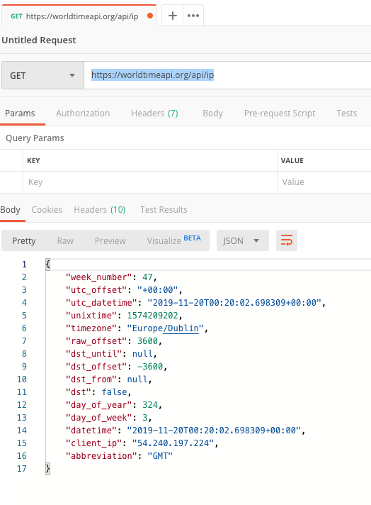
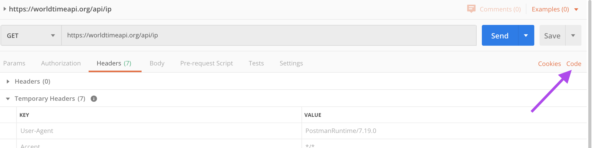

# HTTP Request Practice

### Projected Time

** TODO: add**
Example: ????
- Lesson: ? min
- Guided Practice: ?-? min
- Independent Practice: ? min
- Check for Understanding: ?-? min

### Prerequisites

**TODO: add**

?????


### Motivation

HTTP is the most common way you will retrieve anything form the internet: usually web pages or API data (see [API & JSON lesson](https://github.com/Techtonica/curriculum/blob/master/api/apis-and-json.md)). It's the backbone of the web. Since HTTP is so simple and versatile (it's just text!), you can make requests lots of different ways.

### Objectives

**Participants will be able to:**

- Make HTTP requests using a variety of tools

### Specific Things to Learn

- Basics of an HTTP Request
- Six different ways to make an HTTP request
	- Postman (Mac GUI app)
	- curl
	- XMLHttpRequest (aka AJAX) in the browser
	- fetch (promises) in the browser
	- http.request in Node.js
	- fetch in Node.js

### Materials

- [HTTP Crash Course](https://www.youtube.com/watch?v=iYM2zFP3Zn0) - _first 17 minutes are all that matter but feel free to watch the whole thing as it covers Postman_
-  b0rk's [Anatomy of an HTTP Request](https://twitter.com/b0rk/status/1145362860136177664/photo/1)

### Lesson

HTTP requests are text-based messages used to request a resource from a server. In these lessons we'll focus on GET requests but there are other methods as well, such as POST, which is used on a form to submit data or in an API to save data.

TODO: slides
- [Be sure to link the slideshow, video,](google.com)
- [or other materials you expect them to follow as part of the lesson.](google.com)

#### Postman - Time API

Open Postman and make a new GET request.

`https://worldtimeapi.org/api/ip`



Inspect the result. If you want you can try out other types of requests listed on the [API doc](http://worldtimeapi.org/). Varying the URL will give you different data.


#### curl - Time API

Now let's make the same request using the [`curl`](https://en.wikipedia.org/wiki/CURL) command line unix utility.

Find the `Code` link in Postman on the right.



This will allow us to make the same request using a variety of other tools. Choose `cURL` from the dropdown.

You will see something like this:

```bash
curl -X GET \
  https://worldtimeapi.org/api/ip \
  -H 'Accept: */*' \
  -H 'Accept-Encoding: gzip, deflate' \
  -H 'Cache-Control: no-cache' \
  -H 'Connection: keep-alive' \
  -H 'Host: worldtimeapi.org' \
  -H 'Postman-Token: 8d3f63db-f54f-48fe-997f-f1f678464644,f75b0ac1-ec5e-489d-af1a-fdefc80d56f9' \
  -H 'User-Agent: PostmanRuntime/7.19.0' \
  -H 'cache-control: no-cache'
```

Copy this entire snippet and paste into Terminal.

You should see output like this:

```json
{"week_number":47,"utc_offset":"-08:00","utc_datetime":"2019-11-20T17:08:24.181139+00:00","unixtime":1574269704,"timezone":"America/Los_Angeles","raw_offset":-28800,"dst_until":null,"dst_offset":0,"dst_from":null,"dst":false,"day_of_year":324,"day_of_week":3,"datetime":"2019-11-20T09:08:24.181139-08:00","client_ip":"69.181.221.255","abbreviation":"PST"}%
```

##### Note about HTTP Headers
You might wonder where all those `-H` lines are coming from when we only put the URL in Postman. As we learned in the HTTP video, headers tell the server additional options. They are like _flags_ in a command line tool or _parameters_ in a JavaScript function. In the case of HTTP, they are almost always optional. 

- Copy _only_ the first two lines and paste it into terminal (do not include the second `\`)
- The result should be the same

Why was it the same? In our case, Postman generated a set of sensible defaults. If we omit them, the server will have its own sensible defaults and so the result is more or less the same.

##### Discussion - Postman & `curl`

- If Postman can generate code for `curl` and other tools, what does that tell us about Postman?

#### XMLHttpRequest - Time API

Now let's go into the browser world, which is more useful for creating web apps.

TODO: instructions

**Editor's note: Is this useful? I don't think I've _ever_ used raw AJAX in my career. I'd recommend moving straight to fetch**


#### `window.fetch` - Time API

**TODO : are promises already known at this stage in the curriculum?**

The `XMLHttpRequest` interface was so awkward that most applications used libraries to wrap it in a friendlier syntax. jQuery was the most common one because it also gave developers lots of other helpful utilities.

However, newer browsers expose an interface called `fetch` that is much easier to use and leverages native `Promise` for clean response and error handling.

Let's try it out!

- Open `https://worldtimeapi.org/` in your browser
- Open the Developer console
- `response = await fetch('https://worldtimeapi.org/api/ip')`
- Once the promise resolves, response will contain a JavaScript object representing the response from the server
- To see the body as like above, execute `await response.json()`

```javascript
Object { week_number: 47, utc_offset: "-08:00", utc_datetime: "2019-11-20T19:17:12.777523+00:00", unixtime: 1574277432, timezone: "America/Los_Angeles", raw_offset: -28800, dst_until: null, dst_offset: 0, dst_from: null, dst: false, … }
```

##### fetch - Discussion Questions

- Notice that even retrieving the body uses Promises (not the `await`). What are some reasons this might be the way it was designed?

##### fetch - Browser Compatibility

[https://caniuse.com/#feat=fetch](https://caniuse.com/#feat=fetch)

Almost all modern browsers support `fetch`. Unless your app needs to support IE11, then it's safe to use. Even then, you can polyfill it.

### `http.request` in Node

There are too many HTTP libraries to count in Node, but there is one that is built-in that we'll use.

```javascript
const options = {
  hostname: 'worldtimeapi.org',
  port: 443,
  path: '/api/ip',
  method: 'GET'
};

const req = https.request(options, res => {
  console.log(`statusCode: ${res.statusCode}`)

  res.on('data', d => {
    process.stdout.write(d)
  })
});

req.end();

```

### Common Mistakes / Misconceptions

Open a new tab and try to issue the same `fetch` command. What happens?

- [b0rk explains CORS](https://twitter.com/b0rk/status/1162392625057583104)
- [Hacking It Out: When CORS won’t let you be great](https://medium.com/netscape/hacking-it-out-when-cors-wont-let-you-be-great-35f6206cc646)

To keep things simply, for this example, we just load the same origin, worldtimeapi.org, so we don't have to worry about it.

### Guided Practice

`fetch` is a standard added by browsers but if you like it, it's also available as a [package for node](https://www.npmjs.com/package/node-fetch). Let's use it!

- `npm install --save node-fetch`
- open node REPL
- `require('node-fetch')`
- Run the same command from fetch in the browser but in your node repl


### Independent Practice

Since there are tons of libraries out there, now's a great time to try a few and see what you like/dislike about them compared to those we used above.

- [5 Ways to Make HTTP Requests in Node.js](https://www.twilio.com/blog/2017/08/http-requests-in-node-js.html)

*Exercise:* Choose 2 libraries from the above article and take a few notes comparing them.

### Challenge

#### Advanced: DIY using telnet

- `brew install telnet` if not installed
- format is `telnet server port` (note: it's not a colon like in a URL)
- `telnet www.google.com 80`
- It will connect and inform you of the escape character
- type `GET / HTTP/1.1` then enter twice. This is the smallest valid HTTP request
- A Google web server will spit out the Google home page

If you're curious what each required piece is, check out this [simplified HTTP specification](https://www.jmarshall.com/easy/http/#requestline). The [complete spec](https://www.w3.org/Protocols/rfc2616/rfc2616.html) is huge and uses a formal mathematical language if you want to go down a rabbit hole.

#### Discussion Question

- Why would you pick one way to make a request over another?
- What affordances to higher-level libraries give us? What does "higher-level library" mean?
- Aside from ease of use from an engineer perspective, what other pros/cons would a software team use to choose an HTTP library for their project?

### Check for Understanding

Some ideas: have apprentices summarize to each other, make a cheat sheet, take a quiz, do an assignment, or something else that helps them self-assess their understanding. This exercise should help apprentices determine whether they've met the outline objectives, or if they need to review.

- On paper or in TextEdit, write out a basic HTTP request and show it your pair to validate. Is anything missing?
- Write out the syntax for a request using `fetch` in the browser. Show it to your pair to validate.

### Supplemental Materials


- [HTTP Status Code Cats](https://http.cat/ =100px)

*TODO: add*
