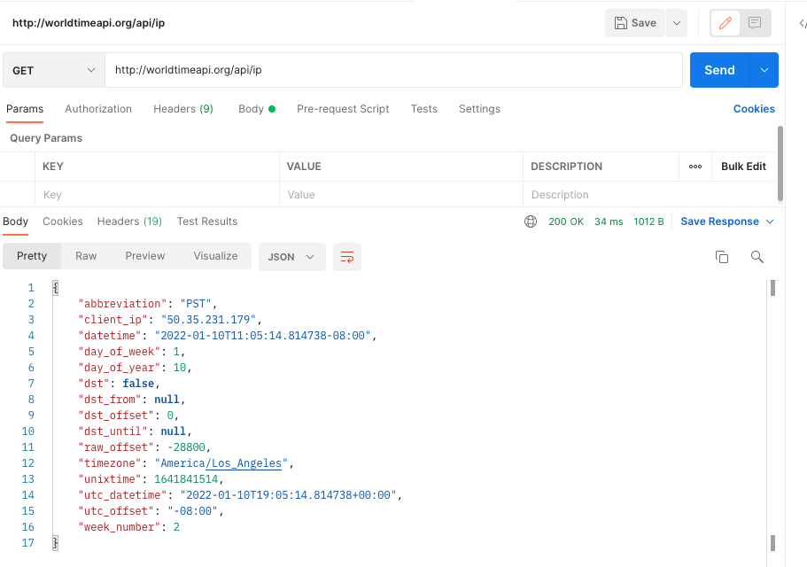
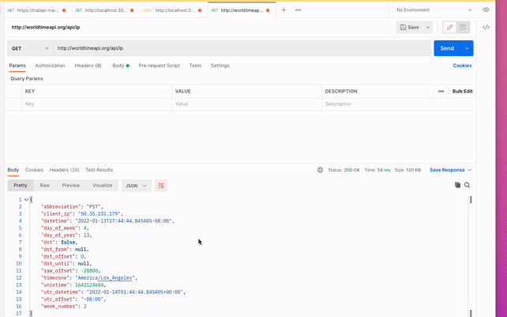

# HTTP Request Practice

### Projected Time

1.5 hour total

- Lesson: 45 min
- Guided Practice: 10 min
- Independent Practice: 15 min
- Check for Understanding: 20 min

### Prerequisites

- [Intro to HTTP](/api/intro-to-http.md)

### Motivation

HTTP is the most common way you will retrieve anything from the internet: usually web pages or API data (see [API & JSON lesson](./apis-and-json.md)). It's the backbone of the web. Since HTTP is so simple and versatile (it's just text!), you can make requests lots of different ways.

### Objectives

**Participants will be able to:**

- Make HTTP requests using a variety of mechanisms.

### Specific Things to Learn

- Basics of an HTTP Request
- Six different ways to make an HTTP request - Postman (Mac GUI app) - curl - XMLHttpRequest (aka AJAX) in the browser - fetch (promises) in the browser - http.request in Node.js - fetch in Node.js

### Lesson

HTTP requests are text-based messages used to request a resource from a server. In these lessons we'll focus on GET requests but there are other methods as well, such as POST, which is used on a form to submit data or in an API to save data.

- [Google Slides](https://docs.google.com/presentation/d/1UI4XmRD3usA67ddO_8VLU3vAR4zfFXWZZaiUSKNLCXM/edit#slide=id.p)

#### Postman - Time API

Open Postman to make a new GET request.

`http://worldtimeapi.org/api/ip`



Inspect the result. If you want you can try out other types of requests listed on the [API doc](http://worldtimeapi.org/). Varying the URL will give you different data.

#### curl - Time API

Now let's make the same request using the [`curl`](https://en.wikipedia.org/wiki/CURL) command line unix utility.

Find the `Code` link in Postman on the right.



This will allow us to make the same request using a variety of other tools. Choose `cURL` from the dropdown.

You will see something like this:

```bash
curl -X GET \
  http://worldtimeapi.org/api/ip \
  -H 'Accept: */*' \
  -H 'Accept-Encoding: gzip, deflate' \
  -H 'Cache-Control: no-cache' \
  -H 'Connection: keep-alive' \
  -H 'Host: worldtimeapi.org' \
  -H 'Postman-Token: 8d3f63db-f54f-48fe-997f-f1f678464644,f75b0ac1-ec5e-489d-af1a-fdefc80d56f9' \
  -H 'User-Agent: PostmanRuntime/7.19.0' \
  -H 'cache-control: no-cache'
```

Copy this entire snippet and paste into Terminal.

You should see output like this:

```json
{"week_number":47,"utc_offset":"-08:00","utc_datetime":"2019-11-20T17:08:24.181139+00:00","unixtime":1574269704,"timezone":"America/Los_Angeles","raw_offset":-28800,"dst_until":null,"dst_offset":0,"dst_from":null,"dst":false,"day_of_year":324,"day_of_week":3,"datetime":"2019-11-20T09:08:24.181139-08:00","client_ip":"69.181.221.255","abbreviation":"PST"}%
```

##### Note about HTTP Headers

You might wonder where all those `-H` lines are coming from when we only put the URL in Postman. As we learned in the HTTP video, headers tell the server additional options. They are like _flags_ in a command line tool or _parameters_ in a JavaScript function. In the case of HTTP, they are almost always optional.

- Copy _only_ the first two lines and paste it into terminal (do not include the second `\`)
- The result should be the same

Why was it the same? In our case, Postman generated a set of sensible defaults. If we omit them, the server will have its own sensible defaults and so the result is more or less the same.

##### Discussion - Postman & `curl`

- If Postman can generate code for `curl` and other tools, what does that tell us about Postman?

#### XMLHttpRequest - Time API

Now let's go into the browser world, which is more useful for creating web apps.

First, we will use the original interface, `XMLHttpRequest` which was added to JavaScript to allow the original background requests commonly called _AJAX_. It is a little awkward to use.

```javascript
function reqListener() {
  console.log(this.responseText);
}

let oReq = new XMLHttpRequest();
oReq.addEventListener('load', reqListener);
oReq.open('GET', 'https://worldtimeapi.org/api/ip');
oReq.send();
```

If correct, you should see the result:

```javascript
Object { week_number: 47, utc_offset: "-08:00", utc_datetime: "2019-11-20T19:17:12.777523+00:00", unixtime: 1574277432, timezone: "America/Los_Angeles", raw_offset: -28800, dst_until: null, dst_offset: 0, dst_from: null, dst: false, … }
```

#### `window.fetch` - Time API

Newer browsers expose an interface called `fetch` that is much easier to use and leverages native `Promise` for simpler processing of the result. And since it is built-in you don't need to add any libraries to use it in the browser.

Let's try it out!

- Open [https://worldtimeapi.org/](https://worldtimeapi.org/) in your browser
- Open the Developer console
- `response = await fetch('https://worldtimeapi.org/api/ip')`
- Once the promise resolves, response will contain a JavaScript object representing the response from the server
- To see the body as like above, execute `await response.json()`

##### fetch - Discussion Questions

- Notice that even retrieving the body uses Promises (not the `await`). What are some reasons this might be the way it was designed?
- Usually you need to be inside an `async` function to use `await`? Why didn't we need to worry about that here?

##### fetch - Browser Compatibility

[https://caniuse.com/#feat=fetch](https://caniuse.com/#feat=fetch)

Almost all modern browsers support `fetch`. Unless your app needs to support IE11, then it's safe to use. Even then, you can polyfill it, e.g. [Github's polyfill](https://github.github.io/fetch/).

### Common Mistakes / Misconceptions

Open a new tab to try to issue the same `fetch` command.

- Open a new tab to blank or google.com in your browser
- Open the Developer console
- `response = await fetch('https://worldtimeapi.org/api/ip')`
- Once the promise resolves, response will contain a JavaScript object representing the response from the server
- To see the body as like above, execute `await response.json()`

What happens?

- [b0rk explains CORS](https://twitter.com/b0rk/status/1162392625057583104)
- [Hacking It Out: When CORS won’t let you be great](https://medium.com/netscape/hacking-it-out-when-cors-wont-let-you-be-great-35f6206cc646)

To keep things simple, for this example, we just load the same origin, worldtimeapi.org, so we didn't have to worry about it.

### `http.request` in Node

There are too many HTTP libraries to count in Node, but there is one that is built-in that we'll use.

```javascript
const options = {
  hostname: 'worldtimeapi.org',
  port: 443,
  path: '/api/ip',
  method: 'GET'
};

const req = https.request(options, (res) => {
  console.log(`statusCode: ${res.statusCode}`);

  res.on('data', (d) => {
    process.stdout.write(d);
  });
});

req.end();
```

### Guided Practice

fetch is a standard added by browsers but if you like it, it's also available as a package for node. Let's use it!

- npm install --save node-fetch
- open node REPL
- require('node-fetch')
- Run the same command from fetch in the browser but in your node repl

### Independent Practice

Since there are tons of libraries out there, now's a great time to try a few and see what you like/dislike about them compared to those we used above.

#### Exercise

- Choose 2 libraries from the above article and take a few notes comparing them.
- Which was your most favorite of the 5 + 2? Your _least favorite_?

#### Discussion Question

- Why would you pick one way to make a request over another?
- What affordances to higher-level libraries give us? What does "higher-level library" mean?
- Aside from ease of use from an engineer perspective, what other pros/cons would a software team use to choose an HTTP library for their project?

### Check for Understanding

Sync up with your pair partner and go through the following exercises.

#### Discuss Your Most/Least Favorite Tools from this List

- Did either of you choose the same one?

### Supplemental Materials

- [Axios](https://github.com/axios/axios) - a popular HTTP client library for Node
