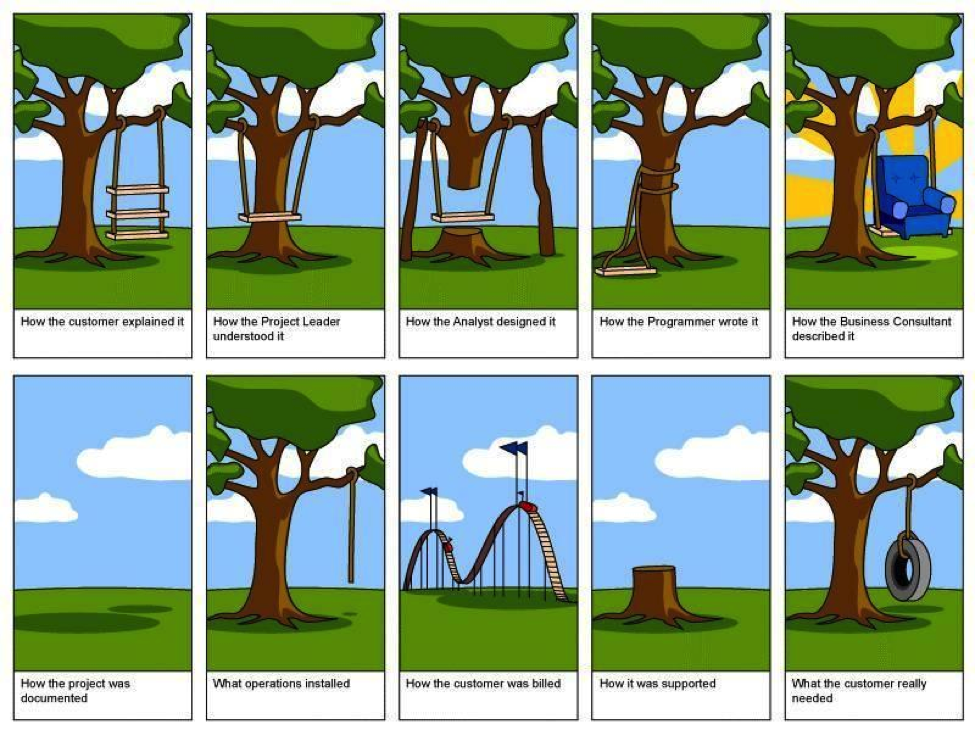

# Technical Program Manager

### Projected Time

30-45 minutes

### Prerequisites

In General you will need following to be a Technical Program Manager:

- **Technical Competency**
- **Project/Program Management & Agile Experience**
- **Past Experience in Handling & Leading Development Teams**

### Motivation

- **Better Estimates**
- **Add Value to Other Parts of the Project**
- **Be the Link Between Development and the Business**

### Objectives

**Participants will be able to:**

- Create and maintain a project plan with tasks and estimates
- Communicate with both IT and business stakeholders
- Risk management and escalation
- Manage scope

### Specific Things to Learn

- What is TPM ?
- Career Path
- Work Responsible for
- Challenges

### Materials

- [Techtonica Slides](https://docs.google.com/presentation/d/1q_sa93_LGQTZhNHyBnQHJmaO_2wgVD_7Mz7-gAjFZ8U/edit#slide=id.p)
- [TPM Overview](http://www.mariogerard.com/technical-program-manager/)

### Lesson

**What is a TPM?**

_TPM stands for **“technical program manager”** a team that manages the coordination of business decisions and leads design through the implementation of the infrastructure._

**Career Path**

1. Technical Program Manager
2. Technical Program Manager II
3. Technical Program Manager III
4. Principal Technical Program Manager
5. Sr. Principal Technical Program Manager

**Technical Program Manager (TPM) is Responsible for:**

- Enabling the team to launch various features
- Leads the sprints, gathers requirements from the product managers
- Sets up architectural reviews with teams consuming the service
- Helps out in on-call and escalation

**Types of Technical Program Managers**

- Front End
- Backend
- Integration
- Business Intelligence
- ERP
- Localization
- Hardware
- Data Center
- Process
- Security
- Cloud TPM
- UI/UX

Perhaps the biggest **advantage** to being a **technical project manager** is having the ability to fill the communication gap between the development team and the business team.

This can manifest itself in many ways:

- Describing how individual development components relate to the big picture for an organization
- Ensuring the business team understands why certain technical decisions were made along with the benefits and trade-offs
- Explaining to the business why a requirement may not be technologically feasible but here are some alternatives

**What Now?**

So now you’re convinced that you should become a technical project manager – **but how?**

1. Take Time to Understand Your Project/Product.
2. Learn to Code on Your Own.
3. Build Something on your Own.

**Challenges**

- Lack of loyalty in employees and corporate bosses.
- Evolution of Technology.
- Globalism in HR.
- Self Image and Proper Restraint.

### Common Mistakes / Misconceptions

- **Tech Project Manager is only skilled in project management**
- **Tech Project Manager Job is to create reports/ Gantt charts**
- **No role for Tech Project Manager in Agile context**
- **Tech Project Manager role is the same across the organisation**

### Independent Practice

Try to manage or lead a project in your current organization or your team.

### Check for Understanding

- Are you able to manage or lead the project?
- Can you deliver project on time?
- Can you Plan for problems and potential conflicts?

### Supplemental Materials

- [TPM wiki](https://en.wikipedia.org/wiki/Program_management) - Use it as a reference.
- [Program management roles](https://www.pmi.org/learning/library/roles-responsibilities-skills-program-management-6799) - Use it to understand the roles.
