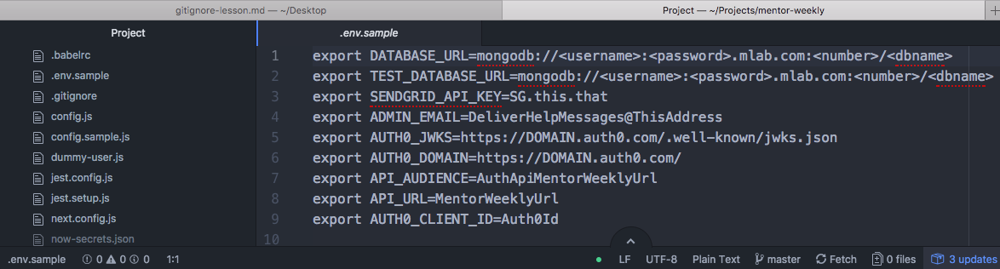
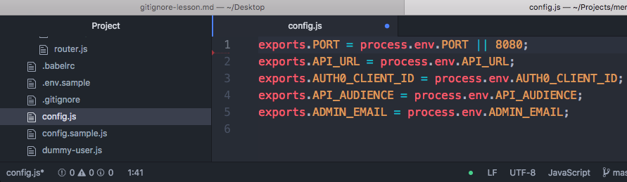
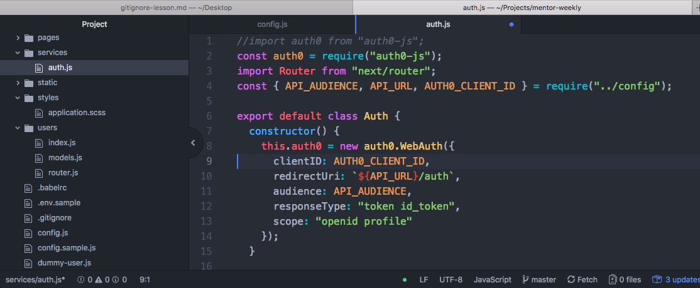

# About .env files

### Projected Time

About 20-30 minutes

### Prerequisites

Here are links to lessons that should be completed before this lesson:

- [Command Line Interface](https://github.com/Techtonica/curriculum/blob/master/command-line/command-line-interface.md)
- [.gitignore lesson](https://github.com/Techtonica/curriculum/blob/master/git-version-control/gitignore.md)

### Motivation

Using a .env (pronounced "env", "dot-env", or "dot-E-N-V") can help you avoid exposed authorization or login credentials by securing these as secret variables. If you add the .env containing your variables to your .gitignore right away, it will never get added or commited to github, and your secrets stay local.

### Objectives

**Participants will be able to:**

- make a .env file
- add it to gitignore
- export variables to a config
- reference the config anywhere while you develop locally
- add env variables to heroku or netlify for deployment

### Specific Things To Teach

- What is a .env?
	- How to write a .env file
	- How to share a .env file
- What is a config.js?
	- How to write a config file
- How to make environment variables in the terminal
- How to use environment variables in your project using .env, config.js, and destructuring the config variables
- Using source .env

### Materials

- [Using Environment Variables - Free Code Camp](https://medium.freecodecamp.org/heres-how-you-can-actually-use-node-environment-variables-8fdf98f53a0a)

### Lesson

.env files are for project *environment variables*. These files often include sensitive data like:
	- API keys, which are private permission keys that allow you make a limited number of requests for data from sites like AllRecipes or GoogleMaps
	- Database URLs
	- All user authorization IDs and URLs, which you would need to set up OAuth, Okta, Auth0, etc.
  

Build on the first information. Have apprentices guess things, do an activity, etc.

### Common Mistakes / Misconceptions

***I'll just remember to remove my sensitive data before every a commit.***
- It only takes one stray commit to expose your database or authorization id's to the public!
- It's much easier to create this list file and add it to .gitignore than it is to come up with a new database or API key.

### Guided Practice

Have the apprentices work with you as you do something.

### Independent Practice

Class does this thing themselves with specific additional items.

### Challenge

Apprentices can try to do this other thing.

### Check for Understanding

Some ideas: have apprentices summarize to each other, make a cheat sheet, take a quiz, do an assignment, or something else that helps assess their understanding.
