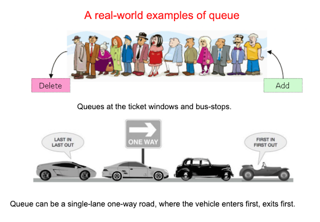

# Queues

### Projected Time

About 60-90 minutes

- Lesson Slides: 15 min
- Medium Article: 15 min
- Video Materials: 10 min
- Group Discussion: 10 min
- Independent Practice: 30 min

### Prerequisites

- [What is a Data Structure](/data-structures/intro-to-data-structures.md)
- [Runtime Complexity](/runtime-complexity/runtime-complexity.md)

### Motivation

Queues are widely used both in programming and in real life. _In programming_: if you have an array of tasks to execute and not enough time to do them all as they come in, you'll need some way to both track the tasks and execute them in the order they arrived. _In real life_: queue can be a single-lane one-way road, where the vehicle enters first, exits first. More real-world examples can be seen as queues at the ticket windows and bus-stops- there are many everyday scenarios that are real-life implementations of queues.



Application of queue in computer science:

- When a resource is shared among multiple consumers. Examples include CPU scheduling, Disk Scheduling.
- When data is transferred asynchronously (data not necessarily received at same rate as sent) between two processes. Examples include IO Buffers, pipes, file IO, etc.
  [(geeksforgeeks)](https://www.geeksforgeeks.org/applications-of-queue-data-structure/)

### Objectives

**Participants will be able to:**

- Understand when to use a queue
- Be familiar with common methods
- Implement a queue
- Find and use a queue library
- Discern performance tradeoffs for different implementations of a queue

### Specific Things to Learn

- Properties of a queue
- Common use cases for queues
- Review of common implementation(s)

### Materials

- [Queue Slides](https://docs.google.com/presentation/d/1-jcSrAvf6Bnaa-vV9uhGx2x3Zxoi5-EaEN7ybx3M4Kc/edit#slide=id.g3c8d44f31f_0_54)
- [A Gentle Introduction to Data Structures: How Queues Work (20 mins read)](https://medium.freecodecamp.org/a-gentle-introduction-to-data-structures-how-queues-work-f8b871938e64)
- [Introduction to queues video (10 mins watch)](https://www.youtube.com/watch?v=XuCbpw6Bj1U)

### Lesson

1. Read through lesson slides [Queue](https://docs.google.com/presentation/d/1-jcSrAvf6Bnaa-vV9uhGx2x3Zxoi5-EaEN7ybx3M4Kc/edit#slide=id.g3c8d44f31f_0_54).
2. Watch the video and read the article in the materials section.

#### What is Queue?

A queue is an ordered list of elements where an element is inserted at the end of the queue and is removed from the front of the queue.

A queue follows the _First-In First-Out (FIFO)_ paradigm: the first item added will be the first item removed.

#### Implementation of Queue in Javascript

A queue can be implemented in javascript with the help of an array object.

**Basic Operations**

- `enqueue()` - add new element(s) to the queue;
- `dequeue()` - remove first element from the queue;
- `front() or peek()` - returns the first element from the queue without removing it.(for checking purposes);
- `isEmpty()` - returns if the queue is empty or not;
- `getLength()` - returns how many elements the queue contains.

### Guided Practice

Let’s create a MyQueue constructor

```js
// create a constructor function called myQueue
function MyQueue() {
  //array to store its elements.
  this.elements = [];
}
```

The `enqueue()` method add elements to a queue at the last position or index. The [push()](https://developer.mozilla.org/en-US/docs/Web/JavaScript/Reference/Global_Objects/Array/push) method can be used to implement enqueue.

```js
MyQueue.prototype.enqueue = function (value) {
  return this.elements.push(value);
};
```

The `dequeue()` method remove the first element from the queue and return it. The [shift()](https://developer.mozilla.org/en-US/docs/Web/JavaScript/Reference/Global_Objects/Array/shift) method can be used to implement dequeue.

```js
MyQueue.prototype.dequeue = function () {
  return this.elements.shift();
};
```

> **_NOTE:_** Time complexity of _Enqueue_ and _Dequeue_ is O(1).

The `peek()` method looks at the first element without popping it from the queue.

```js
MyQueue.prototype.peek = function () {
  return this.elements[0];
};
```

The `isEmpty()` method checks if a queue is empty and returns true if the queue is empty. we can implement by checking if the length property of the array is zero.

```js
MyQueue.prototype.isEmpty = function () {
  return this.elements.length === 0;
};
```

The `getLength()` method returns the length of a queue object.

```js
MyQueue.prototype.getLength = function () {
  return this.elements.length;
};
```

You can use other method to implement Queue in JS. Here is another example using `Class` constructor.

```js
class MyQueue {
  constructor() {
    this.elements = [];
  }
  // add new element
  enqueue(e) {
    return this.elements.push(e);
  }
  // remove first element
  dequeue() {
    return this.elements.shift();
  }
  // get the length of queue
  getLength() {
    return this.elements.length;
  }
  // checks if it is empty
  isEmpty() {
    return this.elements.length === 0;
  }
  // get the first element
  peek() {
    return this.elements[0];
  }
}
```

Now let’s use the MyQueue function and its different method described above

```js
// create an instance of MyQueue
const queue1 = new MyQueue();

console.log(queue1); // {elements: []}

const queue1 = new MyQueue();

console.log(queue1.isEmpty()); // true

queue1.enqueue(1);
queue1.enqueue(2);
queue1.enqueue(3);

console.log(queue1); // {elements: [1, 2, 3]}

console.log(queue1.dequeue()); // 1

console.log(queue1); // {elements: [2, 3]}

console.log(queue1.peek()); // 2

console.log(queue1.getLength()); // 2

console.log(queue1.isEmpty()); // false
```

You can see completed code on [codepen](https://codepen.io/SupriyaRaj/pen/qBVaLyr?editors=1111)

### Common Mistakes / Misconceptions

- There may be an implementation that is very simple, but untenable for larger queues.

### Guided Practice

Discuss with your pair group for the day how a queue differs from other data structures already reviewed. Some suggested questions to consider:

- What are the methods a queue must have?
- What can be tracked in a queue?
- When would a queue be used?
- What other data structures are used to make a queue?

### Independent Practice

Implement a queue in JavaScript with a partner, keeping in mind all methods and helper methods that define a queue. Consider performance -- what happens as you call specific methods you've defined?

### Challenge

Search online with your partner for a way to implement a queue other than the one you just tried. Is this second implementation better? Why or why not?

### Supplemental Materials

- [Queue concepts video (7 mins watch)](https://youtu.be/PjQdvpWfCmE)
- [Introduction to Queues video (9 mins watch)](https://www.youtube.com/watch?v=XuCbpw6Bj1U)
- [Queues Practical Use Case - Messaging (video 10 mins watch)](https://www.youtube.com/watch?v=oUJbuFMyBDk)
- [tuts+ article: Data Structures With JavaScript: Stack and Queue](https://code.tutsplus.com/articles/data-structures-with-javascript-stack-and-queue--cms-23348)
- [Download a queues project and experiment: Kate Morley - JavaScript queues](http://code.iamkate.com/javascript/queues/)

### Check for Understanding

Share what you've learned and your implementation with another person.
