# PostgreSQL Installation

## Projected Time

30 minutes.

## Objectives

**Participants will be able to:**

- Install PostgreSQL.

## Materials

- [Installation steps](https://www.postgresql.org/docs/current/install-procedure.html) - using command line.

## Lesson

### 1. Install PostgreSQL through app [On Windows].

* **Step 1** - Go to [postgreSQL downloads](https://www.postgresql.org/download) and select your platform (here Windows).

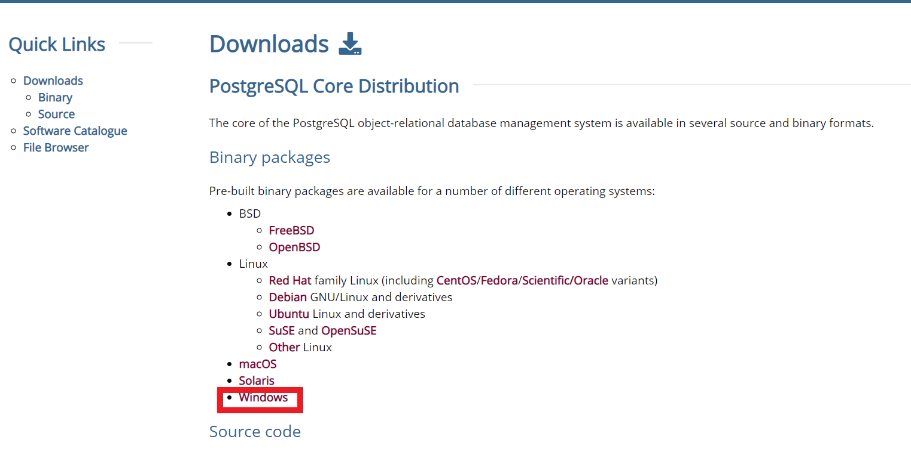

* **Step 2** - You are given two options:

1. Interactive Installer by EnterpriseDB
2. Graphical Installer by BigSQL

BigSQL currently installs pgAdmin version 3 which is deprecated. It's best to choose EnterpriseDB which installs the latest version 4.

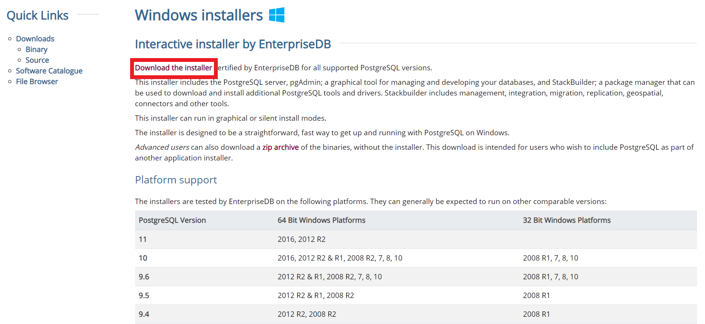

* **Step 3** - You will be prompted to desired Postgre version and operating system. Select the **latest Postgre version** and OS as per your environment. Click the **Download** Button.

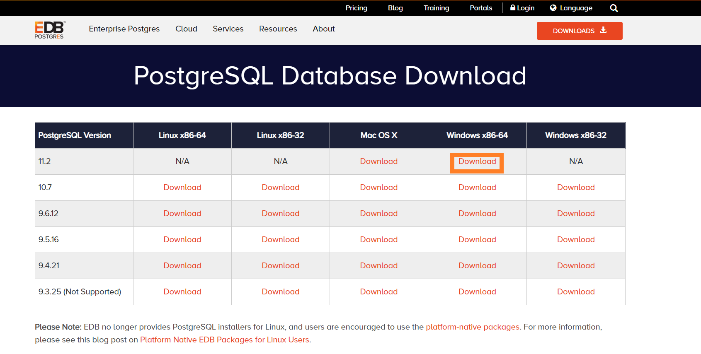

* **Step 4** - Open the downloaded exe and Click next on the install welcome screen.

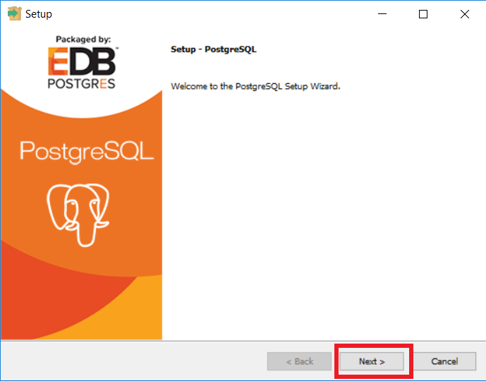

* **Step 5** - Change the Installation directory if required, else leave it to **default** and click **Next**.

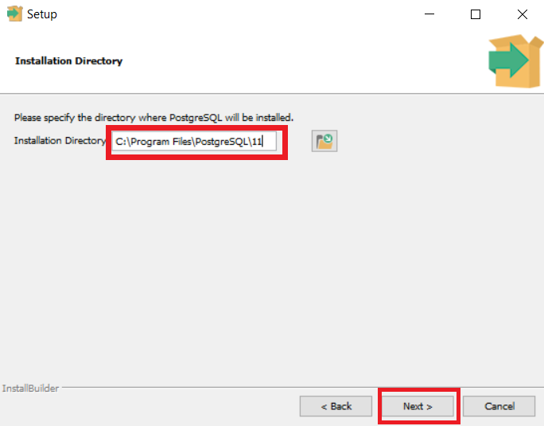

* **Step 6** - You may choose the components you want to install in your system. You may uncheck Stack Builder & click **Next**.

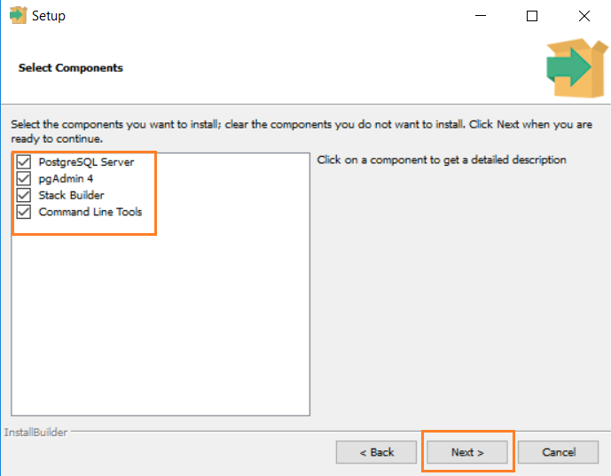

* **Step 7** - You may change the data location & click **Next**.

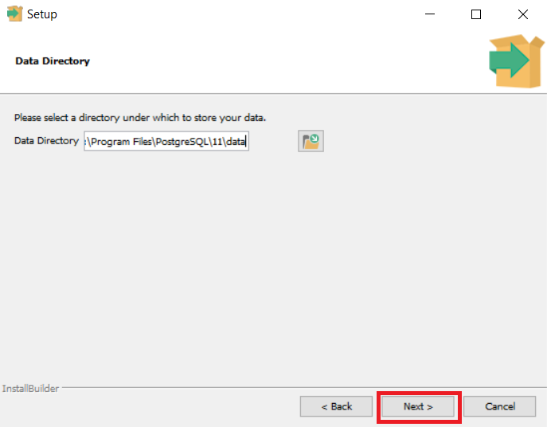

* **Step 8** - Enter **super user password**. Make a note of it & click **Next**.

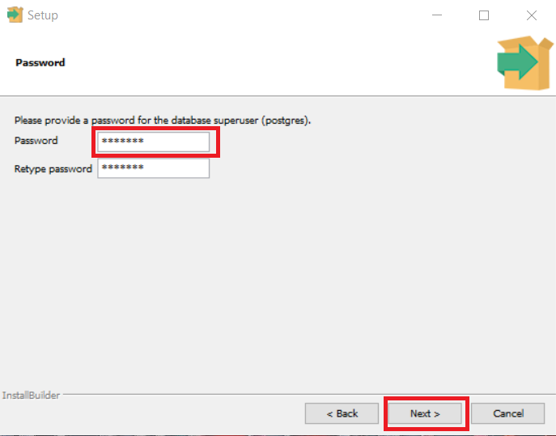

* **Step 9** - Leave the **port number default** & click **Next**.

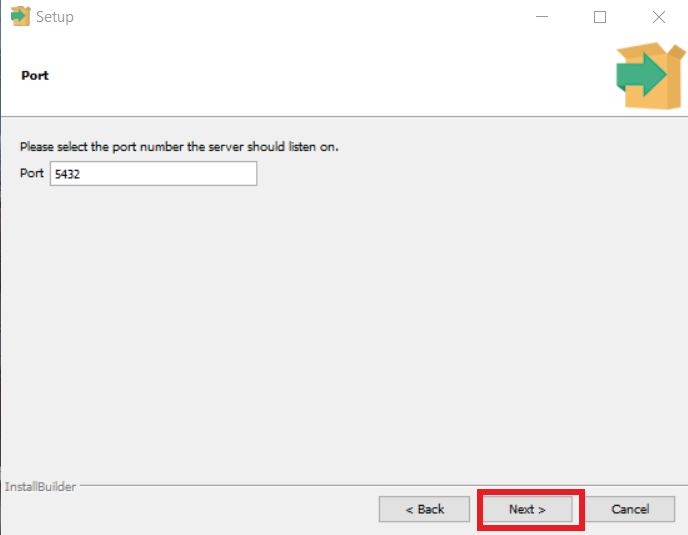

* **Step 10** - Check the pre-installation summary & click **Next**.

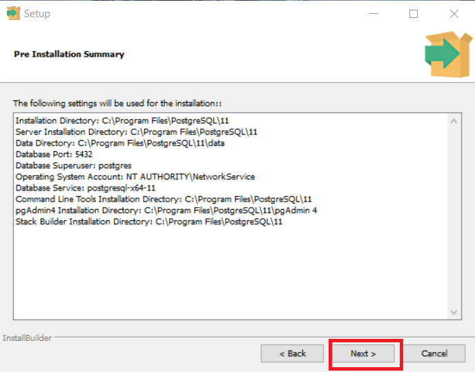

* **Step 11** - Wait for installation.

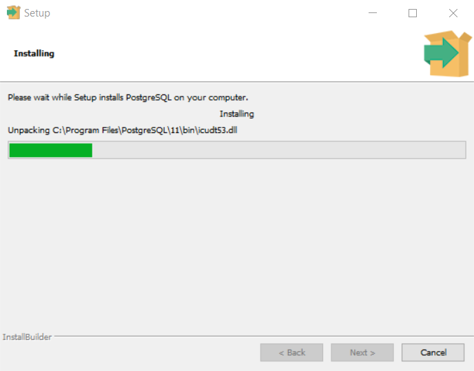

* **Step 12** - Once install is complete you will see the Stack Builder prompt, uncheck that option(for advanced tools). click **Finish**.

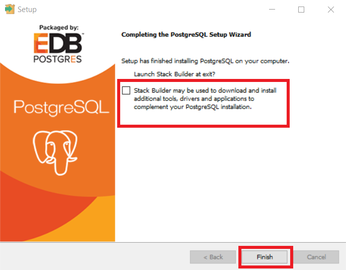

* **Step 13** - To launch Postgre go to Start Menu and search pgAdmin 4.

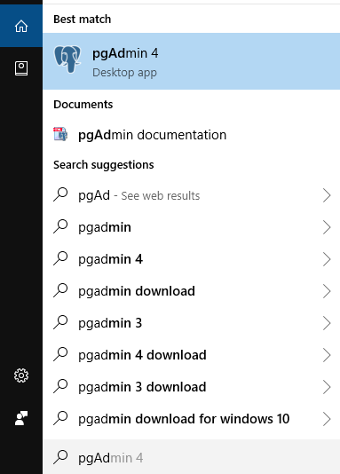

* **Step 14** - You will see pgAdmin homepage.

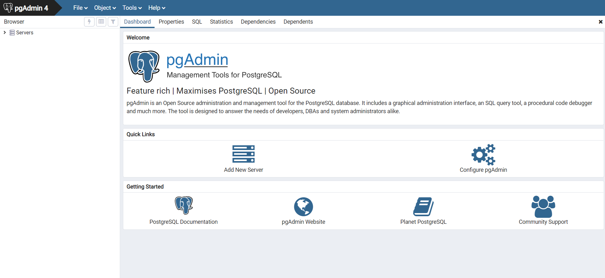

* **Step 15** - Click on Servers > Postgre SQL 11 in the left tree.

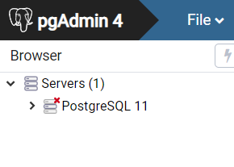

* **Step 16** - Enter super user password set during installation & click **OK**.

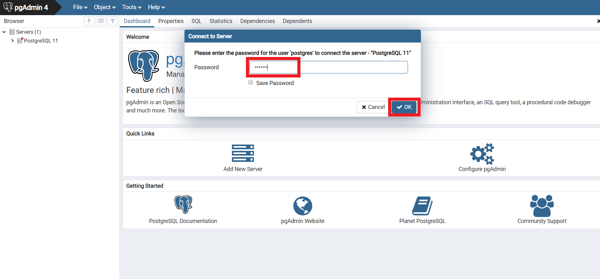

* **Step 17** - You will see the Dashboard.

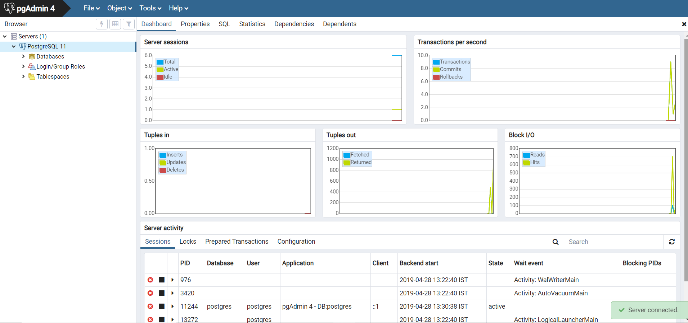

### 2. Install PostgreSQL Using Source Code  [On Debian/Ubuntu].

* **Step 1** - First install required prerequisites such as gcc, readline-devel and zlib-devel using package manager.

`# apt install gcc zlib1g-dev libreadline6-dev`.

* **Step 2** - Download the source code tar file from the official postgres website using the following wget command directly on system (we using version 10 here for demonstration).

`# wget https://ftp.postgresql.org/pub/source/v10.0/postgresql-10.0.tar.bz2`.

* **Step 3** - Use tar command to extract the downloaded tarball file. New directory named postgresql-10.0 will be created.

`# tar -xvf postgresql-10.0.tar.bz2`. 
`# ll`.
 
 * **Step 4** - Next step for installation procedure is to configure the downloaded source code by choosing the options according to your needs.
 
`# cd postgresql-10.0`.
 
 use `./configure --help` to get help about various options.
 
 * **Step 5** - Now create a directory where you want to install postgres files and use prefix option with configure.
 
`# mkdir /opt/PostgreSQL-10/`. 
`# ./configure --prefix=/opt/PostgreSQL-10`.

* **Step 6** - After configuring, next we will start to build postgreSQL using make command.

`# make`.

* **Step 7** - After build process finishes, now install postgresql using following command.

`# make install`.

*Postgresql 10 has been installed in /opt/PostgreSQL-10 directory.*

## Supplemental Materials
- [Commands](https://gist.github.com/Kartones/dd3ff5ec5ea238d4c546) - A list of postgre commands on github gist.
