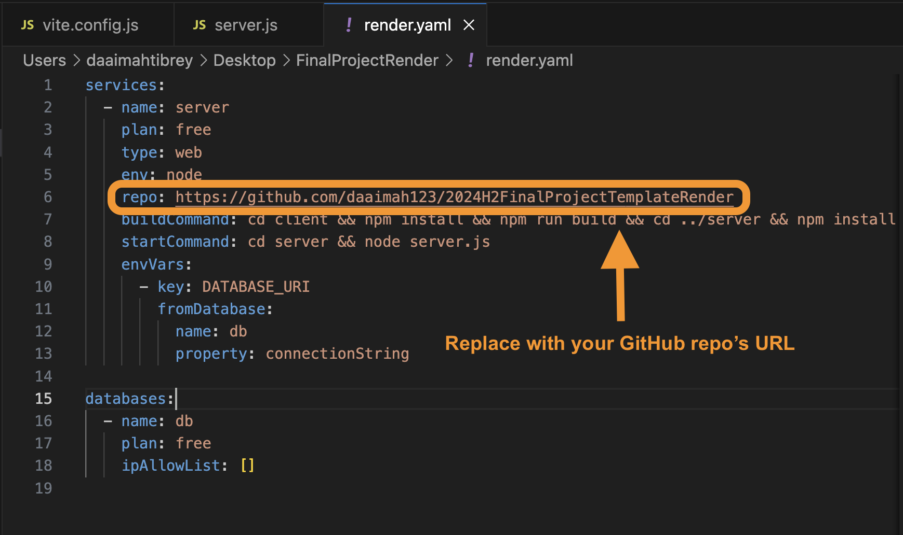
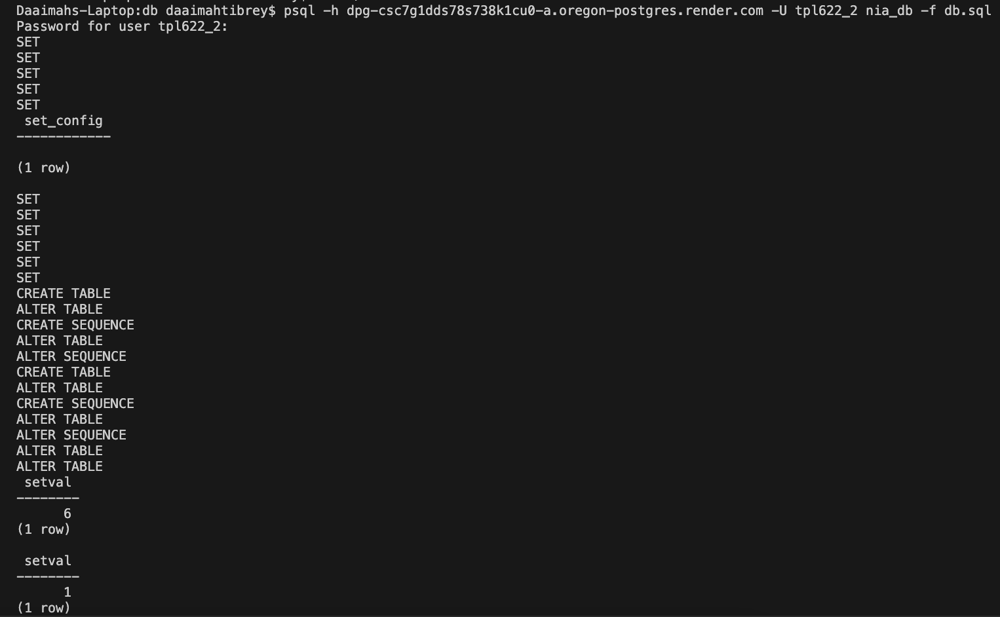
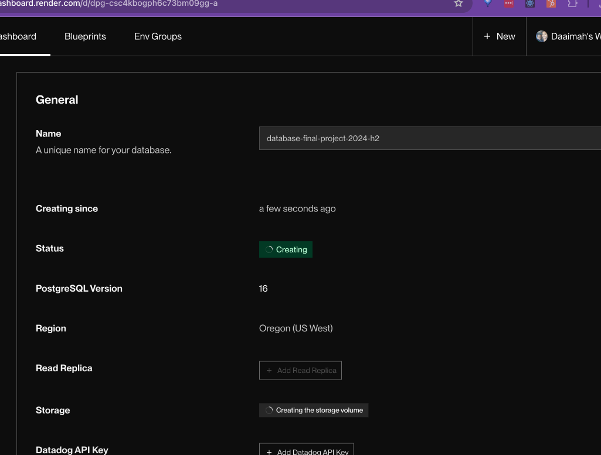
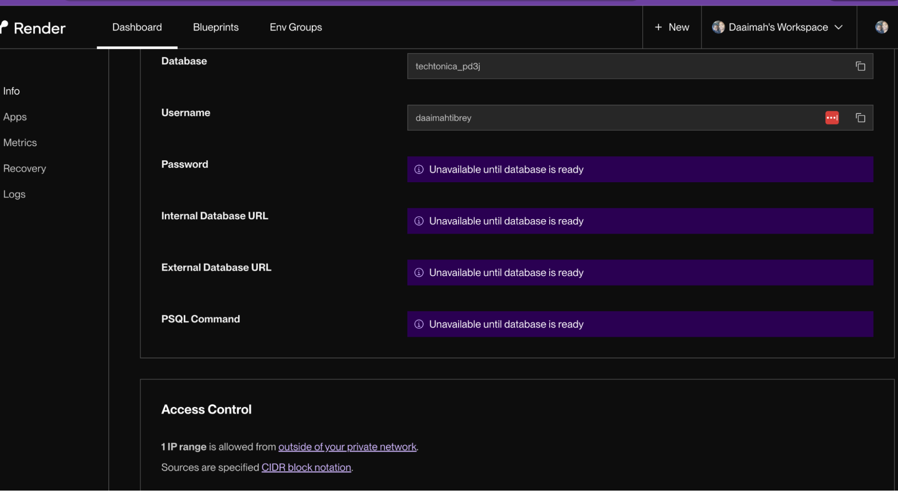
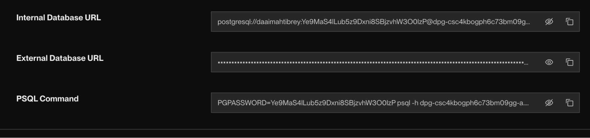
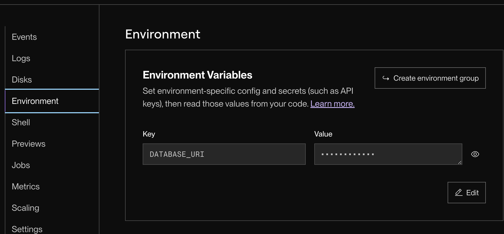

# Deploying to Render

### Prerequisites

- [JS Lessons I - VI](../javascript)
- [Node Lesson](../node-js/node-js.md)
- [Express Lesson](../express-js/express.md)
- [PostgreSQL Lesson](../databases/installing-postgresql.md)
- [Node.js and npm must be installed](https://nodejs.org/en/download/)
- An existing Express/Node.js app

### Motivation

Deployment is a fancy term for getting your website on the web. After building out your app, you might want to share it with others and to do that you need to deploy your app to the web where others can access it. In this lesson, we'll learn more about deployment, and learn one way to deploy an app.

### Objectives

**Participants will be able to:**

- Deploy their website to a third-party hosting service such as Render.

### Specific Things to Learn

- What is deployment?
- Render - a cloud-based server

### Challenges

It can take some time to deploy your application, so you won't see new changes right away the way that you can locally. Databases can also expire, and most free deployment services are fairly limited.

### Common Mistakes

- Not pushing code before deployment, resulting in an outdated deployment even if the app has been updated locally
- Receiving an error similar to the following after completing step 7:

      psql: error: connection to server on socket"/tmp/.s.PGSQL.5432" failed:
      FATAL: database "moralesfamily" does not exist
    If you see this, it means your machine is looking for a database that hasn't been made yet. You need to create a database with that name, like this: ``createdb moralesfamily;``. You should then be able to run the command without errors.
    
### Lesson

- Render is a cloud-based service you can use to put your site on the internet for people to interact with.
- Learn about deployment by going through the [Techtonica Slides on Deploying](https://docs.google.com/presentation/d/1Enwhd9hl1fn1-afMXJ6xvkJm5SDJpHjfQoA7s2znHpw/edit?usp=sharing.)

### Deploying

1. Make sure that you've merged your production-ready code to your main branch **before** deployment so that the code being deployed is up to date.

    Log into Render **with your GitHub account**.

2. You will need to add a YAML file to your project. The YAML file has a script with instructions telling Render how to deploy your project.

    Go to the main branch of your project on GitHub and add a file named `render.yaml`.
3. Copy and paste the `render.yaml` [file contents](https://github.com/daaimah123/2024H2FinalProjectTemplateRender/blob/main/render.yaml) into your file.
    
    
4. In another window, grab the repo URL to paste into the repo:  line instead of what is shown on line 6 of the screenshot. The rest of the inputs should be fairly standard. The `buildCommand` and `startCommand` are telling Render what steps to take to launch your application.

    If you'd like to dig into what's possible with databasing prompts, take a look at [this example](https://render.com/docs/blueprint-spec).

    Commit these changes to the `render.yaml` file.
5. Open up a terminal window and navigate to the main branch of your local copy of your project. `git pull` so that the YAML file you just created from the browser is now added to the local copy of your project.

    Navigate to your server and run the command `pg_dump -d <name-of-database> --column-inserts > db.sql`. Note that there are two dashes before column-inserts. The terminal **doesn't tell you anything** if it works correctly, but if you check your database it will be updated accordingly.
6. Navigate back to your Render account. Click New+ and select PostgreSQL. Select the free option. Render will create the database for you and generate all the associated keys. 
    - Source: 0.0.0.0/0
    - Description: Everything
    - Test IP Address: 0.0.0.0/0

    Save these so that the generated keys will be updated according to source and description; that is, they will use Render's keys when deploying from Render, and local keys when running locally.
7. Copy and paste the "PSQL Command" to a doc, separating everything before `psql` (don't delete; you will need the password string.) Add `-f <dump-file-name>.sql` to the left over command. You should have something that looks like this:

    `psql -h dpg-csc5010gph6c73bm6cg0-a.oregon-postgres.render.com -U daaimahtibrey techtonica_t4x1  -f db.sql`

    `PGPASSWORD=X8FBPrdIaQ1WGSdEMzIy13Uup1cmja2C`

    Navigate to the directory that contains your dump file and enter the first command. You will be prompted for the password; this will not show in the terminal. This command is telling the SQL server, "Hey, copy everything in this file", and hitting enter will do just that. Then the database will appwar on the Render dashboard because it copied everything from the `db.sql` file, as in the below screenshot.

    
    
    
    
    
    
    
8. Navigate back to Render. Go to Web Service Dashboard > Environment > Add variable. Add key value pairs for each variable and save your changes. You don't need the database url anymore because you are now running using the database created on Render. You also don't need quotation marks around each value, Render handles that when you add each variable. Render will automatically deploy with the changes.
9. Add your “Internal Database URL” value to your web service as an “Environment Variable”, titling the variable what your application has after the `process.env` in the server (for example `DATABASE_URL`).

    
10. If you are using Auth0, navigate to your dashboard. Where you added the localhost URLs to the Allowed list, add your Render.com-generated address. Once you've added the AuthO, go back to Render.com and **manually** deploy your app with the Auth0 authentication update phase complete.

### Supplemental Resources
 - [2024 Deployment to Render Video](https://www.dropbox.com/scl/fi/5540qxbwhyexu86usr859/Week15WednesdayDeployToRenderWebService-Database.mp4?rlkey=jkpox0e3hqat5aiyg4ycprojs&e=1&st=fjxbyvr8&dl=0)
 - [Auth0 Lesson](https://github.com/Techtonica/curriculum/blob/main/electives/oauth/o-auth.md)