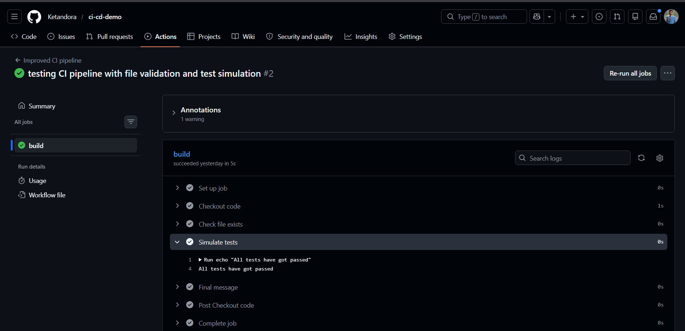
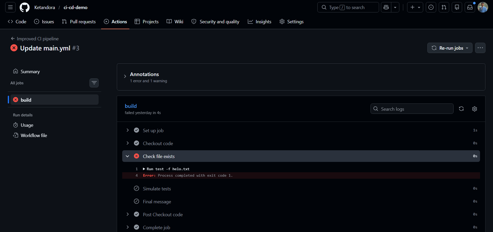

## Prerequisite Topics

Before learning CI/CD, learners should have a basic understanding of the following foundational concepts:

- [Software Development Life Cycle (SDLC)](../agile-development/): Understand the stages of planning, development, testing, and deployment.
- [Git and GitHub Basics](../git/): Learn repositories, commits, pushes, and collaboration workflows.
- [Testing Fundamentals](../testing/): Understand why testing is important for software quality.
- [Basic Command Line Usage](../command-line/): Learn simple terminal commands used in development workflows.
- [Programming Fundamentals](../web-development/): Basic understanding of how applications are built and maintained.


## Motivation

As software projects grow, multiple developers often work on the same codebase simultaneously. Without structured automation, this can create serious development challenges.

Common problems without CI/CD include:

- Code conflicts  
- Unexpected bugs  
- Broken features  
- Slow manual testing  
- Risky deployments  
- Increased human error  

Manual workflows often lead to:

- Delayed releases  
- Repetitive deployment steps  
- Missed bugs reaching production  
- Reduced team efficiency  

CI/CD helps solve these issues by automating critical development processes whenever code is pushed:

- Automatic builds  
- Automated testing  
- Early bug detection  
- Streamlined deployment  
- Faster feedback loops  

This automation allows teams to:

- Catch problems earlier  
- Reduce deployment risks  
- Improve collaboration  
- Release updates more safely  
- Maintain software quality consistently  

Key benefits of CI/CD include:

- Reliability — code is validated before release  
- Consistency — standardized workflows reduce mistakes  
- Confidence — developers trust deployments more  
- Efficiency — less manual effort, faster iteration  

Without CI/CD:

- Development slows down  
- Deployments become riskier  
- Teams spend more time on repetitive tasks  

With CI/CD:

- Workflows become faster  
- Automation reduces errors  
- Software quality improves  
- Teams scale more effectively  

In modern software development, CI/CD is essential not only for faster releases, but for building reliable, maintainable, and collaborative engineering workflows.


## Objectives

By the end of this lesson, learners will be able to:

- Understand the benefits of CI/CD in modern software development  
- Identify the main components and stages of a CI/CD pipeline (build, test, deploy)  
- Explain how CI/CD improves developer workflows and collaboration  
- Understand the role of automation in reducing errors and speeding up development  
- Recognize commonly used CI/CD tools such as GitHub Actions and Jenkins  
- Relate CI/CD practices to real-world development scenarios


## Specific Things to Learn

- Difference between CI and CD  
- CI/CD pipeline stages (Build, Test, Deploy)  
- Automation in development workflows  
- Testing inside the pipeline  
- Basic idea of CI/CD tools  
- How developers actually use CI/CD  
- Deployment approaches  
- Monitoring and feedback after deployment  


## Materials

While using these materials, learners should focus on:
- understanding how pipelines are structured  
- seeing how automation is defined  
- connecting concepts to real workflows
  
- [GitHub Actions Documentation](https://docs.github.com/en/actions): Helps understand how workflows are created and triggered in CI/CD pipelines.
- [Atlassian CI/CD Guide](https://www.atlassian.com/continuous-delivery): Provides a clear conceptual explanation of CI/CD and its importance.
- [Jenkins Documentation](https://www.jenkins.io/doc/): Useful for understanding how CI/CD pipelines are implemented in real-world systems.
- [Introduction to CI/CD](https://www.redhat.com/en/topics/devops/what-is-ci-cd): A simple explanation of CI/CD concepts and why they are important.
- [CI/CD Pipeline Overview](https://circleci.com/ci-cd/): Helps understand pipeline structure and workflow stages.
- [CI/CD Explained (Video)](https://www.youtube.com/watch?v=1er2cjUq1UI): Beginner-friendly video explaining CI/CD step by step.
- [GitHub Actions Tutorial (Video)](https://www.youtube.com/watch?v=R8_veQiYBjI): Demonstrates how to build and run workflows using GitHub Actions.
- [CI/CD Pipeline Diagram](https://www.atlassian.com/continuous-delivery/ci-vs-ci-vs-cd): Visual representation of build, test, and deployment stages.


## Lesson

CI/CD (Continuous Integration and Continuous Deployment/Delivery) is a modern software development practice that automates how code is built, tested, and delivered to users.

Instead of relying on slow manual workflows, CI/CD helps developers:

- Integrate code frequently  
- Detect bugs early  
- Automate testing  
- Streamline deployments  
- Reduce human error  
- Improve software quality  

This makes development faster, safer, and more reliable.

### Continuous Integration (CI)

Continuous Integration focuses on regularly merging code changes into a shared repository such as GitHub.

When code is pushed:

- The project is built  
- Automated tests run  
- Errors are detected quickly  
- Developers receive immediate feedback  

Benefits of CI:

- Smaller code changes are easier to manage  
- Bugs are caught earlier  
- Merge conflicts are reduced  
- Debugging becomes simpler  
- Team collaboration improves  

CI helps prevent large, risky integrations by encouraging frequent updates.

### Continuous Deployment / Continuous Delivery (CD)

CD extends CI by automating the release process after successful testing.

Two common deployment models:

- **Continuous Delivery:** Code is deployment-ready but may require manual approval  
- **Continuous Deployment:** Code is automatically released without manual intervention  

Benefits of CD:

- Faster software releases  
- Reduced deployment effort  
- More reliable release cycles  
- Improved delivery consistency  

Many organizations prefer Continuous Delivery because it balances automation with release control.

### CI/CD Pipeline (Practical Workflow)

A CI/CD pipeline is the automated workflow code follows:

**Developer → Repository → Build → Test → Deploy → Users**

Typical stages include:

- Code push  
- Build process  
- Automated testing  
- Validation checks  
- Deployment  
- Monitoring  

If any stage fails:

- The pipeline stops  
- Errors are reported  
- Faulty code is blocked from production  

This protects users from broken software releases.

### Real-World Example

For example, in an e-commerce application:

- A developer fixes a checkout issue  
- Code is pushed to GitHub  
- CI builds and tests the update  
- CD deploys the fix if tests succeed  
- Users receive the update safely  

This removes delays caused by manual testing and deployment.

### Why CI/CD Matters

CI/CD improves far more than release speed.

Key advantages:

- Reliability — code is tested before release  
- Consistency — standardized workflows reduce mistakes  
- Confidence — developers trust deployment quality  
- Efficiency — automation saves time  
- Scalability — teams can release frequently  

### CI/CD in the SDLC

CI/CD mainly supports:

- Development  
- Testing  
- Deployment  

It automates critical SDLC phases, improving software delivery from development to production.

### Important Reality

CI/CD is powerful, but it depends on:

- Proper pipeline configuration  
- Strong automated tests  
- Reliable infrastructure  
- Continuous maintenance  

Without these, automation alone cannot guarantee quality.

### Final Takeaway

CI/CD is a foundational practice in modern software engineering because it helps teams:

- Build better software  
- Release updates faster  
- Reduce operational risks  
- Maintain higher software quality  

Once understood in practice, CI/CD becomes one of the most valuable workflows in professional development.


## Common Mistakes & Misconceptions

When beginners first learn CI/CD, several misconceptions can create confusion. Understanding these early helps build a stronger and more practical foundation.

- **“CI/CD is only useful for large companies or enterprise projects.”**  
  In reality, even small teams and solo developers benefit from CI/CD through automation, consistency, and improved software reliability.

- **“CI/CD eliminates the need for testing.”**  
  CI/CD does not replace testing — it depends on it. Automated pipelines execute tests, but developers must still create meaningful test cases.

- **“Continuous Deployment means no human control.”**  
  This is not always true. Many teams use Continuous Delivery, where deployment is prepared automatically but requires manual approval before release.

- **“CI/CD is only for DevOps engineers.”**  
  While DevOps teams often manage infrastructure, developers actively interact with CI/CD whenever they push, test, or deploy code.

- **“Once CI/CD is set up, everything works perfectly forever.”**  
  CI/CD pipelines require ongoing maintenance, proper configuration, and strong test coverage to remain effective.

- **“Faster deployment always means better software.”**  
  Speed alone is not the goal. CI/CD focuses on delivering updates quickly while maintaining safety, reliability, and software quality.

- **“CI/CD replaces developer responsibility.”**  
  CI/CD supports developers by automating workflows, but developers are still responsible for writing reliable code, meaningful tests, and maintaining quality.


## Guided Practice

To understand CI/CD better, you can try a simple hands-on example using GitHub Actions.

Start by creating a new repository on GitHub and add a simple file, such as a text file named `hello.txt`.

Next, create a folder in your repository named:

.github/workflows

Inside this folder, create a workflow file (for example, `main.yml`) and add the following basic CI configuration:

```yaml
name: Simple CI Pipeline

on:
  push:
    branches: [ "main" ]

jobs:
  build:
    runs-on: ubuntu-latest

    steps:
      - name: Checkout code
        uses: actions/checkout@v3

      - name: Check file exists
        run: test -f hello.txt

      - name: Run test step
        run: echo "All tests passed"

      - name: Final message
        run: echo "Pipeline completed successfully"
```

To explore it:

- Go to the **Actions tab** in your repository  
- Click on the latest workflow run  
- Open the **build job** to see each step and its logs  

When the file `hello.txt` exists, the pipeline runs successfully:

  
*Figure: Successful CI/CD pipeline execution showing all workflow steps passing correctly.*

This successful run shows that the required file was found, tests passed, and the workflow completed correctly.

To understand failure handling:

- Rename the file `hello.txt` to something else (for example, `hello1.txt`)  
- Commit and push the changes  

Now go back to the **Actions tab** and open the latest run again.

When the file name is changed (for example, `hello.txt` → `hello1.txt` or the workflow checks for an incorrect file like `helo.txt`), the pipeline fails at the file check step:

  
*Figure: Failed CI/CD pipeline execution caused by missing or incorrectly named required file.*

This failed run demonstrates how CI/CD pipelines automatically stop when an expected condition is not met, preventing broken or incorrect changes from moving forward.

This guided example helps learners understand both successful automation and failure detection, which are essential parts of real-world CI/CD workflows.


## Independent Practice

After trying the guided example, you should now experiment with CI/CD on your own. The goal here is to move beyond following steps and start understanding how things actually work.

Start by creating your own workflow from scratch without copying the previous one exactly. Try to remember the structure and write a basic pipeline that runs on push.

Next, modify your workflow:

- Add a new step (for example, print another message or simulate a build step)  
- Change the trigger (for example, run it on pull requests as well)  

Try testing different scenarios:

- Intentionally break the workflow (for example, check for a file that does not exist)  
- Observe how the pipeline fails  
- Then fix it and see it pass again  

You can also extend your pipeline further:

- Add multiple steps such as build, test, and final message  
- Try organizing steps clearly and giving meaningful names  

If you want to go a bit further, try deploying a simple static website using GitHub Pages. This gives you an idea of how Continuous Deployment works in real projects.

While doing these exercises, always check:

- workflow logs  
- error messages  
- execution steps  

Understanding why something fails is just as important as making it work.

Overall, independent practice is about experimenting and learning by doing. The more you try different things, the more comfortable you will become with CI/CD workflows.


## Check for Understanding

To check whether the concepts of CI/CD are clearly understood, learners should be able to answer questions that reflect practical and conceptual understanding.

### Reflective Questions

- What is Continuous Integration (CI), and why is it important in team-based software development?  
- What is the difference between Continuous Delivery and Continuous Deployment?  
- What are the major stages of a CI/CD pipeline?  
- Why is automation important in modern software development?  
- What problems might arise if CI is not used in a collaborative project?  
- What happens when a test fails in a CI/CD pipeline, and why is this important?  
- How does CI/CD improve software quality compared to manual workflows?  
- If a developer pushes code that breaks an existing feature, how would CI/CD help address the issue?  
- In what situations might a team prefer Continuous Delivery over Continuous Deployment?  
- How does CI/CD help teams release software more frequently while reducing deployment risks?  


## Supplemental Materials

- [Advanced GitHub Actions Workflows](https://docs.github.com/en/actions/using-workflows): Learn about multi-job pipelines, environment variables, caching, and conditional execution.
- [Jenkins Pipeline Documentation](https://www.jenkins.io/doc/book/pipeline/): Understand how CI/CD pipelines are implemented and managed at scale.
- [Docker Overview](https://docs.docker.com/get-started/): Learn how containers are used to ensure consistency across environments in CI/CD workflows.
- [Introduction to DevOps](https://www.redhat.com/en/topics/devops): Explore how CI/CD fits into broader practices like monitoring, logging, and infrastructure management.
- [CI/CD Best Practices](https://circleci.com/blog/cicd-best-practices/): Learn common strategies and patterns used in real-world pipelines.
- [CI/CD Case Studies](https://www.atlassian.com/devops/ci-cd/case-studies): See how companies implement CI/CD in production systems.
- [CI/CD Security Practices](https://snyk.io/learn/ci-cd-security/): Understand how to secure pipelines and prevent vulnerabilities.
- [Scaling CI/CD Pipelines](https://martinfowler.com/articles/continuousIntegration.html): Learn how pipelines evolve as applications grow.
