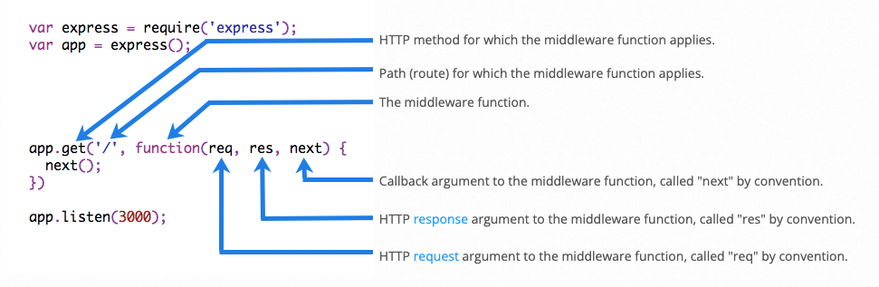

# Express.js

### Projected Time

4 hours, including lab exercise

### Prerequisites

- [How the Internet Works](../requests-and-responses/requests-and-responses.md)
- [Node.js](../node-js/node-js.md)

### Motivation

- Express.js is one part of the PERN web development stack (PostgreSQL, Express.js, React.js, Node.js), we cover at Techtonica. Express.js allows you to quickly build a website served by Node.js.
- Express enables robust routing and improve performance.
- It is flexible as there are numerous modules available on [**npm**](https://www.npmjs.com/) which can be directly plugged into Express.

### Objectives

**Participants will be able to:**

- Explain the MVC framework
- Create a basic web app using Node.js for the server and Express.js as the MVC framework

### Specific Things to Learn

- [What Express.js?](#what-is-expressjs)
- [Features of Express.js](#features-of-expressjs)
- [Installing Express.js](#installing-expressjs)
- [Routing](#routing)
- [Middleware](#middleware)
- [Error-handling middleware](#error-handling-middleware)
- [REST APIs](#rest-apis)

### Materials

- [Express.js slides](https://docs.google.com/presentation/d/12h5SyQO7yk-cepXk_t5o-5zvXLGAOUFU-Ui7U5ZLDcY/edit?usp=sharing)
- [Express.js](https://expressjs.com/)

### Lesson

- Read through lesson slides [Express.js](https://docs.google.com/presentation/d/12h5SyQO7yk-cepXk_t5o-5zvXLGAOUFU-Ui7U5ZLDcY/edit?usp=sharing)
- Video walkthrough of lesson slides [Express.js](https://drive.google.com/file/d/1F-mQpSktXY4EETO4urrVrPuepE_1p-m6/view?usp=sharing)

#### What is Express.js?

- Express is a fast, unopinionated, minimalist web framework for [Node.js](https://nodejs.org/en/)[^1]
- Express.js is a Node.js web application server framework, which is specifically designed for building single-page, multi-page, and hybrid web applications.

#### Features of Express.js

- The capability to design single-page, multi-page, and hybrid web applications
- Options for setting up middleware to respond to HTTP requests
- It defines a routing table that is used to perform different actions based on the HTTP method and URL
- Enables users to dynamically render HTML pages based on passing arguments to templates

### Guided Practice

#### Installing Express.js

Assuming you’ve already installed [Node.js](https://nodejs.org/en/), lets create an empty folder for the project

```bash
mkdir learn-express
cd learn-express
```

Use the `npm init` or `npm init -y` command to create a `package.json` file for your project.

```bash
npm init -y
```

Install `Express` by running the following command:

```bash
npm install express --save
```

Now that Express is installed, the package.json file should look like this:

```json
{
  "name": "learn-express",
  "version": "1.0.0",
  "description": "",
  "main": "index.js",
  "scripts": {
    "test": "echo \"Error: no test specified\" && exit 1"
  },
  "keywords": [],
  "author": "",
  "license": "ISC",
  "dependencies": {
    "express": "^4.17.2"
  }
}
```

Now, let’s move onto the next step - creating the web application.

First create a file `app.js`

```bash
touch app.js
```

In `app.js` type below these commands

```javascript
// importing express.js module
const express = require('express');
//create an object of the express module
const app = express();
//set the port to 3000
const port = 3000;

// Middleware function goes here....

//Routing goes here....

// make the server listen on port number
app.listen(port, () => {
  console.log(`Example app listening at http://localhost:${port}`);
});
```

In the above example, we imported Express.js module using require() function. The express module returns a function. This function returns an object which can be used to configure Express application (app in the above example).

The app object includes methods for routing HTTP requests, configuring middleware, rendering HTML views and registering a template engine.

The app.listen() function creates the Node.js web server at the specified host and port. It is identical to Node's http.Server.listen() method.

Run the above example using node app.js command and point your browser to http://localhost:3000. It will display **Cannot GET /** because we have not configured any routes yet.[^2]

#### Routing

Routing determine the way in which an application responds to a client request to a particular endpoint.n the simplest terms, a route represents an endpoint which people can access. A route is associated with an HTTP method (e.g. `GET`, `POST`, `PUT`, and `DELETE`), and takes a URL path. It also takes a function which is called when the endpoint is accessed.

Route definition takes the following structure:

```
app.METHOD(PATH, HANDLER)
```

Where:

- app is an instance of express.
- METHOD is an HTTP request method such as get, post, put, delete, etc..
- PATH is a path on the server.
- HANDLER is the function executed when the route is matched

Type the following code in the routing section of your `app.js` file. It demonstrates configuring routes for HTTP requests.

```javascript
//Routing goes here....
app.get('/', function (req, res) {
  res.send('Hello Techtonica!');
});

//Respond to POST request on the root route (/), the application’s home page:
app.post('/', function (req, res) {
  res.send('Got a POST request');
});

//Respond to a PUT request to the /user route:
app.put('/user', function (req, res) {
  res.send('Got a PUT request at /user');
});

//Respond to a DELETE request to the /user route:
app.delete('/user', function (req, res) {
  res.send('Got a DELETE request at /user');
});
```

Let’s run our application, save the file, and run `node app.js` command on your terminal and navigate http://localhost:3000 you will see
"Hello Techtonica!" on your browser.

#### Middleware

Middleware functions are functions that have access to the **request object** (req), the **response object** (res), and the next function in the application’s request-response cycle.

Middleware functions can perform the following tasks:

- Execute any code.
- Make changes to the request and the response objects.
- End the request-response cycle.
- Call the next middleware in the stack.

The following figure shows the elements of a middleware function call:

[^3]

Lets work on another middleware example. Write these codes in Middleware function section in your `app.js` file and also make slight changes in get request.

```javascript
// Middleware function
var requestTime = function (req, res, next) {
  req.requestTime = Date.now();
  next(); // It is important to call next() to ensure the response get sent
};

//app.use(middleware) is called every time a request is sent to the server.
app.use(requestTime);

//Respond with Hello Techtonica!! on the homepage:
app.get('/', function (req, res) {
  var responseText = 'Hello Techtonica!<br>';
  responseText += '<small>Requested at: ' + req.requestTime + '</small>';
  res.send(responseText);
});
```

Let start the server using `node app.js` command on your terminal and to go to `http://localhost:3000/`, we will see **Hello Techtonica! Requested at: 1642193239275** something like this.

The above code is example of an _application-level middleware_. If you would like read on router-level middleware [click here](http://expressjs.com/en/guide/using-middleware.html#middleware.router).

#### Error-handling middleware

Express JS comes with default error handling params, define error-handling middleware functions in the same way as other middleware functions, except error-handling functions have four arguments instead of three. This function is invoked only if an error occurs.

```javascript
app.use(function (err, req, res, next) {
  console.error(err.stack);
  res.status(500).send('Something broke!');
});
```

#### REST APIs

A RESTful API is an Application Programming Interface (API) that uses HTTP verbs like GET, PUT, POST, and DELETE to operate data. Also referred to as RESTful web services, RESTful APIs are based on the REpresentational State Transfer (REST) approach, an architectural style that enables developers to manipulate data.

Express is a perfect choice for a server when it comes to creating and exposing APIs (e.g. REST API) to communicate as a client with your server application. Previously you have already implemented one Express route, which sends a "Hello Techtonica!", that you have accessed via the browser. We will cover this in [upcoming lesson](../api/REST-API.md).

### Common Mistakes / Misconceptions

- [Express.js is a web framework; Node.js is a server](https://www.quora.com/What-is-the-difference-between-a-web-server-and-a-web-framework)
- Express.js code goes inside your app.js file

### Independent Practice

[Express.js lab exercise](/express-js/express-lab-exercise.md)

### Challenge

- Install [nodemon](https://www.npmjs.com/package//nodemon) to restart your Node.js Apps Automatically.
- Read [more about Express middleware](https://medium.com/@agoiabeladeyemi/a-simple-explanation-of-express-middleware-c68ea839f498)
- Add ['morgan' middleware](https://github.com/expressjs/morgan#expressconnect) to log each request

### Check for Understanding

- Create a new `app.js` file and make the simplest possible Express server

### Supplemental Materials

- [Learn Express JS In 35 Minutes](https://www.youtube.com/watch?v=SccSCuHhOw0)
- [Node.js Express FrameWork Tutorial – Learn in 10 Minutes](https://www.guru99.com/node-js-express.html)
- [Express.js Tutorial](https://www.edureka.co/blog/expressjs-tutorial/)
- [Intro video series on Express.js](https://www.youtube.com/watch?v=L6_CoHNSbwc&list=PLVHlCYNvnqYpQXeTEA0PxH1spth-K9ey7&index=2&t=0s)
- [Express.js Tutorial: Build RESTful APIs with Node.js & Express.js ](https://www.youtube.com/watch?v=pKd0Rpw7O48)

[^1]: https://expressjs.com/
[^2]: https://www.tutorialsteacher.com/nodejs/expressjs-web-application
[^3]: https://expressjs.com/en/guide/writing-middleware.html
