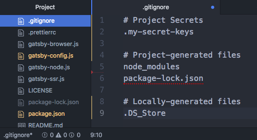

# gitignore

### Week 2 Question

- Why is it important to have a .gitignore file in your project folder?

### Prerequisites

Here are links to lessons that should be completed before this lesson:

- [Git version control](/git/git-version-control.md)

### Motivation

Adding certain files to .gitignore will prevent staging and committing those files in Git, protecting your private info like keys, passwords, and other secrets. It's also useful to exclude very large or locally generated files from being saved unnecessarily.

### Objectives

**Participants will be able to:**

- Add unwanted files to their .gitignore
- Know what data to protect from public view
- Know which files don't need to be committed

### Specific Things to Learn

- Creating a .gitignore at your project root
- Choosing which files to ignore

### Supplemental Materials

- [Ignoring files - GitHub](https://help.github.com/articles/ignoring-files/)
- [Learning how to use gitignore - Medium](https://medium.com/@haydar_ai/learning-how-to-git-ignoring-files-and-folders-using-gitignore-4b6a1ec43ce1)
- [A collection of useful .gitignore templates - Visual Studio template](https://github.com/github/gitignore/blob/master/VisualStudio.gitignore)
- [A collection of useful .gitignore templates - NodeJS template](https://github.com/github/gitignore/blob/master/Node.gitignore)

### Lesson

[Gitignore (Youtube video)](https://www.youtube.com/watch?v=nheGzyk7--8)<br/>
[.gitignore (slides)](https://docs.google.com/presentation/d/1GlkIPUSy5qBKKvKesR5eogoN1p-ltoPmKi3eEBKd1xc/edit?usp=sharing)



When you commit your project data to a version control site like GitHub or Bitbucket, unless you are paying for a private account, all of that data is publicly accessible to anyone.

Private data should never accidentally be committed or pushed to a Git repo, and the best way to do that is by having Git ignore them with a .gitignore file.

Examples of files often added to a .gitignore are:

- .env files for a project, also known as _environment variables_. These files often include sensitive data like:
  - API keys: Private permission keys that let you make a limited number of requests for data from sites like AllRecipes or GoogleMaps
  -  Database URLs: All user authorization IDs and URLs, which you would need to set up OAuth, Okta, Auth0, etc.
  - Locally compiled, large folders that can easily be rebuilt such as:
    - node_modules (made from package.json when you do `npm install`)
    - .cache - build (made by webpack)
    - If a file appears as a muted color in your IDE file tree, it is probably locally compiled.
  - Irrelevant files like:
    - .DS_Store (which locally stores Mac Finder UI preferences)
    - .vs/ (Visual Studio cache/options directory)

### Common Mistakes / Misconceptions

"I will just remember what not to commit."

- Why make more work for yourself? Tell Git to forget about it once; now you _and_ other contributors won't have a problem for the rest of your project, and your Git dialogue will be cleaner.
- Don't leave it to chance! You will be distracted at some point.

### Guided Practice

1. On your command line, navigate to your project's root folder.

2. Enter:

```
touch .gitignore
```

3. Next, enter:

```
touch .my-secret-keys
git status
```

You should see both files as untracked in Git. Don't add or commit anything yet, though.

4. Open .gitignore in your text editor:

```
code .gitignore
```

5. Add this text to your file:

```
# Project Secrets
.my-secret-keys
# Project-generated files
package-lock.json
# Locally-generated files
.DS_Store
```

6. You should see the text of your ignored files darken or lighten in your IDE's tree view.

7. Go back you your command line and type:

```
git status
```

You should no longer see _.my-secret-keys_ in your untracked files because Git is ignoring it!

### Independent Practice

- Add 2 more files to your project's .gitignore using what you've learned, then type _git status_ in your command line to check that they are no longer tracked.

- Add, commit, & push your new .gitignore file to your Git repo.

- Find an example of a wildcard entry in the links under **Supplemental Materials**.

### Check for Understanding

- What sorts of files should you add to your .gitignore?
- How can add all files of the same type to .gitignore?
- How can you add a folder?
- If you want to add all files in the folder except one, how could you do that?
- Should you commit your .gitignore file?
