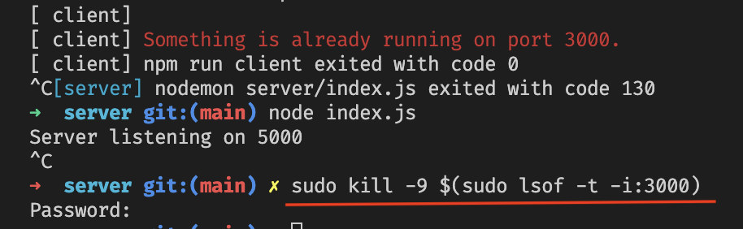

# React Express Starter code

## Quick Guide

First, clone the project

```bash
git clone https://github.com/priyaraj7/React-express-starter-code.git
```

move inside the directory

```bash
cd React-express-starter-code
```

next move into the server and install dependencies and start the server

```bash
cd server
npm install
node index.js
```

Open another terminal tab or window (`cmd + t` or `cmd + n` respectively) then `cd` into the client, install dependencies and start the server

```bash
cd client
npm install
npm start
```

Navigate to `http://localhost:3000/` and click on button. You will get the response from the backend

If you would like to run the backend Express server and the react server at the same time use the following command in server side terminal:

```bash
# Run the client & server with concurrently
npm run dev
```

Note: Server runs on http://localhost:5000 and client on http://localhost:3000

If you get error like this use this command

```bash
sudo kill -9 $(sudo lsof -t -i:<port number>)
```



---
