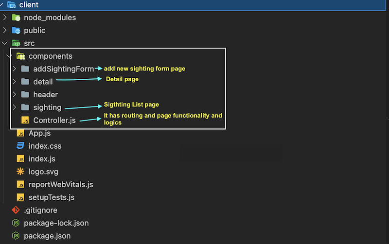
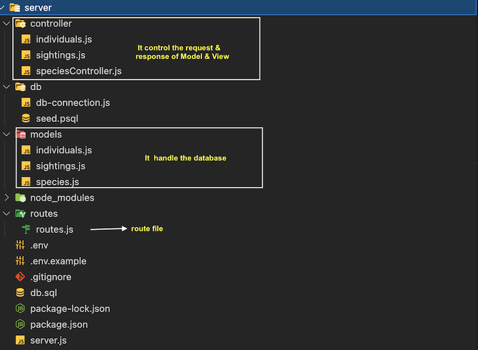
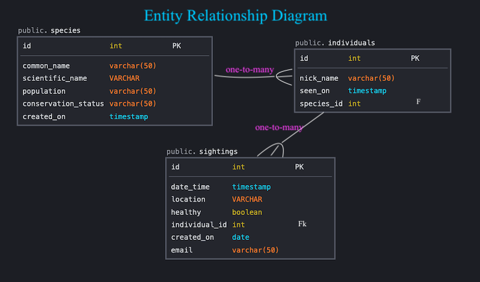
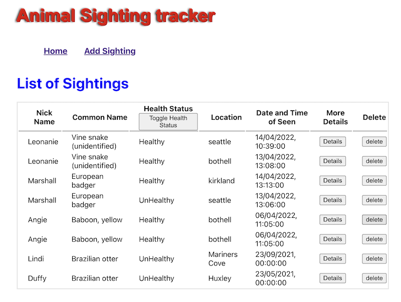
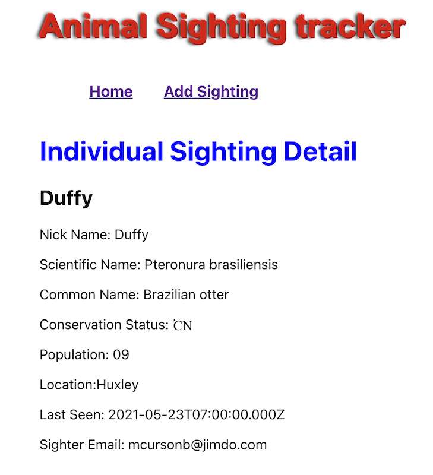
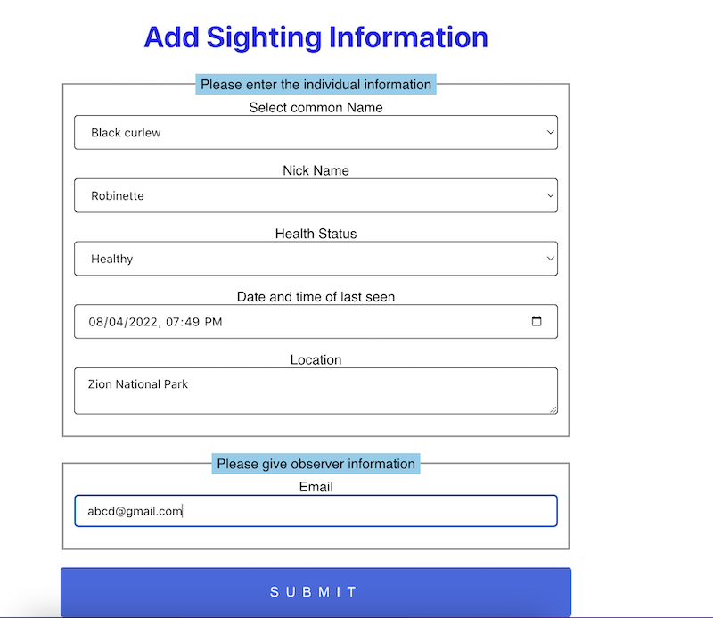

# Animal Sighting Tracker

> This app is a full-stack app with a React frontend, Node/Express backend, and Postgres database.

## Table of Contents

- [Technologies Used](#technologies-used)
- [Features](#features)
- [Screenshots](#screenshots)
- [Setup](#setup)
- [Project Structure](#project-structure)
- [Room for Improvement](#room-for-improvement)

## Technologies Used

- React
- Node
- Express
- Postgres
- CSS
- Docker
- REST API

## Features

- User can see the list of Animal Sightings
- User can filter Healthy and Unhealthy Individuals
- User can go to Detail Page to get more information about the individual
- User can add new sightings
- User can delete Individual Sightings

## Project Structure

This app has two package.json: one for the **React** and another for **nodejs API**. Here all the React app resides under the client folder and nodejs API resides under the server folder.




## Screenshots



**Home Page**



**Detail Page**



**Add Sighting Form Page**



## Setup

First, clone the project and move inside the directory

next move into the server and install dependencies and start the server

```bash
cd server
npm install
npm run server
```

Open another terminal then cd into the client, install dependencies and start the server

```bash
cd client
npm install
npm start
```

Create the database in postgres terminal and create table. You can refer [seed.psql file](./server/db/seed.psql). In this project mock data is created using [mockaroo](https://www.mockaroo.com)

Later create the `.env` file and add all credentials. You can refer `.env.example` file.

If everything goes well you can see the running app at `http://localhost:3000/`.

## Room for Improvement

- Validate the form
- write unit test
