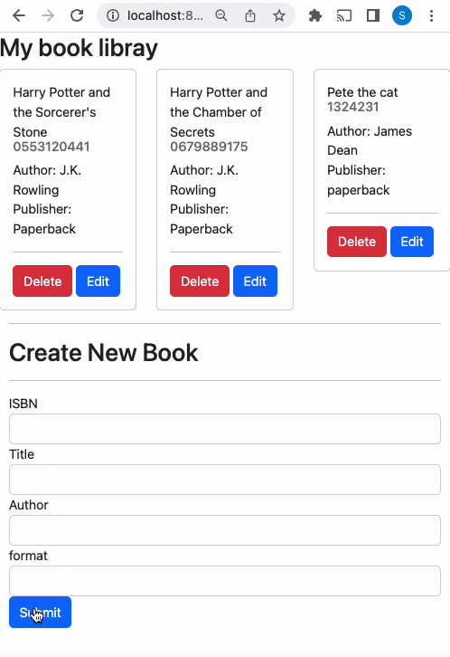

# REST API with expressjs

A RESTful API is an Application Programming Interface (API) that uses HTTP verbs like GET, PUT, POST, and DELETE to operate data—also referred to as RESTful web services.

## Setup/Installation Requirements

- Clone this project
- Move inside the directory
- Install all the packages using the command `npm install`
- Start the server using the command `npm run sever`
- Navigate to `http://localhost:8080/` on your local browser.

## Usecase

- user can create,read, update, delete the book

## Reference

[Building a REST API with Node and Express](https://stackabuse.com/building-a-rest-api-with-node-and-express/)
