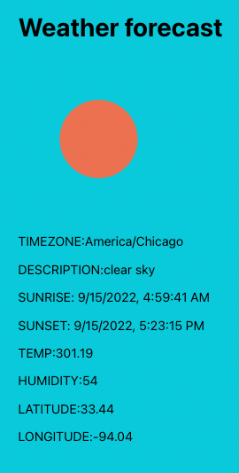

# Weather Forecast app

> This app is a fullstack app build using React Frontend and Express Backend.

### Quick Guide

First get api key from [OpenWeatherMap](https://openweathermap.org/)

Later, clone this project

move inside the directory

next move into the server and install dependencies and start the server

```bash
cd server
npm install
npm start
```

Enter your api-key in `.env` file

Open another terminal then move into the client, install dependencies and start the server

```bash
cd client
npm install
npm start
```

Navigate to `http://localhost:3000/` and enter the city name. You will get the one day weather forecast of the city

### Note:

You can use this code either mock api data and weather app url.

**Example for fetching mock data**

```javascript
app.get('/api/weather', (req, res) => {
  res.json(mockdata);
});
```

**Example for fetching weather api**

```javascript
app.get('/api/weather', (req, res) => {
  const url = `https://api.openweathermap.org/data/3.0/onecall?lat=33.44&lon=-94.04&exclude=hourly,daily&appid=${process.env.API_KEY}`;
  fetch(url)
    .then((res) => res.json())
    .then((data) => {
      console.log(data);
      res.send({ data });
    })
    .catch((err) => {
      console.log(err);
    });
});
```


