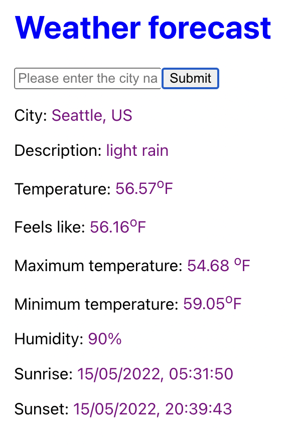

# Weather Forecast app

> This app is a fullstack app build using React Frontend and Express Backend.

## Quick Guide

- First get api key from [OpenWeatherMap](https://openweathermap.org/)

- Later, clone this project

- move inside the project directory

```bash
cd weather-forecast
```
- Install the project dependencies using the command `npm install`

- next move into the server and install dependencies and start the server

```bash
cd server
npm install
npm start   
```

- Create a `.env` file and enter your api-key. You can refer `./server/.envexample` file

- Open another terminal then move into the client, install dependencies and start the server

```bash
cd client
npm install
npm start
```

- Navigate to http://localhost:3000/ and enter the city name. You will get the one day weather forecast of the city



Note:
Server runs on http://localhost:5000 and client on http://localhost:3000

### Technologies used
- Nodejs
- ExpressJs
- React

### Resource
- [How to easily manipulate URL search parameters in JavaScript](https://felixgerschau.com/js-manipulate-url-search-params/)
- [How the frontend and backend work together for the weather project by Kimberly Dang](https://youtu.be/pCSHm0GrcSQ)

