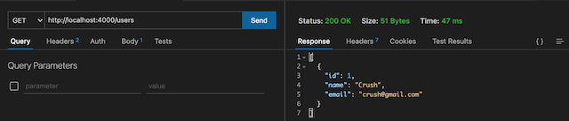
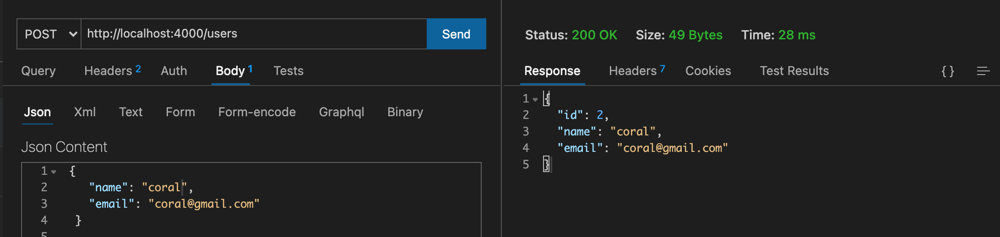
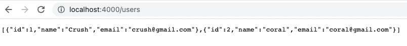

# Eventonica - Postgres Database

### Overview

Previously, your data was stored in memory in Express, so your data would disappear if the application restarted. For production applications, data must be stored in a more permanent way. In this lesson, you will move your data to a Postgres database and connect to that database in your Express APIs.

### How to Submit

In addition to the usual steps:

- Add a clear README for how volunteers can run your app, including DB setup
  - One good way to do this is to add a database dump to the project that includes your table structure and any test data you're using so that volunteer reviewers can run your app and begin using it immediately
- Include any unit or API tests and how to run them in the README

### Instructions

1. Ensure that you have Postgres installed on your machine and that you can use either `PGAdmin` or `psql` - see instructions [here](../../databases/installing-postgresql.md).

1. Create a new database named `eventonica`.

   

1. In your `eventonica` database, create a table named `users` that contains the same fields as a `User` object in your example array.

   - Use the datatype [serial](https://www.postgresql.org/docs/12/datatype-numeric.html#DATATYPE-SERIAL) for `id` to create an auto-incrementing integer id.
   - Make the `id` column a [primary key](https://www.postgresql.org/docs/12/ddl-constraints.html#DDL-CONSTRAINTS-PRIMARY-KEYS) so that every user has a unique id.

   ```sql
   CREATE TABLE users (
   id serial PRIMARY KEY,
   name VARCHAR ( 50 ) UNIQUE NOT NULL,
   email VARCHAR ( 50 ) UNIQUE NOT NULL
   );
   ```

   - Try running the following SQL insert multiple times to see how the `serial` type works. Your table should have automatically filled the `id` field for you!

   ```sql
   INSERT INTO users(name, email)
   VALUES('Crush','crush@gmail.com');
   ```

   

1. Create a table named `events` that contains the same fields as your `Event` class. Create the `id` column like you did for the `users` table.

## Connecting to a Postgres database from Expressjs

1. Install [pg-promise](https://expressjs.com/en/guide/database-integration.html#postgresql) in your project folder - this module connects your Express application to a Postgres database.

   ```bash
   npm install pg-promise
   ```

1. Copy the setup instructions for `pg-promise` in your db folder (you have to create one). Your connection string is probably something like `postgres://localhost:5432/eventonica`. You should not need a username or password if you [setup posgres](../../databases/installing-postgresql.md) correctly.

   ```js
   // server/db/db-connection.js;
   const pgp = require('pg-promise')(/* options */);
   const db = pgp('postgres://localhost:5432/eventonica');

   module.exports = db;
   ```

1. Update your Eventonica methods (addUser, delete etc) to use SQL commands.

   - Use `psql` or `PGAdmin` to test your SQL commands.
   - Add them to your JS using the package `pg-promise` - you can find example queries [here](https://github.com/vitaly-t/pg-promise/wiki/Learn-by-Example).
   - Note that `pg-promise` requires you to specify how many rows, if any, a query should return. For example, `db.any` indicates that the query can return any number of rows, `db.one` indicates that the query should return a single row, and `db.none` indicates that the query must return nothing.

   ```js
   // server/routes/ users.js;
   ......
   var db = require('../db/db-connection.js'); // line 4

   /* GET users listing. */

   router.get('/', async function (req, res, next) {
     const users = await db.any('SELECT * FROM users', [true]);
     try {
       res.send(users);
     } catch (e) {
       console.log(e);
     }
   });

   /* Add users listing. */

   router.post('/', async (req, res) => {
     const user = {
       name: req.body.name,
       email: req.body.email
     };
     console.log(user);
     try {
       const createdUser = await db.one(
         'INSERT INTO users(name, email) VALUES($1, $2) RETURNING *',
         [user.name, user.email]
       );
       console.log(createdUser);
       res.send(createdUser);
     } catch (e) {
       return res.status(400).json({ e });
     }
   });

   /* Delete users listing. */

      //Parameterized queries use placeholders instead of directly writing the
      //values into the statements. Parameterized queries increase security and performance.

    router.delete("/:id", async (req, res) => {
        // : acts as a placeholder
      const userId = req.params.id;
      try {
      await db.none("DELETE FROM users WHERE id=$1", [userId]);
      res.send({ status: "success" });
      } catch (e) {
      return res.status(400).json({ e });
      }
    });

    module.exports = router;
   ```

1. Restart server.

1. Test that your new APIs work using Postman and your webpage. Using your preferred Postgres client such as Postico or `psql`, check that the database contains the information you would expect.

   - Api test using [Thunder Client](https://marketplace.visualstudio.com/items?itemName=rangav.vscode-thunder-client)

     
     

   - testing in psql-terminal

     

   - testing in backend(express) browser
     

1. Restart your Express application - your data from previous sessions should still be there! Your database is independent of your application and continues to store the data even when the application is not running.

### Additional Requirements After the Basics are Working

1. Create a `user_events` table in your database with two columns: `user_id` and `event_id`. Use this table to store which events have been saved for each user, replacing whichever method you used before. When creating the table,

- Add [foreign keys](https://www.postgresql.org/docs/12/ddl-constraints.html#DDL-CONSTRAINTS-FK) to link `user_id` to the `users` table and `event_id` to the `events` table. Specifying `ON DELETE CASCADE` for each column means that deleting a user/event will also delete all linked entries in this table. This ensures that you won't have deleted events saved for users, or events saved for deleted users. Test that your constraints work by saving events for users and deleting the user or event.
- These columns should be unique together (i.e., you do not want to save an event for a user more than once), see [unique constraints](https://www.postgresql.org/docs/12/ddl-constraints.html#DDL-CONSTRAINTS-UNIQUE-CONSTRAINTS). Test what happens when you try to save the same event for a user twice.

1. (Only if you created the `user_events` table): Now, when displaying users and their events on the webpage, can you use SQL joins to get a list of event names that each user has saved?

1. Once you have all `user` routes working, integrate them with your React frontend so a user can successfully GET, POST, and DELETE from the UI.

## Access your API from React app

You can send HTTP requests from React to a backend API using the axios, fetch(). For more information react this [article](https://jasonwatmore.com/post/2020/01/27/react-fetch-http-get-request-examples) or [react doc](https://reactnative.dev/docs/network).

Let's update the `client/User.js` component

You can change getUsers() code from fetch() to async/await so that asynchronous code is readable and appears to be executing synchronously(This is optional).

```jsx
// client/User.js
const getUsers = async () => {
  const response = await fetch('http://localhost:4000/users');
  const user = await response.json();
  setUsers(user);
};

useEffect(() => {
  getUsers();
}, []);
```

```js
//Add new user
const handleSubmit = async (e) => {
  e.preventDefault();
  const newUser = { id: id, name: name, email: email };

  const rawResponse = await fetch('http://localhost:4000/users', {
    method: 'POST',
    headers: {
      Accept: 'application/json',
      'Content-Type': 'application/json'
    },
    body: JSON.stringify(newUser)
  });
  const content = await rawResponse.json();

  setUsers([...users, content]);
};
```

### Troubleshooting

If you are getting HTTP 304 back from your GET requests, it means that the contents of the JSON is identical to when the browser fetched it before. If you're seeing this and you believe the data _should_ be different, i.e. you've added or deleted data in the database, it may be a timing issue. Make sure you are waiting for the database calls to **resolve their promises** before sending back your Express response.

### Challenge

- Create a [unique constraint](https://www.postgresql.org/docs/12/ddl-constraints.html#DDL-CONSTRAINTS-UNIQUE-CONSTRAINTS) on your `events` table using event name, category, and date fields. This will prevent users from adding the same event multiple times. Test what happens when you try to insert the same event twice.
- For either of the above constraints, decide how best to show this error to the user? How will you tell the browser code that something went wrong? Remember, HTTP Status Codes are your friend.

## Reviewing Instructions

TL;DR - they are taking their in-memory backend data objects from their Express code and using Postgres to store them!

- Main criteria is being able to perform all supported actions above
- Review assignment details above

### Common Issues

- README should contain instructions on how to load the testing database schema (likely with data)
- A big part of reviewing this is checking it out and making sure it works
- README should also mention how to run any tests
- SQL commands should be in the model objects, not in the Express app route handlers
- If the code is all stuffed into the handlers, send your preferred explanatory link about the concept of system layers. Our curriculum doesn't currently have a lesson for it.

## Optional Extensions

- Add API test coverage for your endpoints using Jest
- example test, use POST/PUT to create a new user and then GET the users to confirm that user was added and saved
- Add [not-null constraints](https://www.postgresqltutorial.com/postgresql-not-null-constraint/) to all fields in `users` and `events` that must have a value. Test what happens when you try to insert a null value into those fields.

### Supplemental Materials

- [pg-promise query formatiing](https://github.com/vitaly-t/pg-promise#query-formatting)
- [](https://reactnative.dev/docs/network)
