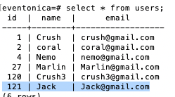

# Eventonica - Postgres Database

### Overview

Previously, your data was stored in memory in Express, so your data would disappear if the application restarted. For production applications, data must be stored in a more permanent way. In this lesson, you will move your data to a Postgres database and connect to that database in your Express APIs.

### How to Submit

In addition to the usual steps:

- Add a clear README for how volunteers can run your app, including DB setup
  - One good way to do this is to add a database dump to the project that includes your table structure and any test data you're using so that volunteer reviewers can run your app and begin using it immediately
- Include any unit or API tests and how to run them in the README

### Instructions

1. Ensure that you have Postgres installed on your machine and that you can use either `PGAdmin` or `psql` - see instructions [here](../../../databases/installing-postgresql.md).

1. Create a new database named `eventonica`.

   ```sql
   CREATE DATABASE eventonica;
   ```

1. Enter command `\l` to get a list of all databases

1. To connect to a Database use PostgreSQL database command

   ```sql
   \c eventonica
   ```

   

1. In your `eventonica` database, create a table named `users` that contains the same fields as a `User` object in your example array.

   - Use the datatype [serial](https://www.postgresql.org/docs/12/datatype-numeric.html#DATATYPE-SERIAL) for `id` to create an auto-incrementing integer id.
   - Make the `id` column a [primary key](https://www.postgresql.org/docs/12/ddl-constraints.html#DDL-CONSTRAINTS-PRIMARY-KEYS) so that every user has a unique id.

   ```sql
   CREATE TABLE users (
   id serial PRIMARY KEY,
   name VARCHAR ( 50 ) NOT NULL,
   email VARCHAR ( 50 ) UNIQUE NOT NULL
   );
   ```

   - Run the following SQL insert multiple times to see how the `serial` type works. Your table should have automatically filled the `id` field for you!

   ```sql
   INSERT INTO users(name, email)
   VALUES('Crush','crush@gmail.com');
   ```

   - Use `SELECT` statement to fetch the data from users table which return data in the form of a result table

   ```sql
   SELECT * FROM users;
   ```

     
   <sub><sub>Please ignore UNIQUE constraint on the "name" column</sub></sub>

1. Create a table named `events` that contains the same fields as your `Event` class. Create the `id` column like you did for the `users` table.

## Connecting to a Postgres database from Expressjs

1. Install [node-postgres](https://www.npmjs.com/package/pg) in your `server` folder - this module connects your Express application to a Postgres database.

   ```bash
   npm install pg
   ```

1. Copy the setup instructions for [pg](https://node-postgres.com/api/pool) in your db folder (you have to create one). Your connection string is probably something like `postgres://localhost:5432/eventonica`. You should not need a username or password if you [setup postgres](../../../databases/installing-postgresql.md) correctly.

   ```javascript
   // server/db/db-connection.js;
   import pg from 'pg';
   const { Pool } = pg;
   const db = new Pool({
     connectionString: 'postgres://localhost:5432/eventonica'
   });

   export default db;
   ```

1. Update your Eventonica methods (addUser, delete etc) to use SQL commands.

   - Use `psql` or `PGAdmin` to test your SQL commands.
   - Add them to your JS using the package `pg` - you can find example queries [here](https://node-postgres.com).

   A GET request will be your first endpoint. You can put raw SQL that will touch the API database inside the db.query(). All users will be get by using `SELECT` clause.

   ```js
   // server/index.js;
    ........
   import db from './db/db-connection.js';
    ........
   /* GET users listing. */
   app.get('/api/users', async (req, res) => {
     try {
       const users = await db.query('SELECT * FROM users');
       res.send(users);
     } catch (e) {
       return res.status(400).json({ e });
     }
   });
      //  POST request goes here
      // PUT request goes here
      // DELETE request goes here
   export default router;
   ```

   Post is used to add new data into database. Pay attention to the `async` and `await` keywords, since node.js is interacting with external PostgreSQL database. Deconstruct the data in request body. Interact with the database by db.query() with SQL command, where $1 and $2 corresponds to the parameters in `[user.name, user.email]`. `RETURNING *` is used to get useful information about the results and the results can be displayed by `res.send()`.

   ```js
   /* Add users listing. */
   app.post('/api/users', async (req, res) => {
     const user = {
       name: req.body.name,
       email: req.body.email
     };
     console.log(user);
     try {
       const createdUser = await db.query(
         'INSERT INTO users(name, email) VALUES($1, $2) RETURNING *',
         [user.name, user.email]
       );
       console.log(createdUser);
       res.json(createdUser.rows[0]);
     } catch (e) {
       return res.status(400).json({ e });
     }
   });
   ```

   To delete User and update User, a corresponding id is needed. So, in the route, `:id` is written and the id is obtained by deconstructing `req.params.`

   ```js
   app.put('/api/users/:id', async (req, res) => {
     const userId = req.params.id;

     const user = {
       name: req.body.name,
       email: req.body.email
     };
     const query = `UPDATE users SET name = $1, email = $2 WHERE id = ${userId} RETURNING *`;

     const values = [user.name, user.email];
     try {
       const updatedUser = await db.query(query, values);
       console.log(updatedUser);
       res.json(updatedUser.rows[0]);
     } catch (e) {
       console.log(e);
       return res.status(400).json({ e });
     }
   });
   ```

   ```js
   /* Delete users listing. */

   //Parameterized queries use placeholders instead of directly writing the
   //values into the statements. Parameterized queries increase security and performance.

   app.delete('/api/users/:id', async (req, res) => {
     // : acts as a placeholder
     const userId = req.params.id;
     try {
       await db.query('DELETE FROM users WHERE id=$1', [userId]);
       res.send({ status: 'success' });
     } catch (e) {
       return res.status(400).json({ e });
     }
   });
   ```

1. Restart server.

1. Test that your new APIs work using Postman and your webpage. Using your preferred Postgres client such as Postico or `psql`, check that the database contains the information you would expect.

   - Api test using [Thunder Client](https://marketplace.visualstudio.com/items?itemName=rangav.vscode-thunder-client)

     
     

   - testing in psql-terminal

     

1. Restart your Express application - your data from previous sessions should still be there! Your database is independent of your application and continues to store the data even when the application is not running.

## Access API from React app

You can send HTTP requests from React to a backend API using fetch(). For more information react this [article](https://jasonwatmore.com/post/2020/01/27/react-fetch-http-get-request-examples) or [react doc](https://reactnative.dev/docs/network).

Let's update the `client/src/components/Users.jsx` component

**GET request using fetch** :
You can change getUsers() code from promises to async/await so that asynchronous code is readable and appears to be executing synchronously(This is optional).

```jsx
// client/src/components/Users.jsx
const getUsers = async () => {
  try {
    const response = await fetch('http://localhost:4000/api/users');

    if (!response.ok) {
      throw new Error(`Error! status: ${response.status}`);
    }

    const result = await response.json();
    setUsers(result);
  } catch (err) {
    console.log(err);
  }
};

useEffect(() => {
  getUsers();
}, []);
```

**POST or PUT request using fetch** :

- To make a POST or PUT request, we need to change fetch's default behavior (making a GET request). This is done by adding an object as a second argument in a fetch call.

- The `method` property in the object specifies the request method. We can set this to `POST` or `PUT`.

- Then, in a nested object within the `headers` property, we specify the content type. This is usually `application/json`.

- Finally, in the body of the request, we pass in the data to send. If sending a JavaScript object, this must be converted to JSON format by wrapping it in `JSON.stringify`.

- Here is an example POST/PUT request, excluding any result handling:

```js
// Add new user
const handleAddSubmit = async (newUser) => {
  const rawResponse = await fetch('http://localhost:4000/api/users', {
    method: 'POST',
    headers: {
      Accept: 'application/json',
      'Content-Type': 'application/json'
    },
    body: JSON.stringify(newUser)
  });
  const content = await rawResponse.json();
  setUsers([...users, content]);
};
```

```js
// Edit user

const editUser = (user) => {
  setIsEditingUser(true);
  setCurrentUser(user);
};

const updateUser = (id, updatedUser) => {
  setUsers(users.map((user) => (user.id === id ? updatedUser : user)));
};

const handleEditSubmit = async (updatedUser) => {
  const response = await fetch(
    `http://localhost:4000/api/users/${updatedUser.id}`,
    {
      method: 'PUT',
      headers: {
        Accept: 'application/json',
        'Content-Type': 'application/json'
      },
      body: JSON.stringify(updatedUser)
    }
  );
  const result = await response.json();

  updateUser(currentUser.id, updatedUser);
  setCurrentUser(result);

  setIsEditingUser(false);
};
```

**DELETE request using fetch** :

- Making a DELETE request is similar to POST and PUT in that we have to specify this in an object placed in the second argument position in the fetch call (to avoid fetch's the default behavior of a GET request).

- Making a DELETE request requires a little less syntax than POST and PUT, though, because we are not passing in any data to be stored on the server:

```js
// Delete user
const deleteUser = async (deleteId) => {
  let response = await fetch(`http://localhost:4000/api/users/${deleteId}`, {
    method: 'DELETE'
  });
  await response.json();
  // here we are filtering - the idea is remove user from the users array on a button click
  const removeUser = users.filter((user) => {
    // return the rest of the users that don't match the user we are deleting

    return user.id !== deleteId;
  });
  // removeUser returns a new array - so now we are setting the users to the new array
  setUsers(removeUser);
};
```

### Add Remaining Functions

- Implement the features listed in [Eventonica README](./README.md#project-requirements).

### Additional Goals After the Basics are Working

1. Create a `user_events` table in your database with two columns: `user_id` and `event_id`. Use this table to store which events have been saved for each user, replacing whichever method you used before. When creating the table,

- Add [foreign keys](https://www.postgresql.org/docs/12/ddl-constraints.html#DDL-CONSTRAINTS-FK) to link `user_id` to the `users` table and `event_id` to the `events` table. Specifying `ON DELETE CASCADE` for each column means that deleting a user/event will also delete all linked entries in this table. This ensures that you won't have deleted events saved for users, or events saved for deleted users. Test that your constraints work by saving events for users and deleting the user or event.
- These columns should be unique together (i.e., you do not want to save an event for a user more than once), see [unique constraints](https://www.postgresql.org/docs/12/ddl-constraints.html#DDL-CONSTRAINTS-UNIQUE-CONSTRAINTS). Test what happens when you try to save the same event for a user twice.

1. (Only if you created the `user_events` table): Now, when displaying users and their events on the webpage, can you use SQL joins to get a list of event names that each user has saved?

1. Once you have all `user` routes working, integrate them with your React frontend so a user can successfully GET, POST, and DELETE from the UI.

### Troubleshooting

If you are getting HTTP 304 back from your GET requests, it means that the contents of the JSON is identical to when the browser fetched it before. If you're seeing this and you believe the data _should_ be different, i.e. you've added or deleted data in the database, it may be a timing issue. Make sure you are waiting for the database calls to **resolve their promises** before sending back your Express response.

### Challenge

- Create a [unique constraint](https://www.postgresql.org/docs/12/ddl-constraints.html#DDL-CONSTRAINTS-UNIQUE-CONSTRAINTS) on your `events` table using event name, category, and date fields. This will prevent users from adding the same event multiple times. Test what happens when you try to insert the same event twice.
- For either of the above constraints, decide how best to show this error to the user? How will you tell the browser code that something went wrong? Remember, HTTP Status Codes are your friend.

## Reviewing Instructions

TL;DR - they are taking their in-memory backend data objects from their Express code and using Postgres to store them!

- Main criteria is being able to perform all supported actions above
- Review assignment details above

### Common Issues

- README should contain instructions on how to load the testing database schema (likely with data)
- A big part of reviewing this is checking it out and making sure it works
- README should also mention how to run any tests
- SQL commands should be in the model objects, not in the Express app route handlers
- If the code is all stuffed into the handlers, send your preferred explanatory link about the concept of system layers. Our curriculum doesn't currently have a lesson for it.

## Optional Extensions

- Add API test coverage for your endpoints using Jest
- example test, use POST/PUT to create a new user and then GET the users to confirm that user was added and saved
- Add [not-null constraints](https://www.postgresqltutorial.com/postgresql-not-null-constraint/) to all fields in `users` and `events` that must have a value. Test what happens when you try to insert a null value into those fields.

### Supplemental Materials

- [pg-promise query formatiing](https://github.com/vitaly-t/pg-promise#query-formatting)
