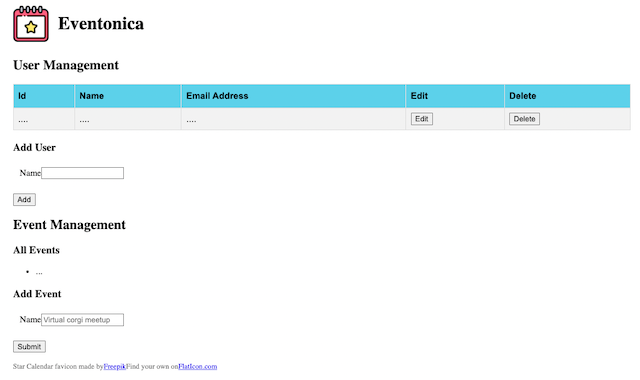

# Eventonica Part 1 - Setup your React App

### Projected Time: ~ 30 min

### Prerequisites

- [Full Apps using React + Vite](https://github.com/Techtonica/curriculum/blob/main/react-js/react-local-vite.md)

### Primary Goals

- Get experience writing your own React code

## Instructions

In this outline, you'll create a React app for frontend Eventonica project.

### Requirements

We will be working from the same set of [Eventonica Goals](./README.md) as all parts of this project.

### Set up a new React App with API Support

First create a folder for your Eventonica project and move inside that directory.

```bash
mkdir Eventonica
cd Eventonica
```

To create a React app, you can use the tool `npx`. npx gives you the ability to use the `create-react-app` package without having to first install it on your computer, which is very convenient.

```bash
npm create vite@latest client
cd client
npm start
```

Once you run this command, a folder named "client" will be created and all of the packages it requires will be automatically installed.

Then open [http://localhost:3000/](http://localhost:3000/) to see your app.

### Insert Starter Code

#### JSX Starter Code

1.Place the following code in `src/App.js` file. Create a images folder in `src` directory. Drag and drop, or copy and paste, [calendar icon](./images/calendar.png) in the `src` folder.

```jsx
// src/App.js
import calendar from './images/calendar.png';
import './App.css';

function App() {
  return (
    <div className="App">
      <header>
        
        <h1>Eventonica</h1>
      </header>

      <main>
        {/* User-management */}
        <section className="user-management">
          <h2>User Management</h2>

          <table id="users">
            <thead>
              <tr>
                <th>Id</th>
                <th>Name</th>
                <th>Email Address</th>
                <th>Edit</th>
                <th>Delete</th>
              </tr>
            </thead>
            <tbody>
              <tr>
                <td>....</td>
                <td>....</td>
                <td>....</td>
                <td>
                  <button>Edit</button>
                </td>
                <td>
                  <button>Delete</button>
                </td>
              </tr>
            </tbody>
          </table>

          <div>
            <h3>Add User</h3>
            <form id="add-user" action="#">
              <fieldset>
                <label>Name</label>
                <input type="text" id="add-user-name" />
              </fieldset>
              {/* Add more form fields here */}
              <input type="submit" value="Add" />
            </form>
          </div>
        </section>
        {/* Event-management */}
        <section className="event-management">
          <h2>Event Management</h2>
          <div>
            <h3>All Events</h3>
            <ul id="events-list">
              {/* Display all Events here */}
              <li>...</li>
            </ul>

            <h3>Add Event</h3>
            <form id="add-event" action="#">
              <fieldset>
                <label>Name</label>
                <input
                  type="text"
                  id="add-event-name"
                  placeholder="Virtual corgi meetup"
                />
              </fieldset>
              {/* Add more form fields here */}
              <input type="submit" />
            </form>
          </div>
        </section>
      </main>

      <footer>
        <div>
          Star Calendar favicon made by
          <a href="https://www.flaticon.com/authors/freepik" title="Freepik">
            Freepik
          </a>
          Find your own on
          <a href="https://www.flaticon.com/" title="Flaticon">
            FlatIcon.com
          </a>
        </div>
      </footer>
    </div>
  );
}

export default App;
```

2.  Go to `client/src/App.css` and delete the contents. Place the [starter](./starter-code/index.css) code in `client/src/App.css` file.

3.  Navigate to http://localhost:3000/. You should see your UI update automatically.

4.  Look at all the code that's now in your App component. Take 2 minutes to point out to yourself where repeated elements might be turned into a reusable component later.



> Note:<br> Remove `.git` folder from your react app before pushing into your github repo.<br>Navigate to your `client` folder in the terminal.<br> Remove the `.git` folder using `rm -rf .git` command. <br>Come out of client folder using `cd ..`. <br>Inside Eventonica directory, initialize Git repository and push all your code to Github.
