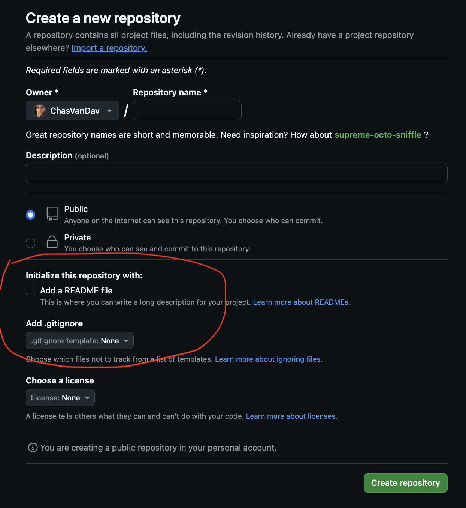

# Portfolio Project with HTML and CSS

### Additional Skills

- VS Code
- Developer Tools
- Keyboard Shortcuts
- [Web Patterns](/electives/web-patterns.md)
- UI/UX
- GitHub for code storage and static-site hosting
- Ergonomics
- Writing a good README

### Primary Goals

To demonstrate understanding of the foundational topics covered in the first week of Techtonica, before diving further into the PERN stack.

1. Create a new HTML/CSS webpage
2. Modify the contents of your page using DOM methods
3. Use common CSS rules to align content (left, right, center), modify colors, adjust sizes of containers and text, etc.
4. Get comfortable using CSS media queries

### Overview

In this project, you will build a simple portfolio page to practice what you've learned about VSCode, HTML, CSS, Git, and GitHub. In the future, a great portfolio page will be a valuable way to showcase your skills as you look for engineering work.

### Motivation

Increase your job prospects dramatically with your web page. Get creative and show off your technical skills. Employers will love you!
Here's a list of example portfolios: https://github.com/HackathonHackers/personal-sites

## Project Requirements:

You should write clear & informative commit messages for each commit. Create pull requests once big/multiple changes have been made, for your mentor to review. Add the github link to your portfolio page to the cohort shared sheet ('Checklist items' tab).

- At least 50 commits
  - Pro-tip: Get used to committing your code every single time a new line of code works
- At least one PR
  - Consider pushing your code to GitHub every time you finish a bolded section, but at least every day
- Use of the command line to create files and implement the use of Git
- Practice the use of developer tools
- HTML
  - Photo
  - Headers
  - Sections
  - Semantic Tags
  - Links to social media accounts
  - Contact information for yourself
  - Contact form with required fields
    - contact form asking for a name (required)
    - email (required)
    - phone number (not required)
    - address (not required)
- CSS
  - At least 3 style properties applied to text
  - Border
  - Use of columns
  - Use of at least 1 ID
  - Use of at least 3 [web design patterns](https://github.com/Techtonica/curriculum/blob/main/electives/web-patterns.md)
  - Override a CSS rule in your code in an obvious way at least once
  - Change display property of at least 1 element
- Additional Requirements
  - Have at least 1 style change for narrow, medium, and wide browser views

---

### Project Checklist

**Ergonomics**

- [ ] Remember to get up to stretch or walk for 5-10 minutes _every hour_. (Set an alarm)
- [ ] Each hour, check foot, knee, elbow, and spine position and correct if necessary. (Set an alarm)

**Create your project**

- [ ] Use bash to create a local portfolio-website directory. Use the command line to make a portfolio.html file and a portfolio.css file in the portfolio-website directory.
- [ ] Use the command line to change the names of portfolio.html and portfolio.css to index.html and styles.css.
- [ ] Use the command line to make a .gitignore file in your desktop directory and add at least one real unwanted file to the .gitignore list.
- [ ] Use the command line to move the .gitignore file from your desktop directory to your portfolio-website directory.
- [ ] Using your command line, initialize a GitHub repo in portfolio-website directory.
- [ ] Create a portfolio-website remote repository on Github. (If your local directory already includes a README and .gitignore file, DO NOT opt for adding a README or .gitignore file in the Github initial set up. Otherwise, there will be a conflict when you attempt to push your commits.)

- 

- [ ] Using your command line, add and commit your portfolio-website directory, and then do a git push.
- [ ] Open your portfolio-website directory in VS Code using your command line.
- [ ] Increase or decrease your VSCode text size before starting.
- [ ] Open your VSCode Integrated Terminal, and close your terminal/command line program.
- [ ] Add a linting extension to VSCode. You are welcome to keep or remove it after trying it out.

**HTML**

- [ ] Use VS Code shortcuts to create boilerplate code for your html file.
- [ ] Open and view your HTML file in Chrome using only the VSCode application.
- [ ] Make a basic header for your online resume - your name and a short description of your experience.
- [ ] In a separate section, list a few coding experience entries and some past work experience that you can apply to a tech job.
- [ ] Add a title tag to your file.
- [ ] Double-check that you have proper indentation for readability.
- [ ] Use semantic tags rather than presentational tags when possible.
- [ ] (Remember to make a git commit after each set of code changes!)
- [ ] (Second half of week) - Add a contact form with the following fields: name (required), email (required), phone number (not required), and address (not required) (Hint: Required fields in a form are those where you normally see a \* symbol)

**Developer Tools**

- [ ] Inspect your page at least once using the Source Code Viewer
- [ ] Inspect your page at least once using the Quick Source Viewer Chrome Extension
- [ ] Access the JavaScript console at least once to check your page for errors and warnings.

**CSS**

- [ ] Link your styles.css file to index.html.
- [ ] Style your text using at least 3 different properties.
- [ ] Add and style a profile photo of yourself. Include a border.
- [ ] Have some info in a second column
- [ ] Use one "id" correctly.
- [ ] Select 3 [web design patterns](https://github.com/Techtonica/curriculum/edit/main/electives/web-patterns.md) to implement
- [ ] Use your search bar at least once to jump to an element or style.
- [ ] Have 2 CSS blocks that include the class "override" with one overriding the other rule in an obvious way.
- [ ] Change the display property of at least one element.

**Media Queries, UI, UX**

- [ ] Have at least one style change each for a narrow, medium, and wide browser window.
- [ ] Use developer tools at least once to inspect your styles and check window width.
- [ ] Make sure the User Interface of your site is appealing at all widths while keeping it simple.
- [ ] Ask a peer to test your site and tell you about their experience. Change one thing that would provide better UX.

**README**

- [ ] Create a README.md file from your command line.
- [ ] Include relevant README content (what the project is, what open-source license it uses, how to install, etc.).
- [ ] Use markdown to organize your README.

---

### Recommended extension activity if time permits

- [ ] Go into the settings of your portfolio-website repo in GitHub and create a link for your live site
- [ ] Link to your live github.io site that is clickable on your README.

---

Full Time Program Week 3: Portfolio App Part 1 of 3
