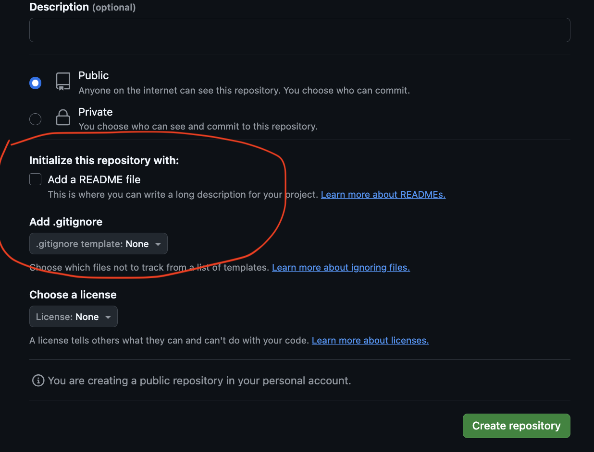

# Portfolio Project with HTML and CSS

### Additional Skills

* VS Code
* Developer Tools
* Keyboard Shortcuts
* [Web Patterns](/electives/web-patterns.md)
* UI/UX
* GitHub for code storage and static-site hosting
* Ergonomics
* Writing a good README

### Primary Goals

To demonstrate understanding of the foundational topics covered in the first week of Techtonica, before diving further into the PERN stack.

1. Create a new HTML/CSS webpage
2. Modify the contents of your page using DOM methods
3. Use common CSS rules to align content (left, right, center), modify colors, adjust sizes of containers and text, etc.
4. Get comfortable using CSS media queries

### Overview

In this project, you will build a simple portfolio page to practice what you've learned about VSCode, HTML, CSS, Git, and GitHub. In the future, a great portfolio page will be a valuable way to showcase your skills as you look for engineering work.

### Motivation

Increase your job prospects dramatically with your web page. Get creative and show off your technical skills. Employers will love you!
Here's a list of example portfolios: [https://github.com/HackathonHackers/personal-sites](https://github.com/HackathonHackers/personal-sites)

---

## Project Requirements:

You should write clear & informative commit messages for each commit. Create pull requests once big/multiple changes have been made, for your mentor to review. Add the github link to your portfolio page to the cohort shared sheet ('Checklist items' tab).

* At least 50 commits

  * Pro-tip: Get used to committing your code every single time a new line of code works
* At least one PR

  * Consider pushing your code to GitHub every time you finish a bolded section, but at least every day
* Use of the command line to create files and implement the use of Git
* Practice the use of developer tools
* HTML

  * Photo
  * **Headings (h1–h6)**
  * Sections
  * Semantic Tags
  * Links to social media accounts
  * Contact information for yourself
  * Contact form with required fields

    * contact form asking for a name (required)
    * email (required)
    * phone number (not required)
    * address (not required)
* CSS

  * At least 3 style properties applied to text
  * Border
  * Use of columns
  * Use of at least 1 ID
  * Use of at least 3 [web design patterns](https://github.com/Techtonica/curriculum/blob/main/electives/web-patterns.md)
  * Override a CSS rule in your code in an obvious way at least once
  * Change display property of at least 1 element
* Additional Requirements

  * Have at least 1 style change for narrow, medium, and wide browser views

---

### Project Checklist

**Ergonomics**

* [ ] Remember to get up to stretch or walk for 5-10 minutes *every hour*. (Set an alarm)
* [ ] Each hour, check foot, knee, elbow, and spine position and correct if necessary. (Set an alarm)

**Create your project**

* [ ] Use bash to create a local portfolio-website directory. Use the command line to make a portfolio.html file and a portfolio.css file in the portfolio-website directory.

* [ ] Use the command line to change the names of portfolio.html and portfolio.css to index.html and styles.css.

* [ ] Use the command line to make a .gitignore file in your desktop directory and add at least one real unwanted file to the .gitignore list.

* [ ] Use the command line to move the .gitignore file from your desktop directory to your portfolio-website directory.

* [ ] Using your command line, initialize a GitHub repo in portfolio-website directory.

* [ ] Create a portfolio-website remote repository on Github. (If your local directory already includes a README and .gitignore file, DO NOT opt for adding a README or .gitignore file in the Github initial set up. Otherwise, there will be a conflict when you attempt to push your commits.)

* 

* [ ] Using your command line, add and commit your portfolio-website directory, and then do a git push.

* [ ] Open your portfolio-website directory in VS Code using your command line.

* [ ] Increase or decrease your VSCode text size before starting.

* [ ] Open your VSCode Integrated Terminal, and close your terminal/command line program.

* [ ] Add a linting extension to VSCode. You are welcome to keep or remove it after trying it out.

**HTML**

* [ ] Use VS Code shortcuts to create boilerplate code for your html file.
* [ ] Open and view your HTML file in Chrome using only the VSCode application.
* [ ] Make a basic header for your online resume - your name and a short description of your experience.
* [ ] In a separate section, list a few coding experience entries and some past work experience that you can apply to a tech job.
* [ ] Add a title tag to your file.
* [ ] Double-check that you have proper indentation for readability.
* [ ] Use semantic tags rather than presentational tags when possible.
* [ ] (Remember to make a git commit after each set of code changes!)
* [ ] (Second half of week) - Add a contact form with the following fields: name (required), email (required), phone number (not required), and address (not required) (Hint: Required fields in a form are those where you normally see a * symbol)

**Developer Tools**

* [ ] Inspect your page at least once using the Source Code Viewer
* [ ] Inspect your page at least once using the Quick Source Viewer Chrome Extension
* [ ] Access the JavaScript console at least once to check your page for errors and warnings.

**CSS**

* [ ] Link your styles.css file to index.html.
* [ ] Style your text using at least 3 different properties.
* [ ] Add and style a profile photo of yourself. Include a border.
* [ ] Have some info in a second column
* [ ] Use one "id" correctly.
* [ ] Select 3 [web design patterns](https://github.com/Techtonica/curriculum/edit/main/electives/web-patterns.md) to implement
* [ ] Use your search bar at least once to jump to an element or style.
* [ ] Have 2 CSS blocks that include the class "override" with one overriding the other rule in an obvious way.
* [ ] Change the display property of at least one element.

**Media Queries, UI, UX**

* [ ] Have at least one style change each for a narrow, medium, and wide browser window.
* [ ] Use developer tools at least once to inspect your styles and check window width.
* [ ] Make sure the User Interface of your site is appealing at all widths while keeping it simple.
* [ ] Ask a peer to test your site and tell you about their experience. Change one thing that would provide better UX.

**README**

* [ ] Create a README.md file from your command line.
* [ ] Include relevant README content (what the project is, what open-source license it uses, how to install, etc.).
* [ ] Use markdown to organize your README.

---

### Recommended extension activity if time permits

* [ ] Go into the settings of your portfolio-website repo in GitHub and create a link for your live site
* [ ] Link to your live github.io site that is clickable on your README.

---

Full Time Program Week 3: Portfolio App Part 1 of 3

---

## Quick answer: the short distinctions

* `<head>` — the document metadata container (title, meta tags, links to CSS, scripts). Not visible as page content.
* `<header>` — a page or section header: landmark container for introductory content, logo, nav. Visible content.
* **Headings (`<h1>`–`<h6>`)** — *document structure* elements used to create a semantic outline. They describe the hierarchy of content.

> Plain English: `head` → "document information", `header` → "top of a page/section", `heading` → "titles/subtitles that form the document outline."

`<body>
  <header>
    <h1>Your Name</h1>
    <p>Short description of your experience</p>
    <nav>
      <a href="#about">About</a>
      <a href="#projects">Projects</a>
      <a href="#contact">Contact</a>
    </nav>
  </header>

  <main>
    <section id="about">
      <h2>About Me</h2>
      <p>A brief introduction about who you are and what you do.</p>
    </section>

    <section id="projects">
      <h2>Projects</h2>
      <p>Examples of your work or experience.</p>
    </section>

    <section id="contact">
      <h2>Contact</h2>
      <p>How people can reach you.</p>
    </section>
  </main>

  <footer>
    <p>© Your Name</p>
  </footer>
</body>`

---

## Why semantics matter

1. **Accessibility** — Screen readers and assistive tech rely on semantic structure to let users navigate (jump to main content, list headings, skip navigation).
2. **Search & Indexing** — Search engines use semantics to understand page structure and content importance.
3. **Maintainability** — Future you (or collaborators) will understand the structure faster when elements are meaningful.
4. **Presentation separation** — HTML describes *what* content is, CSS decides *how* it looks. That makes refactors and theming easier.

---

## Semantic elements — short reference + example

### Landmarks and sections

* `<header>` — introductory content for a page or section (logo, h1, nav for that section).
* `<nav>` — navigation block (main site nav, not every link list).
* `<main>` — main content of the document (one per page).
* `<section>` — a thematic grouping of content, usually with a heading.
* `<article>` — independent, self-contained content (blog post, news item).
* `<aside>` — tangential content (sidebars, pull quotes).
* `<footer>` — closing content for page or section (copyright, secondary links).

**Example skeleton:**

```html
<!doctype html>
<html lang="en">
  <head>
    <meta charset="utf-8">
    <title>My Portfolio</title>
    <link rel="stylesheet" href="styles.css">
  </head>
  <body>
    <header>
      <div class="brand">My Name</div>
      <nav aria-label="Main navigation">
        <ul>
          <li><a href="#about">About</a></li>
          <li><a href="#work">Work</a></li>
          <li><a href="#contact">Contact</a></li>
        </ul>
      </nav>
    </header>

    <main>
      <section id="hero">
        <h1>Hi — I'm Jane, a Frontend Developer</h1>
      </section>

      <section id="work">
        <h2>Selected Projects</h2>
        <article>
          <h3>Project Title</h3>
          <p>Short description...</p>
        </article>
      </section>

      <aside aria-label="Related links">
        <p>Extra resources</p>
      </aside>
    </main>

    <footer>
      <p>© 20XX My Name</p>
    </footer>
  </body>
</html>
```

---

## Non‑semantic elements: when & how to use them

* `<div>` — generic block-level container when no semantic element fits.
* `<span>` — generic inline container.

Use these when you need a container purely for styling or to group elements for scripting, but prefer semantic elements whenever meaningful.

**Bad:** using `<div>` for everything (no structure) — makes navigation and semantics hard.

**Good:** use `<section>` and put an `<h2>` inside, then use `<div class="grid">` if you need a layout wrapper for CSS.

---

## Head vs Header vs Heading — detailed

### `<head>`

* Placed directly inside `<html>`.
* Contains `<title>`, `<meta>`, `<link>`, `<script>` (sometimes), and other metadata.
* Not shown on the page body.

**Example:**

```html
<head>
  <meta name="description" content="Frontend developer portfolio">
  <title>Jane Doe – Portfolio</title>
  <link rel="stylesheet" href="styles.css">
</head>
```

### `<header>`

* Visible content: branding, intro, navigation, sometimes search.
* Can appear more than once (page header + article header).
* It's a **landmark** — good for assistive tech navigation.

**Example:**

```html
<header>
  
  <h1>Jane Doe</h1>
  <nav aria-label="Primary">
    <!-- links -->
  </nav>
</header>
```

### Headings (`<h1>`–`<h6>`)

* Describe the structure and content hierarchy.
* Only one `<h1>` per page is recommended for most content (page title), but modern HTML & ARIA allow reasonable variations if the document uses clear sections/articles with their own headings.
* Use headings to *outline* your content: `<h1>` page title → `<h2>` main sections → `<h3>` subsections, etc.

**Important rule of thumb:**

> Use headings to show the logical order of information, not to make text big. If you want big text for emphasis, use CSS on an appropriate semantic element (e.g., `.big-title { font-size: 2.5rem; }`).

---

## Common misconception — “I’ll add an `<h1>` in the middle because I want big bold text”

**Bad example:**

```html
<p>Some intro text here.</p>
<!-- designer wants large text mid-page -->
<h1>This should just be big intro text</h1>
```

Why this is bad:

* An `<h1>` in the middle breaks the document outline if you already have an `<h1>` at the top.
* Screen reader users will get an inaccurate structure, making navigation confusing.

**Correct approach:**

* Choose the correct semantic element (maybe `<p>` or `<h2>` depending on structure).
* Use CSS to change appearance:

```html
<h2 class="visually-large">This looks big but remains a proper structure heading</h2>
<!-- or -->
<p class="hero-lead">This is an emphasized paragraph, styled large in CSS</p>
```

```css
.visually-large { font-size: 2.25rem; font-weight: 700; }
.hero-lead { font-size: 1.5rem; font-weight: 600; }
```

---

## Accessibility best practices (quick)

* Use a single `<main>` landmark per page.
* Give `<nav>` an `aria-label` (e.g., `aria-label="Main navigation"`).
* Associate `<label for="...">` with form inputs.
* Ensure headings are in logical order (don’t jump from h1 → h4 without intermediate levels unless there's a clear reason).
* Provide descriptive alt text for images.
* Provide keyboard focus styles and test keyboard navigation.
* Consider a "Skip to content" link at top for keyboard/screen reader users.

---

## Suggested changes for the Portfolio Project files & checklist

**Problem you reported:** the checklist and lesson use the word **Headers** where the correct HTML term is **Headings** and the lesson doesn’t clearly say HTML is for structure not presentation.

**Suggested edits (copy/paste to your docs):**

* Replace every instance of **"Headers"** with **"Headings (h1–h6)"** in the HTML lesson and in `Portfolio Web Page 1` requirements.
* Add a short note under HTML requirements:

> **Note:** Use HTML elements to express structure and meaning. Don’t use tags to style content — use CSS for how things look. For example, choose `<h2>` if the text is a subsection heading even if you want it large; apply CSS to make it visually larger.

* In the requirements list, change the item **"Headers"** to **"Headings (use h1–h6 to create a semantic document outline)"**.

* Add an accessibility bullet under HTML: **Labels for form fields, `aria-label` for navigation when necessary, and alt text for images.**

* Example phrasing to add to the Misconceptions section:

> **Misconception:** “I’ll add an `<h1>` here in the middle of the page because I want big bold text.”
>
> **Fix:** Mark it up as the correct semantic element for the content (paragraph or lower-level heading) and style with CSS. Using correct structure supports screen readers and future maintenance.

---

## Example: corrected Portfolio HTML snippet (contact form + headings)

```html
<section id="contact">
  <h2>Contact Me</h2>
  <form action="/submit" method="post">
    <label for="name">Full name *</label>
    <input id="name" name="name" type="text" required>

    <label for="email">Email *</label>
    <input id="email" name="email" type="email" required>

    <label for="phone">Phone</label>
    <input id="phone" name="phone" type="tel">

    <button type="submit">Send</button>
  </form>
</section>
```

**Note:** The `required` attribute informs the browser; retain labels for accessibility.

---

## Teaching activities & exercises (quick)

1. **Spot the mistake** — give students an HTML file that uses `<div>` for everything and `<h1>` repeated multiple times. Ask them to fix structure and explain changes.
2. **Make it accessible** — add `aria-label`, labels, alt text, and a skip link.
3. **Style separation** — give a page with inline `style="font-size:..."` and ask students to move styling to `styles.css` and keep the HTML semantic.
4. **Portfolio mini‑review** — exchange portfolios and check for: presence of `<main>`, logical heading order, form labels, and alt text.

---

## Assessment rubric (simple)

* ✅ **Structure (40%)**: Uses semantic elements (header, main, section, footer); logical heading order.
* ✅ **Accessibility (30%)**: Labels, alt text, one `<main>`, `aria` where needed.
* ✅ **CSS & Presentation (20%)**: Styling separated to CSS, media queries present for narrow/medium/wide.
* ✅ **Git workflow (10%)**: Clear commit messages, at least one PR.

---

## Quick checklist for students (copy into project README)

* [ ] `index.html` starts with a proper `<!doctype html>` and `<meta charset>` in `<head>`.
* [ ] Use one `<main>` landmark.
* [ ] Use semantic tags for major sections (`<header>`, `<nav>`, `<section>`, `<article>`, `<aside>`, `<footer>`).
* [ ] Headings are used to create a clear outline (h1 → h2 → h3...).
* [ ] Accessibility: labels, `alt` text, `aria-label` where appropriate.
* [ ] No inline styles — use `styles.css`.
* [ ] Responsive: narrow, medium, and wide views have different styles via media queries.
* [ ] Commit early and often; include clear commit messages and open at least one PR.

---

## Closing notes — teacher

Keep examples short and live‑coded. Encourage students to test with keyboard navigation and, where possible, a screen reader. Emphasize the mindset: *HTML describes meaning; CSS describes appearance.*
---

## Short Quiz Assessment

**Instructions for students:** Complete this short quiz without searching the web. Answer each question briefly. Total time: 10–15 minutes.

1. **Multiple choice — semantics**
   Which HTML element is *semantic* and intended to mark the main content of the page?

   * A) `<div>`
   * B) `<main>`
   * C) `<span>`
   * D) `<b>`

2. **Multiple choice — headings**
   Which statement is correct about headings (`<h1>`–`<h6>`)?

   * A) Headings are only used for making text large and bold.
   * B) You should always use multiple `<h1>` tags on a single page.
   * C) Headings create a document outline and reflect content hierarchy.
   * D) Headings are required only for accessibility and ignored by search engines.

3. **True / False — head vs header**
   The `<head>` element content is visible on the page. (True / False)

4. **Short answer — non‑semantic tags**
   When would you prefer to use a `<div>` or `<span>` over a semantic element? Provide one concise example.

5. **Practical — structure vs presentation**
   You want a paragraph to appear very large on the page, but it is not a heading. Write the minimal HTML snippet (one element) and a short CSS rule to make it visually large while preserving semantics.

6. **Accessibility — labelling**
   Name two things you should do to make a contact form accessible to screen reader users.

7. **Code‑fix challenge**
   A student wrote this snippet. Identify one semantic mistake and give the corrected HTML.

   ```html
   <div class="top">My Portfolio</div>
   <div><h1>Contact</h1></div>
   ```

8. **Short answer — headings order**
   Why should you avoid jumping from `<h1>` directly to `<h4>` without intermediate headings? Give a one-sentence reason.

---

**Developer Tools**

- [ ] Inspect your page at least once using the Source Code Viewer
- [ ] Inspect your page at least once using the Quick Source Viewer Chrome Extension
- [ ] Access the JavaScript console at least once to check your page for errors and warnings.

**CSS**

- [ ] Link your styles.css file to index.html.
- [ ] Style your text using at least 3 different properties.
- [ ] Add and style a profile photo of yourself. Include a border.
- [ ] Have some info in a second column
- [ ] Use one "id" correctly.
- [ ] Select 3 [web design patterns](https://github.com/Techtonica/curriculum/edit/main/electives/web-patterns.md) to implement
- [ ] Use your search bar at least once to jump to an element or style.
- [ ] Have 2 CSS blocks that include the class "override" with one overriding the other rule in an obvious way.
- [ ] Change the display property of at least one element.

**Media Queries, UI, UX**

- [ ] Have at least one style change each for a narrow, medium, and wide browser window.
- [ ] Use developer tools at least once to inspect your styles and check window width.
- [ ] Make sure the User Interface of 

---

### Recommended extension activity if time permits

- [ ] Go into the settings of your portfolio-website repo in GitHub and create a link for your live site
- [ ] Link to your live github.io site that is clickable on your README.

---

Full Time Program Week 3: Portfolio App Part 1 of 3
