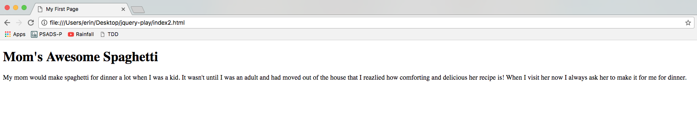
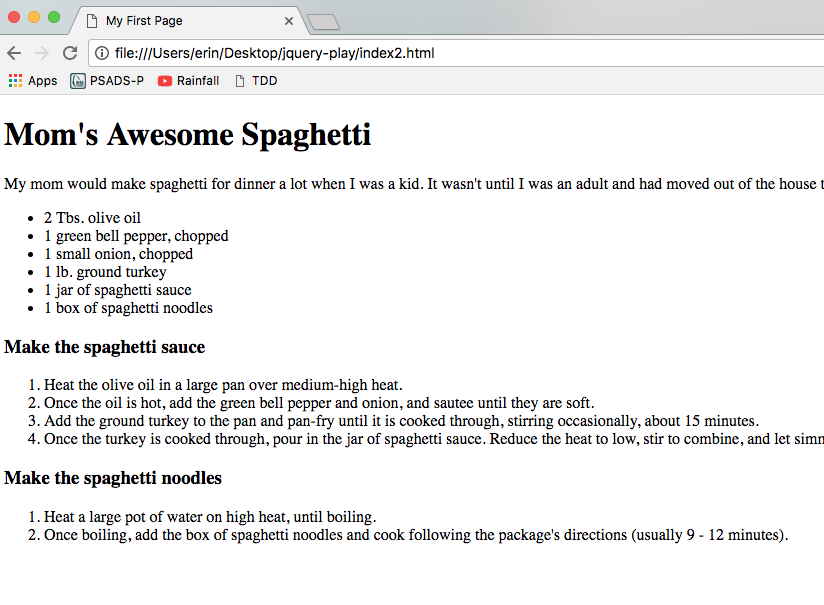
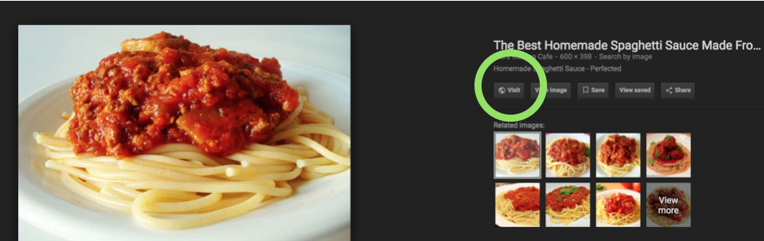

# Project 1 - Recipe Page

### Phase 1 - Create structure with HTML

### Languages

- HTML

### Frameworks

None

### Primary Goals

1. Learning to use various HTML tags
2. Receiving and incorporating constructive feedback on a project

### Overview

In this project you will create a well-designed webpage that displays one of your favorite recipes. It will include the ingredients, the steps needed to make the dish, links to similar recipes, and at least one photo.

Phase 1 of the project involves coding the structure of your webpage using HTML. This includes the ingredients, the steps needed to make the dish, links to similar recipes, and at least one photo.

Phase 2 of the project involves adding styling and pizazz using CSS. This includes changing the font style, font size, colors, and other qualities that interest you.

Phase 3 of the project involves incorporating Bootstrap. You'll add a navigation bar and several other Bootstrap components of your choosing.

Phase 4 of the project involves incorporating jQuery. You'll add at least one interactive element of your choosing.

### Context

- You've learned the basic structure of an HTML page
- You've learned the proper syntax for many commonly-used HTML elements
- You've learned how to open an HTML file in Chrome
- Let's put all these things together!

### Basic Requirements

1. Create an HTML file
2. Code the basic HTML structure
3. Add the title of the recipe
4. Add a brief background or blurb about the recipe
5. Add an unordered list of ingredients
6. Add an ordered list of the steps required to make the dish
7. Add at least one image
8. Add links to similar recipes you found online
9. Wrap each section in `<div>` tags

## Setup Instructions

Use the Terminal for navigating around the file system and creating new folders and files. Refer to the lesson on [The Command Line Interface](../../dev-tools/command-line-interface.md) if you need guidance on using the Terminal.

When you get to the steps below that ask you to initialize a git repo and track files using git, refer to the lesson on [Git and Version Control](../git/git-version-control.md) if you need guidance.

If you do not yet have a directory called `techtonica-projects` on your Desktop, create one now using the Terminal.

1. Navigate to the `techtonica-projects` directory.
2. Create a new directory called `recipe-page` within the `techtonica-projects` directory.
3. Navigate to the `recipe-page` directory.
4. Initialize recipe-page as a git repo.

If you have questions, do not disturb your colleagues until you have spent at least 20 minutes troubleshooting on your own. Be sure to format your question using the template we practiced in the [Asking Good Questions](../../onboarding/asking-good-questions.md) lesson.

## Lab Exercise

#### Part 1 - Create an HTML file & open it in VSCode

Using the Terminal, ensure you are in the `recipe-page` directory. Create a new file in this directory called `index.html`. Open this file in VSCode using the Terminal shortcut to do so.

#### Part 2 - Code the basic HTML structure

Using the [HTML lesson slides](https://docs.google.com/presentation/d/1sqmplQtQw0KfC64VGL8Ur8NWOtyeUvSVYN407lJvjzY/edit?usp=sharing) or another online resource, code only the most essential elements for an HTML page (the basic structure). Create a reasonable title given the recipe you are going to showcase. Do not include any code within the `<body>` tags yet.

Navigate to the `recipe-page` directory and run `git status`. You should see changes that need to be added and committed. Add and commit them, making sure to write a descriptive commit message in the present tense, such as "Code basic HTML structure."

#### Part 3 - Add the title of the recipe to the body

Using either the `<h1>` or `<h2>` heading tags, create a heading within the `<body>` tags that displays the title of your recipe.

Open `index.html` in Chrome to verify that this works.

Once you can see that adding the title worked, run `git status`. You should see changes that need to be added and committed. Add and commit them, making sure to write a descriptive commit message in the present tense, such as "Add recipe title."


#### Part 4 - Add a brief background or blurb about the recipe

Using the `<p>` paragraph tags, write a little blurb or background story about the recipe underneath the title. It doesn't need to be long; a few sentences will do. Don't worry about how the text looks on the webpage. We'll make things more readable when we style the text with CSS in Phase 2 of the project!

Refresh `index.html` in Chrome by pressing `<COMMAND> + r`.

Once you can see that adding the blurb worked, run `git status`. You should see changes that need to be added and committed. Add and commit them, making sure to write a descriptive commit message in the present tense, such as "Add recipe description."



#### Part 5 - Add an unordered list of ingredients

Using the `<ul>` unordered list tags and the `<li>` list item tags, list the ingredients in the order that they will be used in the recipe. Be sure to include the amount you need of each ingredient!

Refresh `index.html` in Chrome by pressing `<COMMAND> + r` to make sure the list appears as you intended.


Run `git status`. You should see changes that need to be added and committed. Add and commit them, making sure to write a descriptive commit message in the present tense, such as "Add list of ingredients."

#### Part 6 - Add an ordered list of the steps required to make the dish

Using the `<ol>` ordered list tags and the `<li>` list item tags, list the steps that are involved in creating the dish.

- If there are distinct parts to the recipe, such as "make frosting" and "make the cupcakes", feel free to use sub-headings and multiple ordered lists to clearly show which steps go with which parts of the recipe.

Refresh `index.html` in Chrome by pressing `<COMMAND> + r`.

Once you can see that adding the list of steps worked, run `git status`. You should see changes that need to be added and committed. Add and commit them, making sure to write a descriptive commit message in the present tense, such as "Add recipe instructions."



#### Part 7 - Add at least one image

Using the `` image tag, add an image between the blurb and the list of ingredients.

<pre>
This should be an image you find online. Do a Google search for "(name of dish) image",
like "spaghetti image". Click on the "Images" tab in the upper left (it's just to the
right of "All"). When you find an image you like, click on it to see a larger version.
Make sure that the width of the image is at least 600 pixels. Then, click on the
"View Image" button. Doing this will open a new tab that contains  only the image.
Copy the URL that appears in the search bar -- this is the URL you can  use inside the
`src` attribute of your `img` tag!
</pre>

[Here's a short video that walks you through the steps given above](https://youtu.be/lTJWBagWE4c).

1. You'll need to use the `src` attribute inside the `` tag in order to specify the URL where the image is hosted.
2. Specify the width of the image to be 600px using the `"width"` attribute.

Underneath the image, include a photo credit that links to the source of the image. This just means to link to the main website that originally posted the image. It could be a food blogger's website or something similar. Hint: You'll need to use a combination of tags for this! You can find the URL of the image's owner by clicking on the "Visit" button instead of the "View Image" button:




Run `git status`. You should see changes that need to be added and committed. Add and commit them, making sure to write a descriptive commit message in the present tense, such as "Add image and image credit."

#### Part 8 - Add links to similar recipes you found online

Place at least 2 links to similar recipes online underneath the recipe's instructions. Refresh the webpage to make sure it worked.


Once you can see that adding the external links worked, run `git status`. You should see changes that need to be added and committed. Add and commit them, making sure to write a descriptive commit message in the present tense, such as "Add links to more recipes."

#### Part 9 - Add some `<div>`s for easy CSS integration later

Wrap each section (listed below) in its own pair of `<div>` tags:

1. The title and blurb/description. Give this div the class `top`.
2. The image(s) and photo credit(s)
3. The list of ingredients
4. The list of steps required to make the dish
5. The external links to similar recipes

Make sure you maintain the proper levels of indentation after adding the `<div>` tags!

Let's do another layer of `<div>`s so we can ultimately use CSS to form this layout:


6. Create another `<div>` that wraps around both the image/photo credit div and the ingredients div. Give this new, outer `<div>` the class `left`. It should look similar to this:

```html
<div class="left">
  <div>
    <!-- Image and photo credit go here -->
  </div>

  <div>
    <!-- Ingredients go here -->
  </div>
</div>
```

7. Create another `<div>` that wraps around both the instructions div and the external links div. Give this new, outer `<div>` the class `right`. It should look similar to this:

```html
<div class="right">
  <div>
    <!-- Instructions go here -->
  </div>

  <div>
    <!-- External links go here -->
  </div>
</div>
```

You should see changes that need to be added and committed. Add and commit them, making sure to write a descriptive commit message in the present tense, such as "Put each section in its own div."

---

### Questions to Consider

- What, if anything, was challening about this phase of the project?
- What did you enjoy the most while working on this phase of the project?
- What questions came to mind as you were working through the steps?
- If you were to explain to a bright child what you worked on during the phase, what would you tell them?

### Extensions

- Using w3Schools or another online resource, incorporate more features into your recipe page using HTML tags. Some ideas:
  - `<table>`, `<th>`, `<tr>`, `<td>`
  - `<button>` (Maybe turn external recipe links at the bottom of the page into buttons?)
  - `<footer>`
  - `<hr>`
- Insert a YouTube video of someone showing how to make the dish
