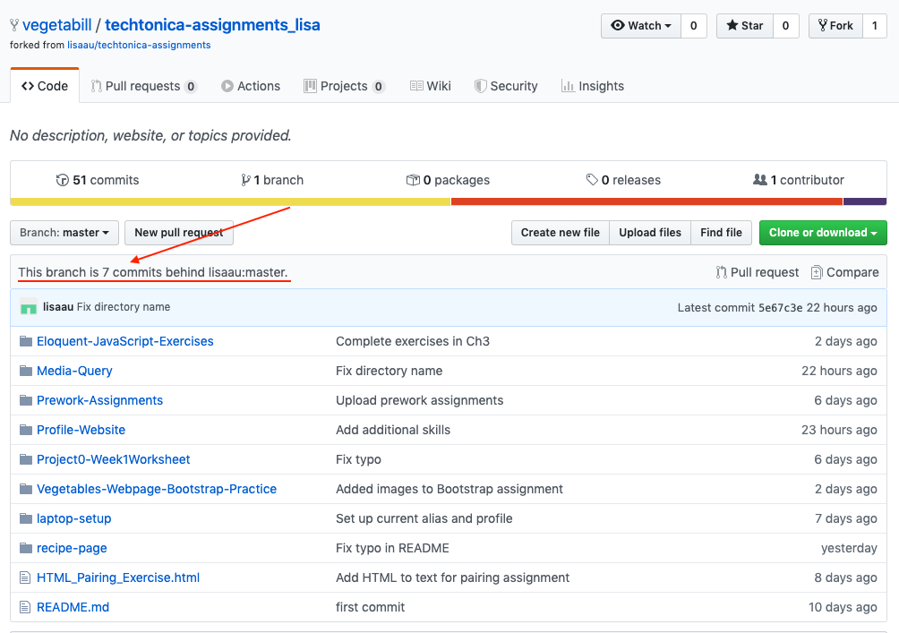
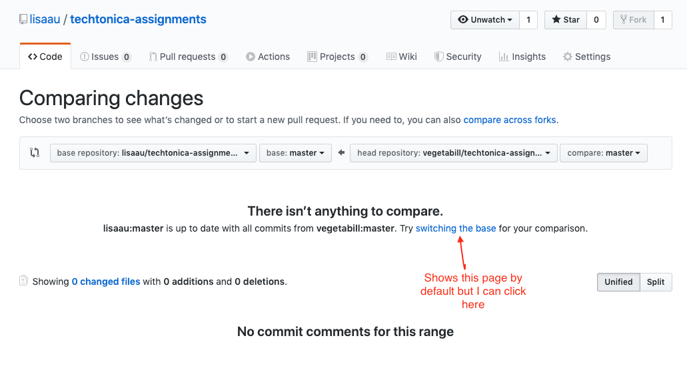
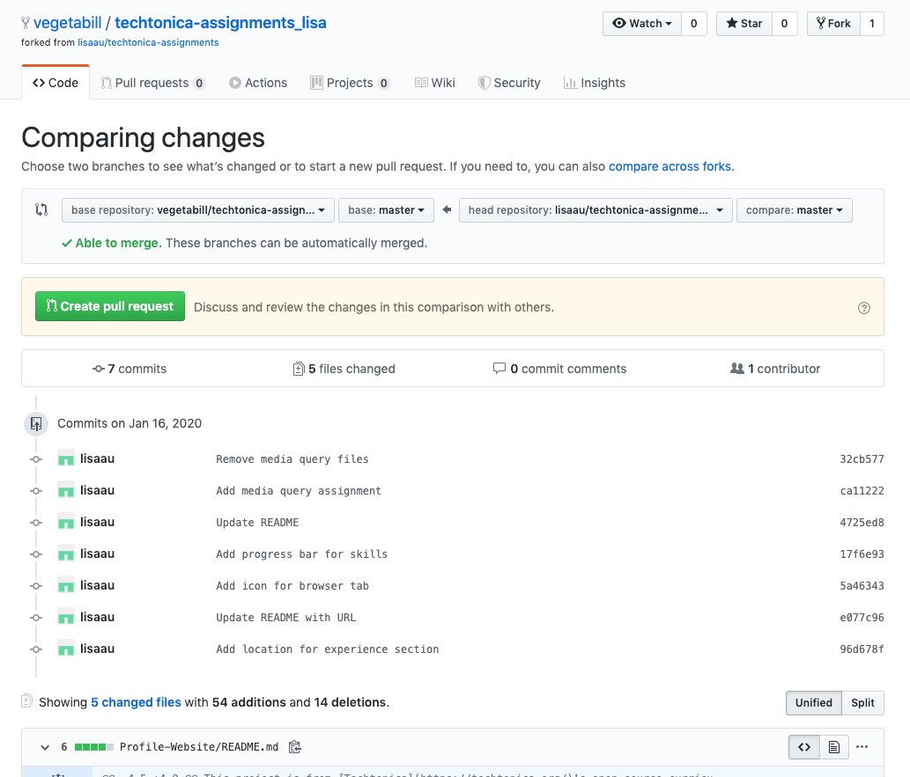

# How to Submit Work

These instructions only apply to in-person learners. Open source readers can skip this file.

## Prerequisites

- [Git Version Control](/git-version-control/git-version-control.md)
- [GitHub Collaboration](/github-collaboration/github-collaboration.md)

These instructions apply to anything that you need to submit to the SEAM for review. If unsure if you need to submit something, ask the SEAM.

## Pull Request

1. Forking another's project
2. Your own project you started from scratch (not very likely)

First, open terminal. Go into or `cd` into the techtonica assignment repo. In this example repository is called `techtonica-assignments-repo`.

I assume you you are in a git repos working tree. You can check using the following command:

```bash
git rev-parse --is-inside-work-tree
```

Next, `cd` into the folder you want to do the PR.

Lets create the branch on your local machine and switch in this branch

```bash
git checkout -b [name_of_your_new_branch]
```

Double-check you are in the new branch. Make any change/edit within the code just so we have a change to commit in the PR. Lets `Save` the files and get ready to make this PR.

Check the status of all the files we changed.

```bash
git status
```

Add the files to get pushed into the PR using the command `git add .` or `git add <filename>`

Now files are added, let's go ahead and commit it

```bash
git commit -m "commit message"
```

Lastly push all your work to the GitHub repo

```bash
git push
```

#### Creating the Pull Request

In this final step, we need to head back to the GitHub repo.

## Push to Your Assignments Repository

- Create a branch, e.g. `game-project` on your checked out copy of your assignments repo
  - If using a separate repository from your assignments repo, see FAQ below
- Commit your work locally using git on the branch (don't use `main`)
- Push these commits to your homework repository, usually something like: https://github.com/YOUR-NAME/techtonica-assignments
- The SEAM will send each of you a link to their _fork_ of that repo, something like https://github.com/SEAM/techtonica-assignments-YOUR-NAME
  - If you forget you can always find it at the top right **Fork** button which lists all known forks of your repo
- When viewing that repo you should see an indicator of commits differing between the two
- After opening the pull request you can checkout main and start a new branch for your next assignment
- Do not merge your pull request commits into main until they have be reviewed and merged to the SEAM fork (usually 7-10 days later)

### Differences between forks



These are your commits since last merged PR.

When you click "New Pull Request" you'll see this page.



There will be a small hint about which "base" to use.



Verify the changes are what you'd like to have reviewed. If it is too many changes you'll need to create a branch with _only_ the changes you want to be reviewed. When in doubt, smaller PR's are easier to review and merge.

### Naming

The default name of the PR is the last commit message. Instead, please make it the name of the assignment used, e.g.

> HTML/JS Game Project - Boggle

### General Suggestions

- Read any PR comments and try to address the feedback promptly. It's harder to remember the code if more time has elapsed.
- If the feedback is confusing, ask for clarification or for your pair to read it and see if they understand
- Keep the SEAM's fork up to date so you're not opening a huge PR or multiple PR's in one week
- Volunteers may review the PR's and so they may not know as much context. Try to be understanding if they misinterpet what we're doing

### FAQ

#### I prefer to create a new repo per project

- That's entirely up to you
- For the purposes of submitting for review, the SEAM will only review PR's in their fork of your Assignments repo
- Get your separate repo is in a state where you want to review
- Copy the folder of your repo (using regular `cp`) to your assignments repo. For simplicity, naming the destination folder as the same of your repo might help keep things simple
  - consider adding `-snapshot` to the end of the name to help remind you it's just a copy of another repo and won't stay in sync
- Commit and push those changes to your assignments repo
- Open a PR to the SEAM's fork as above
