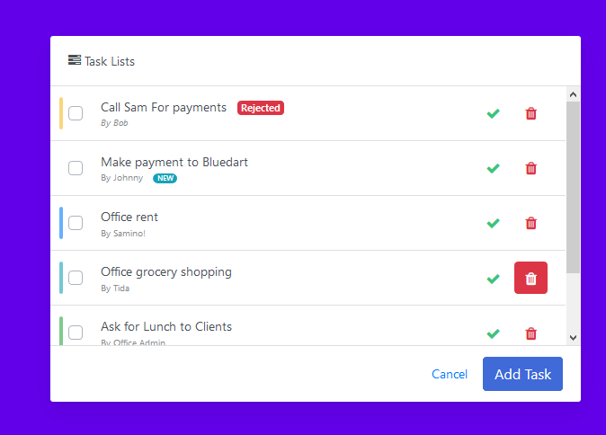

# Styling in ReactJS

### Projected Time : 1 hr
- Lesson: 40 mins
- Independent Practice: 20 min

### Prerequisites
- CSS: [css](../css/css.md)
- Bootstrap: [bootstrap](../bootstrap/bootstrap.md)
- ReactJs: [reactJs](./react.md)

### Motivation

Styling has been one of the building blocks of web development. Cascading Style Sheets is a style sheet language used for describing the presentation of a document written in a markup language like HTML. React only provides a virtual DOM , whereas the presentation part still lies with CSS.

### Objectives

- Styling in JS Framework
- Inline styling and using external Stylesheet
- Bootstrap in React	 

### Specific Things To Learn

- Defining styles as objects
- Importing stylesheets into react application

### Materials

- [3 Types of Styling](https://www.youtube.com/watch?v=j5P9FHiBVNo) - Using external css, internal and css modules
- [Bootstrap in React](https://www.youtube.com/watch?v=wdbzLi0tWq0) - Bootstrap in ReactJs can be used using CDN or by installing the package. 

### Lesson

- [Techtonica sildes: CSS in ReactJs ](https://drive.google.com/open?id=1xVsjUzPsNGq2sPaoNvc0eLLXy2Zm3kVk)

### Common Mistakes & Misconceptions

- Combining different classes based on certain state/props.
- Wrong path provided while importing CSS.
- CamelCase is supported in ReactJS for CSS styles.

### Independent Practice

Create simple applications by adding Css to it. Then change the css to bootstrap classes.

### Check for Understanding

Task- 
 - Create a Todolist using ReactJs
 - Add delete , update ,toggle up , toggle down and checked functionality 
 - refer 	

### Supplemental Materials
- [React Strap](https://reactstrap.github.io/) - Provides predefined components for React styled with Bootstrap
