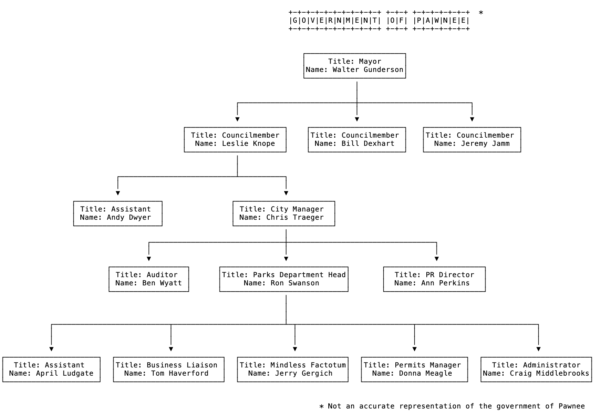

# Recursion

### Projected Time

About 6 hours

- 50 minutes for the lesson
- 30 minutes for Independent Practice
- 240 minutes for Independent Practice & Challenge

### Prerequisites

- [JavaScript 1 - Variables, Strings, Numbers](/javascript/javascript-1-variables.md)
- [JavaScript 2 - Arrays, Functions](/javascript/javascript-2-array-functions.md)
- [JavaScript 3 - Conditionals, Comparisons, Booleans](/javascript/javascript-3-conditionals.md)
- [JavaScript 4 - Loops](/javascript/javascript-4-loops.md)

### Motivation

Recursion is a powerful technique you can use to solve certain types of problems, usually those that involve hierarchical data. It is also a common interview subject area.

### Objectives

**Participants will be able to:**

- Understand the structure and definition of a recursive algorithm
- Distinguish between iterative and recursive functions
- Recognize problems where recursion would be a good solution
- Solve coding challenges using recursion

### Specific Things to Learn

- Types of problems where a recursive algorithm would be useful
  - Interview Questions!
    - Fibonacci sequence
    - Factorial
    - Tree traversal
- The structure and definition of a recursive algorithm
  - Base case
  - Recursive case
- How to avoid infinite recursion/stack overflow

### Common Misconceptions

- Myth: Recursion is only used in Computer Science classes and in interviews. Real Code™ doesn't use it.
  - This is 100% untrue
  - Operations on the DOM (a tree structure) often involves recursion
  - Other hierarchical data structures are natural fits for recursive algorithms (filesystems, lists of lists, any graph)
- **Recursion is inefficient.**
  - (Often the reason cited for why Real Code™ doesn't use it)
  - Recursive code is compact because it's essentially using the [call stack]() as a built-in data structure. However, this structure has a cost. So on the one hand, this is not a myth. However if your call stack can fit in memory, why not use this elegant tool?
  - Also Pro Tip: Performance of in-memory code is usually largely irrelevant. System scaling bottlenecks in the real world usually relate to databases and other forms of latency. Unlike Computer Science students, professional engineers usually favor simpler code that is easier to understand later than squeezing every last byte from an algorithm.
  - "The real problem is that programmers have spent far too much time worrying about efficiency in the wrong places and at the wrong times; premature optimization is the root of all evil (or at least most of it) in programming." –[Donald Knuth](https://en.wikiquote.org/wiki/Donald_Knuth)

### Materials

#### Techtonica Definition

- A **recursive** function is any function that calls itself.
  - (**Recursion** refers to the process of evaluating a recursive function)
- Recursion is usually contrasted with **iteration**, the process of solving a problem by a single function, called once, that solves the problem in its entirety
- Recursive solutions tend to divide a larger problem (or data set) into smaller pieces, often further and further, until the logic can seem trivial (adding two numbers or check if a == b)
- Recursive solutions tend to be short and sweet, which means you have to think about them for a bit to follow along, unlike an iterative solution that might be easier to read

#### Example

Summing an array. `a = [1,2,3,5,6,7,8]`

```javascript
function sumArray(arr) {
  let sum = 0;
  for (let i = 0; i < arr.length; i++) {
    sum += arr[i];
  }
  return sum;
}
```

You could loop through each number and add them to a running total and then return it. That would be the iterative solution.

The _recursive solution_ would instead say:

- The sum of an entire array is the sum of it's _first half_ [1,2,3,4] + its _second half_ [5,6,7,8]
- The sum of that half array is the sum of **its** first half [1,2] + **its** second half [3,4]
- The sum of that array is the sum of its first half [1] and its second half [2]
- (**Base Case**) The sum of that array is just itself since it's a single element: 1

This might seem almost silly. Why would you reduce it in this way? But it's an incredibly powerful technique, for some reasons:

- The final step is usually very simple
- If you can run these different steps in parallel, the total clock time to determine the answer could be shorter

```javascript
function recursiveSum(arr) {
  if (arr.length === 1) {
    return arr[0]; // Base Case
  } else {
    const halfwayPoint = Math.floor(arr.length / 2);
    const firstHalf = arr.slice(0, halfwayPoint);
    const secondHalf = arr.slice(halfwayPoint, arr.length);
    return recursiveSum(firstHalf) + recursiveSum(secondHalf);
  }
}
```

#### Resources

- [FunFunFunction - Recursion - Part 7 of Functional Programming in JavaScript video (16 mins watch)](https://www.youtube.com/watch?v=k7-N8R0-KY4) - Learn from Matthias about recursion.
- [Recursion Slides](https://docs.google.com/presentation/d/1KQ5bPs839gvH3iO4-v5fdVZ3JOH9_4QP0y5g0_YxxlQ/edit#slide=id.p)
- [Recursion slides video (12 mins watch)](https://www.useloom.com/share/e2ce9f18d8af4fa1a836ce72d873566c)
- [Recursion: Russian Nesting Dolls video (5 mins watch)](https://www.youtube.com/watch?v=93_iFq6rBy8)

### Supplemental Materials

- [Understand Recursion in JavaScript in depth](https://www.thecodingdelight.com/understanding-recursion-javascript/)
- [Recursive Practice Problems](https://www.geeksforgeeks.org/recursion-practice-problems-solutions/)

### Lesson

- Video walkthrough of lesson slides [Recursion video (12 mins watch)](https://www.useloom.com/share/e2ce9f18d8af4fa1a836ce72d873566c)
- Read through lesson slides [Recursion](https://docs.google.com/presentation/d/1KQ5bPs839gvH3iO4-v5fdVZ3JOH9_4QP0y5g0_YxxlQ/edit#slide=id.p)
- Watch video [Recursion: Russian Nesting Dolls (5 mins watch)](https://www.youtube.com/watch?v=93_iFq6rBy8)
- Watch [FunFunFunction - Recursion - Part 7 of Functional Programming in JavaScript video (16 mins watch)](https://www.youtube.com/watch?v=k7-N8R0-KY4) - Learn from Matthias about recursion.

### Things to Remember

- You can solve all recursion problems with a while loop and vice versa
  - Recursion solutions are usually simpler to implement and easier to read
- Recursive algorithms are often used to solve problems with the Tree data structures (for example, the DOM is a tree!)

### Demonstration

The instructor demonstrates in the video walkthrough an example of a recursive algorithm in JavaScript.

### Independent Practice

Write a recursive function `isPalindrome(aString)` that returns `true` if `aString` is a [palindrome](https://en.wikipedia.org/wiki/Palindrome). A palindrome is any string that is the same read forwards or backwards:

```
isPalindrome('racecar') -> true
isPalindrome('step on no pets') -> true
isPalindrome('a') -> true
isPalindrome('goat') -> false
```

### Challenges

#### [Challenge] - Factorial

The [factorial](https://en.wikipedia.org/wiki/Factorial#Definition) of a whole number `n` is written `n!` and defined as the product of all positive whole numbers less than or equal to `n`.

For example, the value of `3!` (read: three factorial) is `6` which is calculated by multiplying together all whole numbers less than or equal to `3`:

```
factorial(3) = 3! = 3 * 2 * 1 = 6
```

The value of `10` factorial, for example, can be calculated by:

```
10 * 9 * 8 * 7 * 6 * 5 * 4 * 3 * 2 * 1
```

> Write a function that uses recursion to calculate the factorial of a number.

#### [Challenge] - Fibonacci

The [Fibonacci sequence](https://en.wikipedia.org/wiki/Fibonacci_number) appears in unexpected places all over mathematics and nature. It is defined by the following three rules:

- The first Fibonacci number is 1
- The second Fibonacci number is 1
- Every other Fibonacci number is the sum of the previous two Fibonacci numbers

For example, the first few numbers in the Fibonacci sequence are:

```
1, 1, 2, 3, 5, 8, 13, 21, ...
```

The next Fibonacci number is:

```
13 + 21 = 34
```

> Write a method `fib(n)` that calculates the `n`th Fibonacci number (starting from `n = 1`).

#### [Challenge] - GCD

The [GCD](https://en.wikipedia.org/wiki/Greatest_common_divisor) of two or more integers, none of which are zero is the largest positive integer that divides each of the integers.
The greatest common divisor(GCD) is also known as:

- the greatest common factor (GCF),
- highest common factor (HCF),
- greatest common measure (GCM),
- highest common divisor.

For example:

the GCD of 48 and 14 is 2.

##### Pseudocode to calculate GCD of two numbers:

```
GCD(x, y)
Begin
    if y = 0 then
        return x;
    else
        Call: GCD(y, x%y);
    endif
End
```

#### [Challenge] - Tree Operations (Optional Additional Practice)

Consider a fictitious hierarchical organization that looks like follows:



It's a simple reporting structure, but we can do many interesting things with it. The data structure to represent each node on this tree can be simply expressed as follows:

```
class Employee {
    constructor(name, title, directReports=[]) {
        this.name = name
        this.title = title
        this.directReports = directReports
    }
}
```

The very first thing you'd want to do is to starting building the object in your code that would accurately represent the hierarchy in the diagram. Here's a small sample of what would be needed:

```
let donnaMeagle = new Employee("Donna Meagle", "Permits Manager");

let jerryGergich = new Employee("Jerry Gergich", "Mindless Factotum");

let ronSwanson = new Employee("Ron Swanson", "Parks Department Head", [donnaMeagle, jerryGergich]);
```

Build the entire hierarchy of employees first, and then write functions on the `Employee` class that would:

1. Give you the total number of reports (both direct and indirect) for any given employee. For the given diagram, `getTotalReportsCount()` on Chris Traeger should return `8`.

2. Give you all the reports (both direct and indirect) for any given employee. For the given diagram, `getAllReports()` on Chris Traeger should return an array of employee objects for Ben Wyatt, Ann Perkins, Ron Swanson, April Ludgate, Jerry Gergich, Tom Haverford, Craig Middlebrooks, and Donna Meagle.

### Check for Understanding

Given the following code:

```
int fun1(int x, int y)
{
  if(x == 0)
    return y;
  else
    return fun1(x - 1,  x + y);
}
```

What do these function calls return?
`fun1(1, 1)`
`fun1(2, 1)`
`fun1(2, 2)`
`fun1(0, 2)`

### And remember: always have a base case


Note: You can get this on a [T-shirt](https://www.teepublic.com/t-shirt/1935527-maximum-call-stack-size-exceeded-programming)
