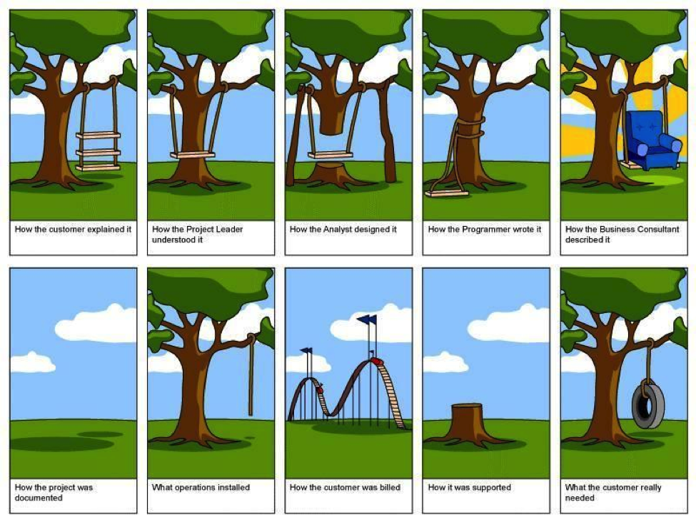

# Technical Program Manager

### Projected Time
30-45 minutes

### Prerequisites

In General you will need following to be a Technical Program Manager:

* **Technical Competency**
* **Project/Program Management & Agile Experience**
* **Past Experience in Handling & Leading Development Teams**

### Motivation

* **Better Estimates**
* **Add Value to Other Parts of the Project**
* **Be the Link Between Development and the Business**

### Objectives

**Participants will be able to:**
- Create and maintain a project plan with tasks and estimates
- Communicate with both IT and business stakeholders
- Risk management and escalation
- Manage scope

### Specific Things To Teach
- What is TPM ?
- Career Path
- Work Responsible for
- Challenges

### Materials

- [Techtonica Slides](example.com)
- [Technical Program Management](http://www.mariogerard.com/technical-program-manager/)

### Lesson

**What is a TPM?**

*TPM stands for “technical program manager.” a team that manages the coordination of business decisions and leads design through the implementation of the infrastructure.*

**Career Path**

1. Technical Program Manager
2. Technical Program Manager II
3. Technical Program Manager III
4. Principal Technical Program Manager
5. Sr. Principal Technical Program Manager

**Technical Program Manager (TPM) is Responsible for:

- Enabling the team to launch various features
- Leads the sprints, gathers requirements from the product managers
- Sets up architectural reviews with teams consuming the service
- Helps out in on-call and escalation

**Types of Technical Program Managers**

* Front End
* Backend
* Integration
* Business Intelligence
* ERP
* Localization
* Hardware
* Data Center
* Process
* Security
* Cloud TPM
* UX/UI

Perhaps the biggest **advantage** to being a **technical project manager** is having the ability to fill the communication gap between the development team and the business team.  This can manifest itself in many ways:

* Describing how individual development components relate to the big picture for an organization
* Ensuring the business team understands why certain technical decisions were made along with the 
  benefits and trade-offs
* Explaining to the business why a requirement may not be technologically feasible  but here are some alternatives

**What Now?**

So now you’re convinced that you should become a technical project manager – **but how?**

1. Take Time to Understand Your Project/Product.
2. Learn to Code on Your Own.
3. Build Something on your Own.

**Challenges**

* Lack of loyalty in employees and corporate bosses.
* Evolution of Technology.
* Globalism in HR.
* Self Image and Proper Restraint.

### Common Mistakes / Misconceptions

* **Tech Project Manager is only skilled in project management**
* **Tech Project Manager Job is to create reports/ Gantt charts**
* **No role for Tech Project Manager in Agile context**
* **Tech Project Manager role is the same across the organisation**

### Independent Practice

Try to manage or lead a project in your current organization or your team.

### Check for Understanding

* Are you able to manage or lead the project.
* Can you deliver project on time.
* Can you Plan for problems and potential conflicts.
